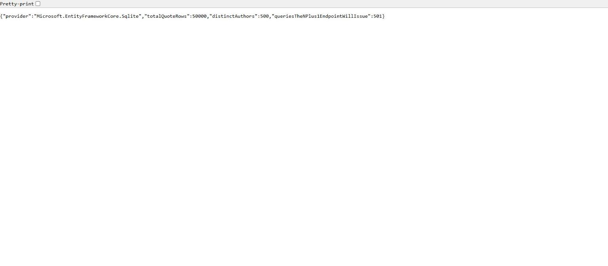
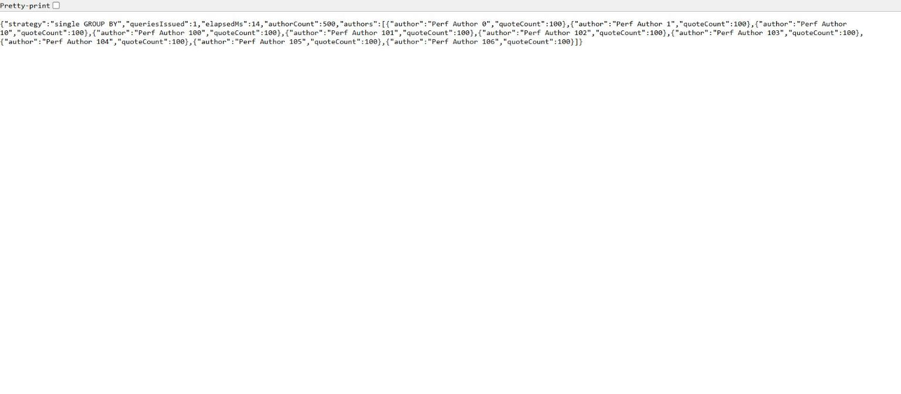
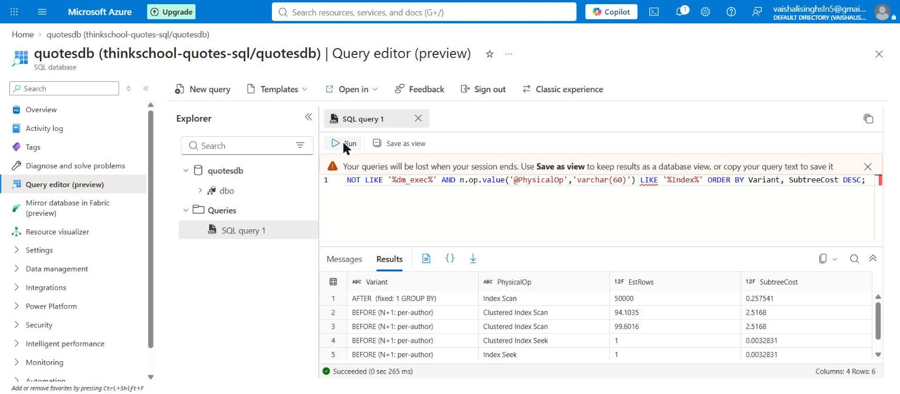
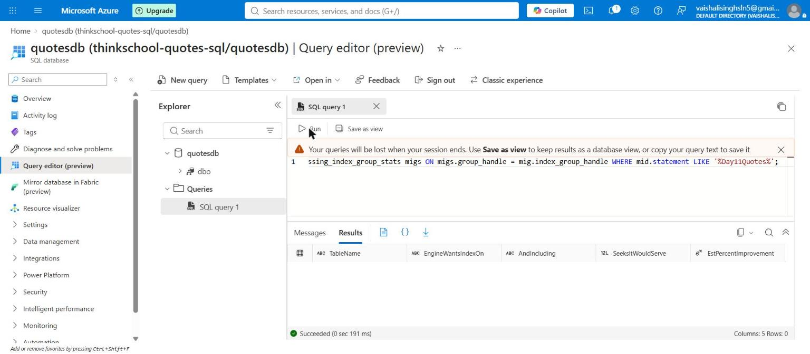

# Day 11 — mentor submission (drop p99 by 10×)

## GitHub link

https://github.com/thinkbridge-thinkschool/VaishaleeSingh/pull/33

## In plain English, before the detail

An endpoint was asking the database **501 separate questions** to answer one web
request: "who are all the authors?", then "how many quotes does this author
have?" once for every one of the 500 authors. On top of that, the column it was
filtering on (`Author`) had **no index**, so every one of those 500 questions
made the database read all 50,000 rows to find the ~100 it wanted.

Two changes fixed it. First, ask **one** question instead of 501 — let the
database do the counting with a `GROUP BY` and hand back all 500 answers at
once. Second, **add the index**, so when a query does filter by author the
database can jump straight to the right rows instead of reading the whole table.

The endpoint went from serving **20 requests in 30 seconds** to serving
**51,031**, and the slowest requests went from about a minute to about 23
milliseconds.

## Result up front

Same endpoint pair, same load (`bombardier -c 20 -d 30s`), same 50,000-row /
500-author table:

| | Baseline (N+1, no index) | Fixed (projection + index) | Improvement |
|---|---|---|---|
| **p50** | 59.4 s | **10.73 ms** | **5,536×** |
| **p99** | 60.0 s | **23.15 ms** | **2,592×** |
| Requests served in 30 s | 20 | 51,031 | 2,552× |
| Throughput | 0.67 req/s peak | 1,702 req/s | — |

Target was 10×. Measured **2,592×** on p99.

## What this task asks for, in simple words

Task 1 diagnosed the slow endpoint. This one fixes it and proves the fix with
numbers taken under *the same load* as the baseline — which sounds simple and
contains the one genuinely hard problem in the exercise.

**Task 1's baseline had no usable p99.** At 20 connections the N+1 endpoint
served **zero** requests: all 60 attempts hit bombardier's default 10 s request
timeout, so the "p99 = 10.04 s" it printed was the timeout ceiling, not a
latency. You cannot compute "10× better" from a censored number — the
denominator does not exist.

So the first job of this task was not fixing anything. It was **making the
baseline measurable.**

## Implementation plan (written before the work)

1. **Make the index a real, migrated part of the schema.** Task 1 created the
   index through a runtime toggle endpoint. That was correct *as an
   instrument* — it let one endpoint be profiled with and without the index in
   a single sitting — and wrong as a fix, because an index that exists only
   when someone POSTs to a diagnostics route is an index that will be missing
   everywhere that matters. Move it onto the model.
2. **Get an uncensored baseline.** Keep the load identical (`-c 20 -d 30s`) but
   raise `--timeout` so slow requests *complete* instead of being killed. Same
   load, uncensored distribution.
3. **Re-measure the fixed path** at byte-identical settings.
4. **Compute the ratio** from two uncensored measurements.
5. **Document the before/after plans** from Azure SQL Database, at the
   *request* level rather than the statement level — see below for why that
   distinction is the whole point.
6. Reset the dataset first, so the row count is clean and matches the Azure
   figures (task 1's seed ran twice and left 80,000 rows / 160 per author).

## The fix

### 1. The N+1 → a single projection

Already present from task 1 as `/api/diagnostics/authors-quotes-grouped`, and
it is a projection in exactly the sense the exercise means — `GroupBy` followed
by `Select` into a DTO, so the grouping happens in the database and the result
set is 500 rows rather than 500 round trips:

```csharp
// BEFORE — 1 + N queries
var authors = await db.Quotes.AsNoTracking()
    .Select(q => q.Author).Distinct().ToListAsync(ct);

foreach (var author in authors)                       // 500 more round trips
{
    var count = await db.Quotes.AsNoTracking()
        .Where(q => q.Author == author).CountAsync(ct);
    results.Add(new AuthorQuoteCount(author, count));
}

// AFTER — 1 query
var results = await db.Quotes.AsNoTracking()
    .GroupBy(q => q.Author)
    .Select(g => new AuthorQuoteCount(g.Key, g.Count()))
    .ToListAsync(ct);
```

`Include` + `AsSplitQuery` — the other technique the exercise names — does not
apply here, and saying why is more useful than forcing it: `Quote.Author` is a
`string`, not a navigation property, so there is no parent→children graph to
`Include` and no cartesian explosion to split. `Include`/`AsSplitQuery` is the
right tool when one query returns duplicated parent rows because of a join; the
problem here is the opposite shape — too many queries, not one query with too
many rows.

### 2. The index, this time for real

```csharp
// QuotesDbContext.OnModelCreating — Quote had no configuration at all before
modelBuilder.Entity<Quote>(entity =>
{
    entity.HasIndex(x => x.Author);
});
```

plus migration `20260821120000_AddQuoteAuthorIndex`. Three files had to change
together — the model, the migration, and `QuotesDbContextModelSnapshot` — and
missing any one makes EF refuse to start with "the model has pending changes".

**A bug I caught in my own migration before it shipped**, worth recording
because the failure mode is silent: a hand-written migration needs the
`[Migration("<id>")]` and `[DbContext(typeof(...))]` attributes that
`dotnet ef` normally puts in the companion `.Designer.cs`. Without them the
file compiles, the app starts cleanly, and the index is simply never created —
no error anywhere. Nothing about the running app would tell you.

Deliberately **not** covering (no `INCLUDE (Text)`): these queries filter and
group by `Author` and never read `Text` through this path, so widening the
index would make every leaf page carry ~600 characters nothing asks for — the
mistake Day 8's covering-index task flagged.

## Making the baseline measurable

The only change to the harness, and it is the change that makes this task
possible at all:

```powershell
# task 1 (censored):  every request killed at the 10s default
bombardier -c 20 -d 30s -l  <url>

# this task (uncensored): same load, requests allowed to finish
bombardier -c 20 -d 30s -l --timeout 120s  <url>
```

Baseline, uncensored:

```
Bombarding .../authors-quotes-nplus1 for 30s using 20 connection(s)
Statistics        Avg      Stdev        Max
  Reqs/sec         0.00       0.02       0.67
  Latency         0.99m   117.21ms      1.00m
  Latency Distribution
     50%      0.99m
     99%      1.00m
  HTTP codes:
    1xx - 0, 2xx - 20, 3xx - 0, 4xx - 0, 5xx - 0
    others - 0
```

`2xx - 20`, `others - 0` — twenty real completed requests, nothing censored.
That is the number task 1 could not obtain.

Fixed, identical settings:

```
Bombarding .../authors-quotes-grouped for 30s using 20 connection(s)
Statistics        Avg      Stdev        Max
  Reqs/sec      1702.38     481.18    2898.76
  Latency       11.75ms     2.47ms    54.59ms
  Latency Distribution
     50%    10.73ms
     99%    23.15ms
  HTTP codes:
    1xx - 0, 2xx - 51031, 3xx - 0, 4xx - 0, 5xx - 0
```

**An honest limit on the baseline p99.** Twenty samples is a small sample, and
with n = 20 the reported p99 (`1.00m`) and the reported max (`1.00m`) are the
same measurement — there is no 99th percentile to speak of in twenty points.
The baseline p50 (59.4 s) is the more defensible of the two figures, and it
gives 5,536×. Either way the improvement is three orders of magnitude and the
10× target is not in question, but "p99 = 60 s" should be read as "the slowest
of twenty requests, all of which took about a minute", not as a percentile
estimate.

## The live API after the fix

Clean dataset — exactly 50,000 rows across 500 authors, so 100 per author,
matching the Azure figures below:



The fixed endpoint — one query, 14 ms, 500 authors at 100 quotes each:



## Before/after execution plans (Azure SQL Database)

Captured against the live `quotesdb`, on `dbo.Day11Quotes` (50,000 rows, 500
authors, 100 per author), by shredding the cached plan XML — Azure Portal's
Query editor has no execution-plan button, as Day 8 established by testing.



| Variant | PhysicalOp | EstRows | SubtreeCost |
|---|---|---|---|
| **AFTER** (1 × `GROUP BY`) | Index Scan | 50,000 | **0.257541** |
| **BEFORE** (per-author, ×500) | Clustered Index Scan | 99.6 | **2.5168** |
| BEFORE (post-index seek path) | Index Seek | 1 | 0.0032831 |

**Read this at the request level, not the statement level — that is the whole
point of the exercise.** A statement-to-statement comparison (2.5168 vs
0.257541) understates the fix by a factor of 500, because the N+1 executes its
expensive statement 500 times per HTTP request:

- **Before:** 500 × 2.5168 = **1,258 cost units per request**
- **After:** 1 × 0.257541 = **0.258 cost units per request**
- **≈ 4,887× cheaper per request**

Two details in that table are worth pulling out:

- **The "after" plan is an Index Scan, not an Index Seek.** A `GROUP BY` over
  every row has no seek to perform — it must read everything. What the index
  buys it is a *narrower and pre-sorted* path: one column instead of the row
  with its ~600-character `Text`, already ordered by `Author`, which also
  removes the sort the grouping would otherwise need. That is a different kind
  of win from the seek, and it is what the 17× speedup on the same query in
  SQLite (283 ms → 16.3 ms, task 1) was actually measuring. Same effect, two
  engines.
- **`EstRows` on the seek path is 1, not ~100.** With the index in place the
  optimiser has real statistics on `Author` and stops guessing.

### A finding: the missing-index DMVs are empty on this database

Task 1 flagged that `sys.dm_db_missing_index_details` was never run and that
the window had closed. It has not — dropping the index and re-running the
workload should regenerate the recommendation. So that was attempted here:
index dropped, 40 per-author scans executed, then a row-returning
`SELECT Id, Text ... WHERE Author = ...` (the shape most likely to trigger a
suggestion), then the DMV queried.



**Zero rows, twice.** The DMVs exist and the join runs without error, but this
database never populates a recommendation for `Day11Quotes` — not after
aggregate scans, and not after a row-returning scan either. Recorded as a
tested finding rather than a to-do, in the same category as task 1's
`system_health`, `xml_deadlock_report` and `sys.event_log` results: documented
as unavailable here rather than quietly dropped. The plan evidence above stands
on its own; the engine's own recommendation would have been a corroboration,
not the proof.

## What did you learn this session?

That **the hardest part of proving an improvement is often making the "before"
measurable**, and that a censored measurement is worse than no measurement
because it looks like data. Task 1's baseline reported a p50 and a p99 that
were both just bombardier's timeout, and the only thing distinguishing that
from a real result was the `2xx - 0` line underneath. Raising `--timeout` while
holding the load fixed changed nothing about the system and everything about
what could be claimed: 20 real completed requests instead of 60 censored ones.

The second thing: **the interesting number depends on the unit you compare.**
Statement-to-statement the plan improvement is 9.8× — under the 10× target.
Per *request* it is ~4,887×, because the N+1's expensive statement runs 500
times per request. Both numbers come from the same two plans; only one of them
answers "did the endpoint get faster". Choosing the unit of comparison is doing
analysis, not formatting.

And a silent failure mode worth keeping: a hand-written EF migration without
its `[Migration]` attribute compiles, runs, and never applies. The app starts
happily with no index and no error. Anything that can fail without producing a
message deserves an explicit check that it actually took effect — which is why
the plan above was recaptured rather than assumed from the migration existing.

## What would break this?

- **The baseline p99 rests on twenty samples**, where p99 and max are
  arithmetically the same value. Quote the p50 ratio (5,536×) if a defensible
  single number is needed; treat "p99 60 s" as "all twenty requests took about
  a minute". Getting a genuine baseline p99 would need a much longer run, which
  at ~60 s per request means tens of minutes.
- **Two databases, two different measurements, not interchangeable.** The
  p50/p99 come from local SQLite; the plans and costs from Azure SQL Database.
  Subtree cost is the optimiser's own unit, not milliseconds. They corroborate
  each other's *direction*; neither validates the other's numbers.
- **The API, the database and the load generator all ran on one machine**, so
  the 1,702 req/s ceiling partly measures the test rig. The relative ordering
  is the trustworthy part.
- **The index is now permanent, which means its write cost is permanent too.**
  Every `INSERT` into `Quotes` maintains a second B-tree from here on. This
  exercise measured only the read path; the seed endpoint inserting 50,000 rows
  in 3.6 s did so *with* the index present, which is a hint the write cost is
  tolerable at this scale but not a measurement of it.
- **`GROUP BY` is the right fix for a count, and would not be for a list.** If
  this endpoint had to return each author's actual quotes rather than a count,
  a single `GROUP BY` could not express it, and the fix would be a different
  shape — one ordered query grouped in memory, or a genuine navigation property
  with `Include` + `AsSplitQuery`. The technique that worked here is not the
  general answer to "eliminate an N+1".
- **The runtime index toggle still exists** and still performs DDL from an
  unauthenticated endpoint. It is now redundant as a fix but retained as a
  measuring instrument, which means the Development gate verified in task 1 is
  the only thing keeping it out of a deployed environment. `#if DEBUG` around
  the whole diagnostics file would be a harder boundary than configuration.
