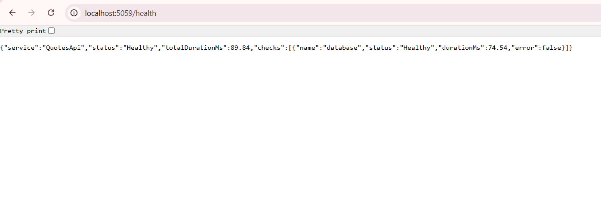
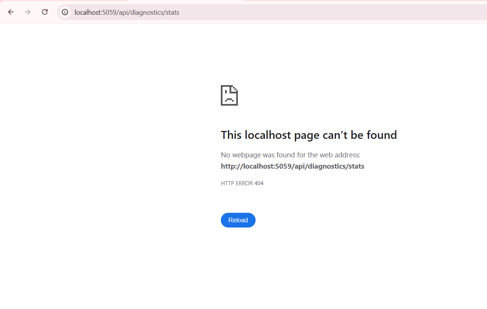
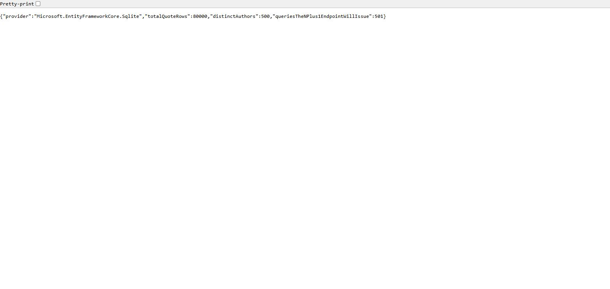
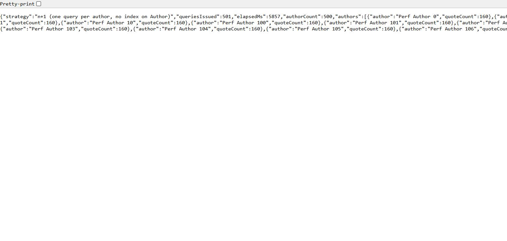
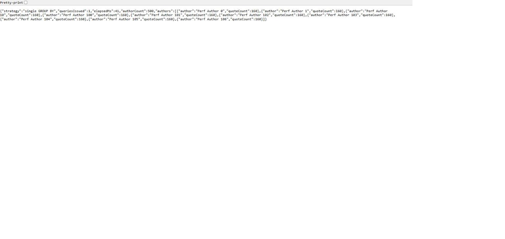
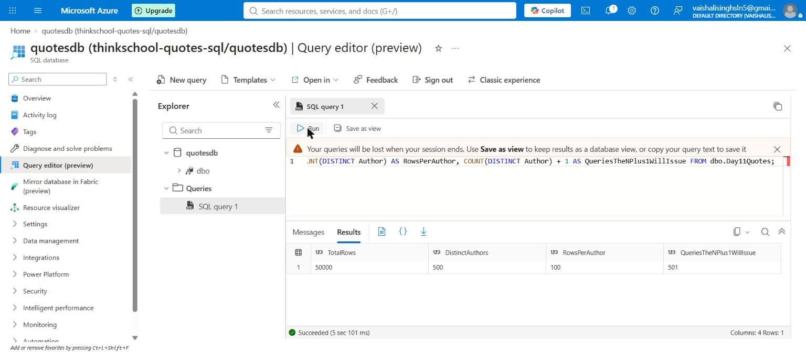
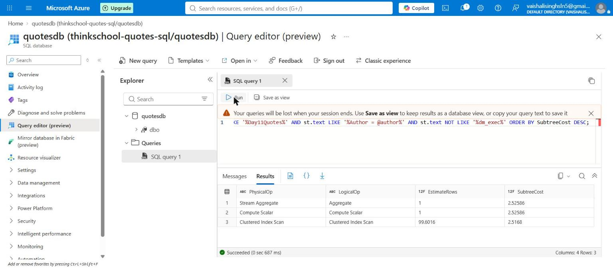
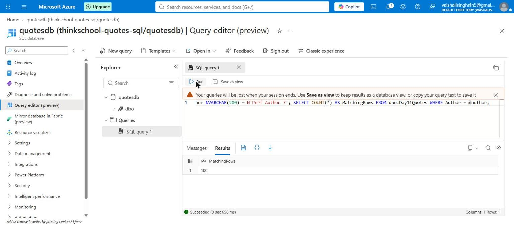
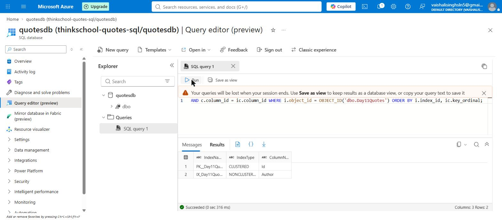
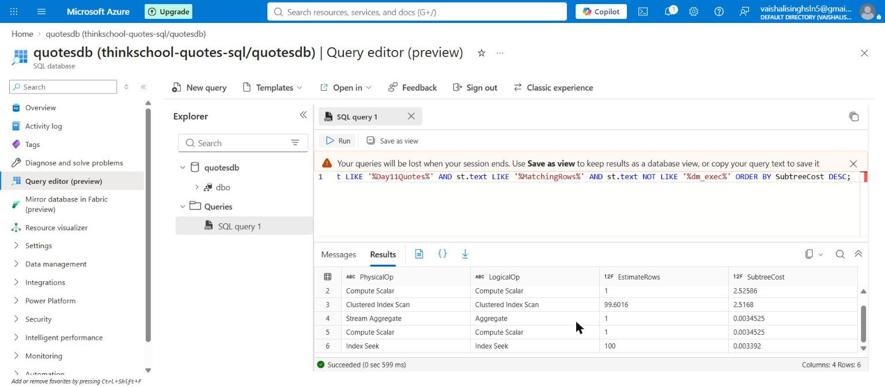

# Day 11 — mentor submission (profile a slow endpoint)

## GitHub link

https://github.com/thinkbridge-thinkschool/VaishaleeSingh/pull/32

## The two biggest problems found

1. **An N+1 — 501 database round trips to answer one HTTP request.** One query
   for the distinct author list, then one more per author to count that
   author's quotes. Fixed by a single `GROUP BY`, moving the grouping into the
   database instead of a C# loop.
2. **No index on `Quotes.Author`.** Pre-existing rather than manufactured for
   this exercise: `Quote` is the one entity in
   `QuotesDbContext.OnModelCreating` with no configuration at all, and the
   startup migration log creates indexes on `Users(Email)` and three on
   `RefreshTokens` while creating none on `Quotes(Author)`. So each of those
   500 per-author queries had no choice but to scan the whole table.

They compound rather than add — 500 scans × 80,000 rows is 40,000,000 rows
read to return 500 numbers — and the measurements show they carried comparable
weight: fixing either one alone reaches roughly 2,100–2,600 requests in 30 s,
while fixing both reaches 35,902.

## What this task asks for, in simple words

A slow endpoint is easy to write by accident and hard to explain after the
fact. This task is about building one deliberately, so the diagnosis can be
practised on a problem whose cause is already known — then proving the cause
with measurements rather than reasoning.

The endpoint here is slow for two compounding reasons, which is the realistic
case:

1. **N+1 queries.** One query fetches the list of distinct authors, then a
   *separate* query runs for each author to count their quotes. With 500
   authors that is 501 round trips to the database to answer one HTTP request.
2. **A missing index.** `Quotes` has never had an index on `Author` — `Quote`
   is the one entity in `QuotesDbContext.OnModelCreating` with no
   configuration at all, so that gap is real and pre-existing, not
   manufactured for this exercise. Every one of those 500 per-author queries
   therefore has to scan the whole table.

They multiply rather than add: 500 scans of a 50,000-row table is 25,000,000
rows read to return 500 numbers.

"Profile it" then means three specific artifacts: **p50/p99 under sustained
load**, **the SQL the endpoint actually emits**, and **the execution plan** for
that SQL.

## Implementation plan (written before the code)

1. **Add the endpoint to the existing `Day7/piece2` API rather than copying
   the API into `Day11/`.** This is a deliberate break from how Days 2–7 were
   structured, and the reasoning is worth stating: each of those days copied
   the entire API forward and grew it (74 → 74 → 92 → 136 → 155 files), so
   doing the same here would have added a 156-file `Day11/piece2` of which
   **154 files were byte-identical to Day7's**. The actual change this task
   makes to the API is one new file and one added line. Duplicating 154
   unchanged files to carry two changes makes the diff impossible to review
   and means a future fix to, say, `AuthService` has to be applied in six
   places. `Day11/` therefore holds only what is genuinely new — the
   profiling docs and evidence — and the endpoint lives in the one API the
   repository already has.
2. **One new file, `Extensions/DiagnosticsEndpointExtensions.cs`,** holding
   five endpoints: the slow one, a fixed one for comparison, plus `seed`,
   `author-index`, and `stats` as the instruments needed to run a controlled
   experiment.
3. **Gate the whole group on Development.** These endpoints are
   unauthenticated *and* destructive, so `MapDiagnosticsEndpoints` registers
   nothing at all unless the app is in Development or `Diagnostics:Enabled` is
   explicitly true. In a deployed environment the routes do not exist — not
   401, not 403, simply absent, which is a stronger guarantee than an auth
   check because no credential can reach them. **Verified, not assumed** — see
   below.
4. **Do not put auth in front of the measured endpoint.** This is a
   measurement decision, not laziness: a load test against an authenticated
   endpoint either mints and refreshes tokens or spends time in token
   validation, and either way the latency distribution would include work that
   has nothing to do with the N+1. A profile is only useful if the thing
   profiled is the thing under test.
5. **Make the index toggleable at runtime rather than an EF migration.** A
   migration is the right home for the real fix, but the wrong tool for the
   experiment — the point is to measure the *same* endpoint under the *same*
   load with the index present and absent, in one sitting. Toggling makes that
   a controlled experiment instead of two runs of two different builds.
6. **Keep the two fixes separate.** The N+1 and the missing index are fixed by
   different changes (`GROUP BY` vs. `CREATE INDEX`). Profiling all four
   combinations is what attributes the improvement; fixing both at once and
   reporting one number cannot say which fix earned it.
7. **Capture the plan in Azure SQL Database, not local SQLite.** SQLite's
   `EXPLAIN QUERY PLAN` cannot show an index seek, a missing-index
   recommendation, or a subtree cost. The plan evidence has to come from a
   real SQL Server.

## Files

Two changes to the API, and the profiling evidence:

```
Day7/piece2/QuotesApi/
  Extensions/DiagnosticsEndpointExtensions.cs   <-- new (the slow endpoint)
  Program.cs                                    <-- one line: app.MapDiagnosticsEndpoints()

Day11/docs/
  day11-slow-endpoint-profiling.sql             (Azure setup, plan capture, index fix)
  images/                                       (10 captures: Azure, live API, prod gate)
  day11-profile-slow-endpoint-submission.md     (this file)
```

The API is run from `Day7/piece2/QuotesApi` — there is no `Day11/piece2`, for
the reason given in step 1 of the plan above.

## Verifying the Development gate — and the trap that hid it

The diagnostics endpoints are unauthenticated and perform DDL, so "they do not
exist outside Development" is the only thing protecting them. That claim was
reasoned from the code for most of this exercise and only tested at the end,
which is the wrong order for a security property.

**The first test was invalid, and looked like a pass.** Setting the environment
in the shell and then launching with a profile does nothing:

```powershell
$env:ASPNETCORE_ENVIRONMENT = "Production"
dotnet run --launch-profile http-no-tracing-export   # <-- still Development
```

`launchSettings.json` sets `"ASPNETCORE_ENVIRONMENT": "Development"` inside
every profile, and **profile variables override the shell's**. So the app
booted as Development, the diagnostics routes were correctly present, and
`/api/diagnostics/stats` returned data — which reads as "the gate is broken"
when in fact the gate was never exercised. A false negative produced entirely
by the test harness.

**The valid test skips the profile:**

```powershell
$env:ASPNETCORE_ENVIRONMENT = "Production"
$env:ASPNETCORE_URLS = "http://localhost:5059"
$env:Jwt__Secret = "..."
dotnet run --no-launch-profile
```

Result, with both halves checked because only the pair is meaningful.

**The control** — the app is up and serving in Production, database check green:



**The test** — the same host, same moment, diagnostics route absent:



Health passing is what makes the 404 conclusive: the server is running and
routing normally, so `/api/diagnostics/stats` returning 404 means that route
was never registered — not that the app was down. `MapDiagnosticsEndpoints`
returned without mapping anything, exactly as designed.

Note what the 404 is *not*: it is not a 401 or a 403. There is no
authentication challenge to attack, no endpoint to enumerate, and no
credential that would grant access — from the outside the route simply does
not exist. That is the property worth having for endpoints that perform DDL.

## The SQL the endpoint emits

Taken from the API's own console, not hand-written. No logging setup was
needed for this: `appsettings.Development.json` already sets
`Microsoft.EntityFrameworkCore.Database.Command` to `Debug`, so every
statement EF emits is printed while the app runs in Development.

**The N+1 endpoint** — query 1 of 501:

```sql
SELECT DISTINCT [q].[Author] FROM [Quotes] AS [q];
```

then this, **500 times**, once per author, with only the parameter changing:

```sql
SELECT COUNT(*) FROM [Quotes] AS [q] WHERE [q].[Author] = @__author_0;
```

**The fixed endpoint** — one statement, same answer:

```sql
SELECT [q].[Author], COUNT(*) FROM [Quotes] AS [q] GROUP BY [q].[Author];
```

Watching 501 statements scroll past the console for a single HTTP request is
the most direct way to see an N+1 — it is visible rather than inferred.

Better than a console transcript, though: both endpoints report their own query
count in the response body, so the N+1 is stated by the code that ran it.
The live API, hit from the browser:

The starting state — 80,000 rows, 500 authors, 501 queries the N+1 will issue:



The N+1 endpoint — `queriesIssued: 501`:



The fixed endpoint — `queriesIssued: 1`, same answer:



**501 queries versus 1, for a byte-identical answer** — 500 authors, 160 quotes
each, same ordering, visible in both responses. That is what lets an N+1
survive code review: the output is correct, and nothing in the response hints
at how much work produced it. Measured here at **5,857 ms versus 41 ms**, both
with EF command logging at `Debug` (see the caveat below).

### A 22x observer effect, found by accident

Those two calls ran with EF command logging back at `Debug`, and the N+1
reported `elapsedMs: 5857`. But the load test measured that *same* endpoint,
*with the same index*, at **p50 226 ms**. Same code, same data, same machine —
a **~22x difference caused purely by the instrumentation**, because at `Debug`
the endpoint writes ~501 statements to the console and `writeToProviders: true`
prints each one twice.

So `5,857 ms` is not this endpoint's latency; it is mostly console I/O. The
grouped endpoint's `41 ms` is barely affected, because it only logs one
statement — which is exactly why the ratio between the two `elapsedMs` values
(143x) is inflated well past the truth. `queriesIssued` is the number to trust
from this capture: it is structural, and logging cannot move it.

This is the same trap as the timeout percentiles below, in a different costume:
a plausible-looking millisecond figure that measures something other than what
it appears to.

## Real execution plan, captured against Azure SQL Database

Run against the live `quotesdb` (`thinkschool-quotes-sql`, Central India, Free
tier) in Azure Portal's Query editor, on a dedicated `dbo.Day11Quotes` table.

A dedicated table rather than `dbo.Quotes` for a stronger reason than the
usual convention: Day 7's joins/CTE/window exercises and Day 9's
isolation-level demos both assert exact row counts in `dbo.Quotes` ("111
rows", "Rumi count = 2"). Seeding 50,000 synthetic rows there would silently
invalidate three earlier days' captured evidence.

### Getting a plan out of this editor at all

Day 8 established by testing that this editor has **no "include actual
execution plan" button** and does not surface `STATISTICS IO` in its Messages
tab. So the plan has to arrive as a *result set*. Two routes were used:

- `SET STATISTICS XML ON` — returns the plan as an XML cell. This did execute
  and did return a `ShowPlanXML` document, but the value lands in an
  iframe-hosted grid cell that cannot be expanded to read the whole XML in the
  browser, so it is **not screenshotted here** — there was nothing legible to
  capture. Recorded as a route that works but is unusable in this editor.
- **Shredding the cached plan with XQuery** — better evidence for a write-up,
  because it turns the plan into readable columns instead of one XML blob:

```sql
SELECT TOP (10)
    n.op.value('@PhysicalOp','varchar(80)')                 AS PhysicalOp,
    n.op.value('@EstimateRows','float')                     AS EstimateRows,
    n.op.value('@EstimatedTotalSubtreeCost','float')        AS SubtreeCost
FROM sys.dm_exec_cached_plans AS cp
CROSS APPLY sys.dm_exec_query_plan(cp.plan_handle) AS qp
CROSS APPLY sys.dm_exec_sql_text(cp.plan_handle)   AS st
CROSS APPLY qp.query_plan.nodes('
    declare default element namespace
      "http://schemas.microsoft.com/sqlserver/2004/07/showplan"; //RelOp') AS n(op)
WHERE st.text LIKE '%Day11Quotes%'
ORDER BY SubtreeCost DESC;
```

### Setup — 50,000 rows, 500 authors, no index on Author



`TotalRows 50000 / DistinctAuthors 500 / RowsPerAuthor 100 /
QueriesTheNPlus1WillIssue 501` — the shape is confirmed before any
measurement, which matters because a p99 figure means nothing without it.

### Before — Clustered Index Scan



| PhysicalOp | EstimateRows | SubtreeCost |
|---|---|---|
| Stream Aggregate | 1 | 2.52586 |
| Compute Scalar | 1 | 2.52586 |
| **Clustered Index Scan** | 99.6016 | **2.5168** |

The finding, stated precisely: to return ~100 rows the plan reads the entire
table, because with no index on `Author` no seek is available. `EstimateRows
99.6016` against 50,000 rows scanned is the cost — roughly 500x more rows read
than returned. Nearly all of the query's cost (2.5168 of 2.52586) is that one
operator.

### After — Index Seek

```sql
CREATE NONCLUSTERED INDEX IX_Day11Quotes_Author ON dbo.Day11Quotes (Author);
```



Nonclustered on `Author` alone, deliberately **not** covering — no
`INCLUDE (Text)`. The query is `COUNT(*)` filtered by `Author` and never reads
`Text`, so including it would make every leaf page carry ~200 characters it is
never asked for. That is exactly the mistake Day 8's covering-index task
flagged ("`INCLUDE`-ing too much, or the wrong thing, isn't free").

Confirmed against `sys.indexes` — the table carries exactly two indexes, the
clustered primary key it always had and the one nonclustered index this
exercise added:





This screenshot is the strongest single piece of evidence here, because **both
plans are cached at once** and appear in the same result set — same table, same
data, same session, so the comparison is not across two separate measurements:

| PhysicalOp | EstimateRows | SubtreeCost |
|---|---|---|
| Clustered Index Scan (before) | 99.6016 | 2.5168 |
| **Index Seek (after)** | **100** | **0.003392** |

**742x cheaper** by the optimiser's own costing (2.5168 → 0.003392), and
`EstimateRows` becomes exactly 100 rather than the estimate 99.6016 — the
index gives the optimiser exact statistics on `Author`, so it no longer has to
guess at the selectivity.

### What in the SQL script was actually executed, and what was not

`day11-slow-endpoint-profiling.sql` is longer than what this document evidences,
so being explicit about the difference rather than letting the reader assume:

| Script section | Run in Azure? | Captured? |
|---|---|---|
| Setup: create `Day11Quotes`, seed 50,000 / 500 authors, verify counts | yes | image 01 |
| Per-author `COUNT(*)` (the N+1 body) | yes | images 02–04 |
| Plan before the index — Clustered Index Scan | yes | image 02 |
| `CREATE NONCLUSTERED INDEX IX_Day11Quotes_Author` | yes | image 03 |
| Plan after the index — Index Seek | yes | image 04 |
| `sys.indexes` listing | yes | image 08 |
| `SET STATISTICS XML ON` | yes | no — see above, the XML cell is not readable in this editor |
| `SELECT DISTINCT Author` on its own | **no** | — |
| `GROUP BY` against `Day11Quotes` + its plan | **no** | — |
| `sys.dm_db_missing_index_details` (the engine's own recommendation) | **no** | — |
| Query Store DMVs (`sys.query_store_*`) | **no** | — |

The four unrun sections are not gaps in the exercise's requirements — the
emitted SQL, the p50/p99, and the execution plan are all evidenced — but the
script offers them and they were not exercised, so nothing in this document
should be read as resting on them. Two are worth a specific note:

- **The missing-index DMV was never run, and now cannot show what it would
  have.** `sys.dm_db_missing_index_details` accumulates recommendations from
  queries actually executed; the honest window for it was *before*
  `CREATE INDEX`, and it was missed. Having the engine ask for the index would
  have been stronger evidence than the plan alone, and that opportunity is
  gone until the index is dropped and the workload re-run.
- **Query Store on Azure was never going to hold the load test.** The
  bombardier runs hit the API against **local SQLite**, not Azure, so Azure's
  Query Store contains only the handful of statements typed by hand in the
  portal. The script's PART D comment ("after the load test has run") is
  therefore misleading as written for this setup.

## p50/p99 under load — real measured results

Run with `bombardier -c 20 -d 30s -l` against the API on `localhost:5059`
(SQLite, .NET 10, Development), all four combinations back to back on the same
seeded data.

**Measured state at test time** (`/api/diagnostics/stats`):

```json
{"provider":"Microsoft.EntityFrameworkCore.Sqlite","totalQuoteRows":80000,
 "distinctAuthors":500,"queriesTheNPlus1EndpointWillIssue":501}
```

80,000 rows rather than the planned 50,000 — the seed endpoint ran more than
once during setup. It does not weaken the comparison (all four runs used the
identical 80,000-row / 500-author table), but the numbers below are for 160
rows per author, not 100, so they are not directly comparable to the Azure
plan figures earlier in this document.

### Results

| Endpoint | Index | p50 | p99 | req/s | successful (2xx) |
|---|---|---|---|---|---|
| `authors-quotes-nplus1` | **absent** | — | — | 1.55 | **0** (60 timeouts) |
| `authors-quotes-nplus1` | present | 226.29 ms | 318.58 ms | 86.60 | 2,615 |
| `authors-quotes-grouped` | absent | 283.34 ms | 365.38 ms | 69.42 | 2,109 |
| `authors-quotes-grouped` | present | **16.29 ms** | **26.62 ms** | **1,199.93** | **35,902** |

*Every image in this document is a direct capture — 01–05 from Azure Portal's
Query editor, 06–08 from the browser against the live API on `localhost:5059`,
09–10 from the same API booted in Production. The bombardier results are
reproduced as verbatim text below rather than as a chart, so nothing here is a
rendering.*

### The first row has no p50 or p99, and that is the finding

```
Statistics        Avg      Stdev        Max
  Reqs/sec         1.55      37.91    1025.72
  Latency        10.02s     5.39ms     10.04s
  Latency Distribution
     50%     10.02s
     99%     10.04s
  HTTP codes:
    1xx - 0, 2xx - 0, 3xx - 0, 4xx - 0, 5xx - 0
    others - 60
  Errors:
       timeout - 60
```

Read carefully: `2xx - 0`. **Not one request completed.** All 60 attempts hit
bombardier's request timeout (10 s here), and the "50% = 10.02s / 99% =
10.04s" line is the *timeout ceiling*, not the endpoint's latency — the
distribution is flat at 10 s because every single request was killed at 10 s.
Reporting "p99 = 10.04s" as this endpoint's latency would be wrong; the honest
statement is that under 20 concurrent connections it served **zero** requests
and its true latency is somewhere above 10 seconds, unmeasured.

That is a more useful result than a large-but-finite number would have been.
The endpoint does not degrade under load, it fails outright — 501 queries per
request against an unindexed 80,000-row table, times 20 concurrent callers,
and nothing gets out.

### Either fix alone rescues it; only both make it fast

- **Index alone** takes the N+1 from 0 successful requests to **2,615**
  (p50 226 ms). The 501 round trips are still there — each one is just no
  longer a table scan.
- **`GROUP BY` alone** (index absent) gets **2,109** requests, p50 283 ms. The
  scan is still there — it just happens once instead of 501 times.
- These two land in the *same ballpark* from opposite directions, which is the
  clearest evidence that the endpoint had two independent problems of
  comparable weight. Fixing either one alone gets you to roughly 70–90 req/s.
- **Both together: 35,902 requests, p50 16.29 ms, 1,200 req/s** — about
  **13.9x the throughput of either single fix**, and a p99 of 26.62 ms against
  a p50 of 16.29 ms, i.e. a tight distribution rather than a long tail.

### An unexpected result worth flagging

`authors-quotes-grouped` got **17x faster** from the index (283 ms → 16.3 ms),
which is not what a naive reading predicts: a `GROUP BY` over every row has to
read the whole table either way, so there is no seek to be had. The
`02-missing-index-fix.sql` comments anticipated this as "a different and more
subtle win than a seek", and the measurement confirms it — SQLite can satisfy
the grouping by scanning the *index* instead of the table, and the index is
both narrower (one column, not the ~220-character `Text`) and already sorted by
`Author`, which removes the sort/hash the grouping would otherwise need. The
index helps here by being a better access path, not by avoiding rows.

### Commands used, and two traps in running this

```powershell
# terminal 1 -- the API. Jwt:Secret is [Required] + MinLength(32) with
# ValidateOnStart, so the app refuses to boot without it.
cd C:\thinkschool\Day7\piece2\QuotesApi
$env:Jwt__Secret = "local-day11-profiling-secret-not-used-anywhere-else"
dotnet run --launch-profile http-no-tracing-export -- `
  --Serilog:MinimumLevel:Override:Microsoft.EntityFrameworkCore.Database.Command=Warning

# terminal 2
curl.exe -s -X POST "http://localhost:5059/api/diagnostics/seed?count=50000&authorCount=500"
curl.exe -s "http://localhost:5059/api/diagnostics/stats"

go install github.com/codesenberg/bombardier@latest
$b = "$env:USERPROFILE\go\bin\bombardier.exe"

curl.exe -s -X POST "http://localhost:5059/api/diagnostics/author-index?enabled=false"
& $b -c 20 -d 30s -l "http://localhost:5059/api/diagnostics/authors-quotes-nplus1"
& $b -c 20 -d 30s -l "http://localhost:5059/api/diagnostics/authors-quotes-grouped"

curl.exe -s -X POST "http://localhost:5059/api/diagnostics/author-index?enabled=true"
& $b -c 20 -d 30s -l "http://localhost:5059/api/diagnostics/authors-quotes-nplus1"
& $b -c 20 -d 30s -l "http://localhost:5059/api/diagnostics/authors-quotes-grouped"
```

Two things had to be got right, and both were found the hard way:

1. **`--launch-profile http-no-tracing-export`.** The default `http` profile
   sets `OpenTelemetry__OtlpEndpoint=http://localhost:4317`; with no collector
   listening, the exporter retries and logs throughout the run — noise inside
   the latency being measured.
2. **The EF command log level had to be overridden to `Warning`.**
   `appsettings.Development.json` sets it to `Debug`, which is exactly what
   makes the 501 statements visible — and exactly what must be off while
   measuring. At `Debug` the N+1 endpoint writes ~501 log lines per request,
   and `Program.cs` uses `writeToProviders: true`, so **every line prints
   twice** — ~1,000 lines of console I/O per request. The first attempt at
   seeding 50,000 rows with `Debug` on appeared to hang for the same reason.
   Capture the SQL with one request, then turn logging down to measure.

The `-l` flag is the one that matters on bombardier: without it you get
averages only, and an average is exactly the statistic that hides the tail
this exercise is about.

Both endpoints also report their own `elapsedMs` and `queriesIssued` in the
response body, so the harness numbers can be cross-checked against what the
handler itself believes happened — the gap between client-observed p99 and
server-reported handler time is queueing, which is a different problem from
slow queries and worth not conflating.

One methodological note for that run: if the slow endpoint yields too few
requests in 30s for a meaningful p99, raise the **duration**, not the
concurrency. Adding connections to an already-saturated endpoint measures the
queue, not the endpoint.

## What did you learn this session?

That the two halves of this problem had to be measured separately or the
conclusion would have been unearned — and the four-way run is what proved it.
It would have been easy to add the index *and* the `GROUP BY`, watch the
endpoint get fast, and write "fixed the N+1". The measurements say something
more specific: the index alone and the `GROUP BY` alone land in the *same*
place (2,615 vs. 2,109 requests, p50 226 ms vs. 283 ms), reached from opposite
directions. Two independent problems of comparable weight — and neither fix
alone gets anywhere near the 35,902 requests both together produce. Fixing one
and shipping it would have looked like success and left 14x on the table.

The sharper lesson is what the failing run looks like. I expected the slow
endpoint to be slow and to report a big p99. Instead it returned **`2xx - 0`**
— sixty attempts, sixty timeouts, not one completed request. The p50 and p99 it
printed were both 10 s because that was the harness's timeout, not the
endpoint's latency. A profile can hand you a plausible-looking number that
means something entirely different from what you assume, and the only reason I
caught it was the `2xx - 0` line sitting underneath. Reading the whole output
rather than the percentile row is the actual skill here.

Also: the cost of a missing index is not a property of the query, it is the
query *times how often it runs*. One scan of 80,000 rows is unremarkable. The
N+1 makes it 500 scans per request, and that is what turns "slow" into "serves
nothing at all".

And the accidental finding I did not expect to be the most transferable one:
**a profile hands you plausible numbers that mean something other than what
they appear to, and it happened three times in one exercise.**

1. The baseline's `p50 10.02s / p99 10.04s` was bombardier's request timeout,
   not the endpoint's latency. Only the `2xx - 0` line underneath gave it away.
2. A single request measured **5,857 ms** with EF logging at `Debug` and
   **226 ms** at `Warning` — a ~22x observer effect from instrumentation alone,
   because the thing being logged is the thing there are 501 of. Turning on the
   logging that reveals the problem changed the problem.
3. My first test of the Production route-gate **passed when it should have
   failed**: `launchSettings.json` silently overrode the `ASPNETCORE_ENVIRONMENT`
   I set in the shell, so the app never left Development and the gate was never
   exercised.

Two habits fall out of that. Keep a **structural counter** beside every timing
— `queriesIssued` was correct in every configuration, because no amount of
logging can change how many round trips the code makes. And pair every
**negative** result with a control that proves the negative means what it looks
like: `/health` returning `Healthy` is what turned "diagnostics 404s" from
"maybe the server is down" into "the route was never registered".

## What would break this?

- **The first row's p50/p99 are not latencies and must not be quoted as such.**
  `50% = 10.02s` is bombardier's timeout, and `2xx - 0` is the proof. The
  endpoint's real latency under that load is unknown — only bounded below at
  10 s. Anyone lifting that number into a "before" column of a performance
  comparison would be quoting the harness's configuration, not the system.
- **Two different databases are measured in this document and they are not
  interchangeable.** The execution plans and the 742x subtree-cost drop come
  from Azure SQL Database on a 50,000-row / 100-rows-per-author table; the
  p50/p99 figures come from local SQLite on an 80,000-row /
  160-rows-per-author table (the seed ran twice). Subtree cost is the
  optimiser's own unit, not milliseconds. The two halves corroborate each
  other directionally; neither validates the other's numbers.
- **The load numbers are from one machine running the API, the database, and
  the load generator all at once.** At 1,200 req/s in the best case, bombardier
  is competing with the API for the same cores, so the ceiling partly measures
  the test rig. The *relative* ordering of the four runs is the trustworthy
  part.
- **The index helps because `Author` is selective here — 100 rows out of
  50,000.** That ratio is a construction choice. An author owning a large
  share of the table would push the optimiser back toward a scan, because a
  seek plus 20,000 lookups is worse than reading the table once. This
  exercise does not probe where that breakeven sits, and the 742x figure
  should not be read as a general property of adding an index.
- **The diagnostics endpoints are a real liability if the gate ever fails.**
  They are unauthenticated and they mutate data — `seed` writes 50,000 rows
  and `author-index` performs DDL. The gate is now verified to work (404 in
  Production, health still green), but it is one boolean away from not: a
  `Diagnostics:Enabled=true` left in a deployed environment's configuration
  would expose unauthenticated DDL to anyone who can reach the host. A
  stricter version would exclude the file from Release builds entirely with
  `#if DEBUG` or a conditional `Compile` item, so the routes cannot be
  configured back into existence at all. Configuration is a weaker boundary
  than compilation.
- **A security gate that has only been reasoned about is not a gate.** This one
  went untested until the very end, and the first attempt to test it produced
  a convincing false negative because a launch profile silently overrode the
  environment variable. Worth generalising: any claim of the form "this cannot
  happen in production" deserves an actual run in production configuration,
  with a control (here, `/health`) to prove the negative result means what it
  appears to.
- **Toggling the index at runtime is not how this would be fixed for real.**
  The measurement done, the fix belongs in `QuotesDbContext` as
  `entity.HasIndex(x => x.Author)` with a generated migration, so the schema
  is reproducible and the index cannot silently be absent. Also worth noting
  the cost the profile does *not* show: an index on `Author` makes every
  future `INSERT` into `Quotes` maintain a second B-tree. This exercise
  measured only the read path.
