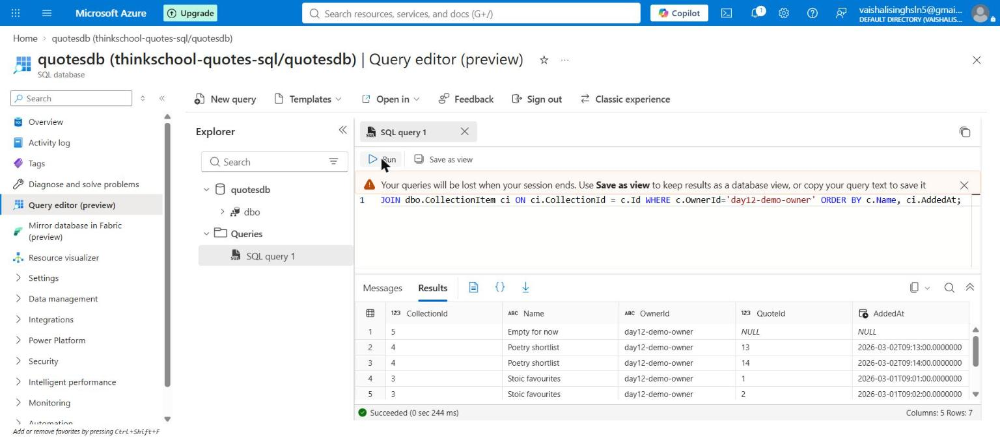
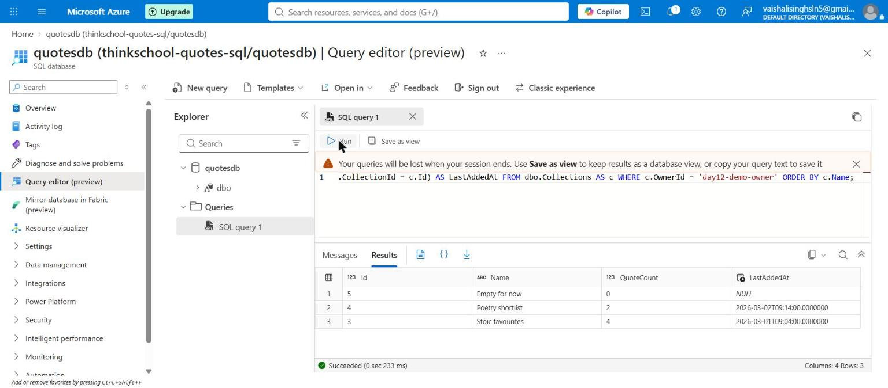

# Day 12 — mentor submission (read models + CQRS-lite)

## GitHub link

https://github.com/thinkbridge-thinkschool/VaishaleeSingh/pull/34

## In plain English

Reading data and writing data want different shapes, and using one shape for
both makes each one worse.

**Writing** needs rules. Creating a collection or adding a quote to it has to
respect: a name is 3–80 characters, at most 50 items, no duplicate quote. To
enforce those you have to load the real `Collection` object, because the rules
live inside it.

**Reading** needs whatever the screen shows. The "my collections" list shows a
name and "12 quotes" — it does not show the quotes. So loading every quote's
full text to render that list is pure waste.

CQRS-lite means exactly two paths, two shapes, one database. No event sourcing,
no message bus, no extra infrastructure.

## What this task asks for, and what I actually found

The exercise says "split one feature into a write model and a read model", so I
expected to build both. The write model was already there and already good:
`Collection` has private setters, a validating constructor, and `AddItem` /
`RemoveItem` enforcing the invariants. Day 7 did that work.

The problem was one interface serving both jobs. `ICollectionRepository`
carried `ListByOwnerAsync` (a read, returning a read-shaped DTO) alongside
`GetByIdAsync` / `AddAsync` / `UpdateAsync` / `DeleteAsync` (writes, returning
the aggregate). Two kinds of method pulling one type in opposite directions:

- a repository that must serve **reads** gets pressure to expose query-shaped
  things — filters, paging, projections, "just give me the count" — until it is
  a thin wrapper over `DbContext`;
- a repository that must serve **writes** wants the opposite: a narrow surface
  returning whole aggregates, so invariants cannot be bypassed.

So the deliverable here was less "build a read model" than "stop one type from
doing two jobs".

## Implementation plan (written before the code)

1. **Add a query side**: `ICollectionQueries` + `CollectionQueries`, taking
   `QuotesDbContext` directly. No repository in front of it — a read model's
   value is being able to shape a query freely, and a repository would either
   restrict the shapes or grow a method per screen.
2. **Two read models, not one shared one** — one per screen. A shape shared
   between two screens becomes the union of both their needs, which means it
   over-fetches for whichever screen needs less. That is exactly what happened
   to `CollectionWithQuotes`.
3. **Narrow the write side**: remove `ListByOwnerAsync` from
   `ICollectionRepository` so it returns aggregates and nothing else.
4. **Point the two GET endpoints at the query side**, leave the three write
   endpoints on the repository. The split then shows up in the endpoint
   signatures, where a reader will actually see it.
5. **Prove it with tests rather than claims** — assert the round-trip count and
   assert on the generated SQL.
6. No MediatR, no handler interfaces. For one feature that machinery would be
   cost without benefit, and the exercise rules out event sourcing anyway.

## Files

New (3), in `Day7/piece2/QuotesApi` because a `.cs` file only compiles inside
the project:

```
QuotesApi/Models/CollectionReadModels.cs     the two read shapes
QuotesApi/Queries/ICollectionQueries.cs      the query-side contract
QuotesApi/Queries/CollectionQueries.cs       one projection per screen
```

Modified (5) — every one load-bearing:

| File | Why it had to change |
|---|---|
| `Extensions/CollectionEndpointExtensions.cs` | the two GETs now take `ICollectionQueries` — this *is* the split |
| `Extensions/InfrastructureExtensions.cs` | DI registration (6 lines) |
| `Repositories/ICollectionRepository.cs` | removing the read method is the split |
| `Repositories/CollectionRepository.cs` | removing its implementation |
| `Quotes.Tests.Unit/CollectionListingQueryCountTests.cs` | referenced the removed method — the build breaks otherwise |

Deleted (1): `Models/CollectionWithQuotes.cs` — orphaned once both screens had
their own shape. Removed rather than left as dead code inviting reuse of the
exact shape this task replaces.

## The split, as it appears in the endpoints

```csharp
// READ  — projection, AsNoTracking, shaped for one screen
group.MapGet("/",          async (ICollectionQueries queries, ...) => ...);
group.MapGet("/{id:int}",  async (ICollectionQueries queries, ...) => ...);

// WRITE — loads the real aggregate so its invariants are reachable
group.MapPost("/",                          async (ICollectionRepository repository, ...) => ...);
group.MapPost("/{id:int}/items",            async (ICollectionRepository repository, ...) => ...);
group.MapDelete("/{id:int}/items/{quoteId}", async (ICollectionRepository repository, ...) => ...);
```

You can now tell whether an endpoint commands or queries purely from the
dependency it asks for.

## What the read models look like

```csharp
// List screen: name + how big + when it last changed. No quotes.
public sealed record CollectionListItem(
    int Id, string Name, int QuoteCount, DateTime? LastAddedAt);

// Detail screen: the quotes, each with when it was added to THIS collection.
public sealed record CollectionDetail(
    int Id, string Name, int QuoteCount, IReadOnlyList<CollectionQuote> Quotes);

public sealed record CollectionQuote(
    int QuoteId, string Author, string Text, DateTime AddedAt);
```

`AddedAt` is worth pointing at. It belongs to the *relationship* between a
collection and a quote, not to the quote — and the old shared read shape
silently dropped it, so a detail screen could not have shown "added 3 days
ago". Nobody noticed the field was missing because no screen owned the shape.
A projection can flatten fields from two tables into one result without either
entity gaining a reference to the other; that is the freedom the read side is
supposed to have.

## The SQL, captured from a test rather than claimed

`ICollectionQueries` promises "one query, only what the screen shows". Both
halves of that are checkable, so the tests check them.

**List read model — one statement, and `Quotes` never appears:**

```sql
SELECT "c"."Id", "c"."Name", (
    SELECT COUNT(*)
    FROM "CollectionItem" AS "c0"
    WHERE "c"."Id" = "c0"."CollectionId"), (
    SELECT MAX("c1"."AddedAt")
    FROM "CollectionItem" AS "c1"
    WHERE "c"."Id" = "c1"."CollectionId")
FROM "Collections" AS "c"
WHERE "c"."OwnerId" = @ownerId
ORDER BY "c"."Name"
```

The count and the timestamp are correlated subqueries over the owned
`CollectionItem` table. The `Quotes` table is not in the query at all —
asserted, not assumed:

```csharp
sql.Should().NotContain(
    "Quotes",
    "the list screen renders no quotes, so the Quotes table has no business in its query");
```

**Detail read model — one statement, with the join:**

```sql
SELECT "c2"."Id", "c2"."Name", "c2"."c",
       "s"."Id", "s"."Author", "s"."Text", "s"."AddedAt", "s"."CollectionId", "s"."QuoteId"
FROM (
    SELECT "c"."Id", "c"."Name", (
        SELECT COUNT(*) FROM "CollectionItem" AS "c0"
        WHERE "c"."Id" = "c0"."CollectionId") AS "c"
    FROM "Collections" AS "c"
    WHERE "c"."Id" = @id
    LIMIT 1
) AS "c2"
LEFT JOIN (
    SELECT "q"."Id", "q"."Author", "q"."Text",
           "c1"."AddedAt", "c1"."CollectionId", "c1"."QuoteId"
    FROM "CollectionItem" AS "c1"
    INNER JOIN "Quotes" AS "q" ON "c1"."QuoteId" = "q"."Id"
) AS "s" ...
```

Note EF chose a **LEFT JOIN** for the nested collection. That is what keeps
"collection exists but is empty" distinguishable from "collection not found" —
an empty collection still returns its header row, so `FirstOrDefaultAsync`
returns an object with zero quotes rather than null. I did not have to force
that; it falls out of projecting a nested collection.

## What this replaced

The removed `CollectionRepository.ListByOwnerAsync` was not buggy. It was a
read being served by a type whose job is writes, and it took the predictable
shape of one:

- loaded every `Collection` **aggregate** for the owner, with all owned items;
- gathered every quote id across all of them;
- ran a **second** query for those quotes — selecting `Author` **and the full
  `Text`**;
- reshaped the result in memory.

Two round trips, aggregates materialized only to be projected away, and full
quote bodies fetched for a list screen that renders none of them. With 15
collections of up to 50 quotes that is up to 750 quote bodies to draw 15 rows.

The read model is one round trip and never touches the quotes table.

## Tests

8 tests, all passing:

```
Passed!  - Failed: 0, Passed: 8, Skipped: 0, Total: 8, Duration: 2 s
```

| Test | What it pins |
|---|---|
| `List_CostsExactlyOneRoundTrip_RegardlessOfCollectionCount` | exactly 1, and constant at 3 vs 15 collections |
| `List_ReturnsDenormalizedCountPerCollection` | the count is right |
| `List_EmptyCollection_ReportsZeroCountAndNullTimestamp` | `MAX` over no rows is SQL `NULL` |
| `List_WithNoCollections_StillCostsOneRoundTrip` | no owner rows still costs 1 |
| `Detail_CostsOneRoundTrip_AndCarriesQuotesWithAddedAt` | 1 statement, quotes ordered by `AddedAt` |
| `Detail_UnknownId_ReturnsNull` | a missing id is a 404, not an exception |
| `List_Sql_IsOneStatement_AndNeverFetchesQuoteText` | the generated SQL omits `Quotes` |
| `Detail_Sql_IsOneStatement_AndJoinsQuotesExactlyOnce` | the nested projection stays one statement |

The old version of this file asserted round trips were *constant at two*. The
read model makes **one** achievable, so the test now asserts one — asserting
the weaker property would let a regression back to two pass unnoticed.

Two of these exist because I flagged the underlying constructs as risky before
running anything, and wanted the answer recorded either way:

- **`c.Items.Max(i => (DateTime?)i.AddedAt)`** — a correlated `MAX` over an
  owned collection. Without the `(DateTime?)` cast EF materializes SQL `NULL`
  into a non-nullable `DateTime` and throws, and an empty collection is an
  ordinary state, not an edge case.
- **the nested collection projection with a join** — the least certain thing I
  wrote. If EF ever splits it into two statements the assertion fails rather
  than the regression going unnoticed.

Both translate. The round-trip assertions passing is the proof.

## The two shapes, against a real SQL Server

Run against the live `quotesdb` (Azure SQL Database). The write-model tables
did not exist there — that database was built by hand for Days 8–11 and has
never had EF migrations applied to it — so `dbo.Collections` and
`dbo.CollectionItem` were created to match the EF schema, then seeded with
three collections (4 items, 2 items, and one deliberately empty).

**The write model — normalized.** One row per collection-item, so the
collection's name and owner repeat on every row. Good for writing: each fact is
stored once, and a new item is one insert.



**The read model — denormalized.** The same data, projected the way the list
screen consumes it: one row per collection, with the count and the last-added
timestamp computed in SQL.



**7 rows become 3.** And "Empty for now" comes back as `0` / `NULL`, which is
the exact case the nullable-cast test guards — the behaviour is the same on
SQL Server as on the SQLite the tests run against.

## What did you learn this session?

That "split reads from writes" is mostly a question about *who owns the shape*.
The read model's value is not that it is faster (though it is); it is that a
specific screen owns it, so someone is accountable for what it contains. The
clearest evidence was `AddedAt`: the shared read shape had been missing a field
a detail screen would obviously want, and it went unnoticed for days because no
screen owned that shape. A shape shared between two screens ends up being the
union of their needs and the responsibility of neither.

The second thing: a claim in a comment is worth much less than an assertion. I
wrote "shaped for the screen, so it does not fetch the text" — and then it
occurred to me that this is a *checkable* statement. The interceptor was
already seeing every command for the round-trip count, so recording
`CommandText` cost nothing and turned that comment into
`sql.Should().NotContain("Quotes")`. Now the build enforces it, and the day
someone adds a quote preview to the list read model they will be told they have
changed something the screen's contract depended on.

## What would break this?

- **The two paths share one database, so they share one schema.** This is
  CQRS-lite, not CQRS: there is no separate read store and no projection
  pipeline, so a schema change still affects both sides at once. The benefit is
  shape and ownership, not independence — and it is worth being clear about
  that, because "we do CQRS" often implies the heavier version.
- **A read model is only cheap while it stays a projection.** The moment
  someone needs a value the database cannot compute, the temptation is to
  materialize entities and finish the job in C# — which is exactly how the old
  repository read ended up loading aggregates. The SQL assertion is a guard
  against that drift, but only for the columns it names.
- **`CollectionDetail` has no paging.** `Collection` caps items at 50, so
  today the worst case is 50 quotes with full text, which is fine. That cap is
  an invariant of the *write* model, though — raise it and this read model
  silently starts returning unbounded payloads. A read model whose safety
  depends on a write-side rule is a coupling worth remembering.
- **The Azure evidence is a faithful reconstruction, not the app's own
  tables.** `dbo.Collections` / `dbo.CollectionItem` were created by hand there
  to match the EF schema; the API itself runs against local SQLite. The shapes
  and the SQL are the same, but nothing in that screenshot was written by the
  running application.
- **Deleting `CollectionWithQuotes` was a judgement call, not a requirement.**
  The build works with it present, just unused. I removed it because dead code
  that models the superseded approach is an invitation to reintroduce it — but
  it is the one change in this task that was optional rather than forced.
