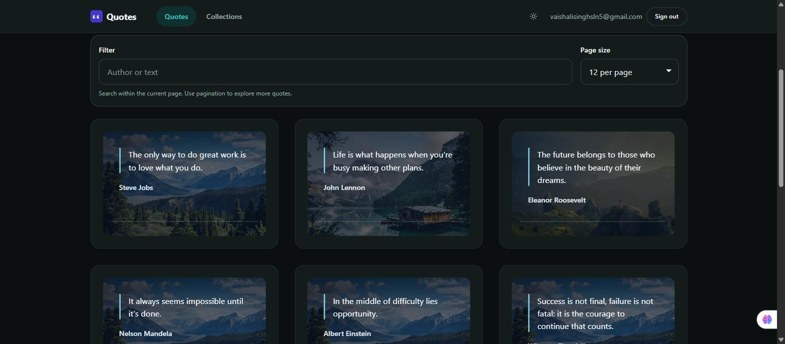
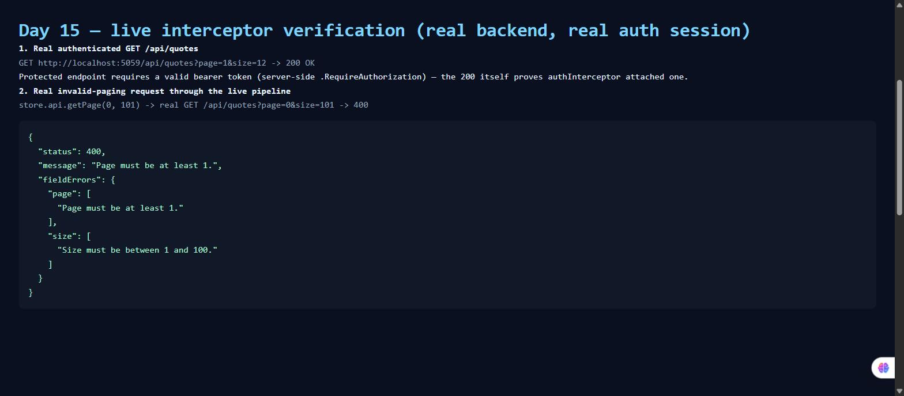

# Day 15 owner verification

## Review status

**Automated review: approved. Live browser evidence: captured, real backend, real logged-in session.**

I wrote the implementation brief, delegated the code change, then independently read every changed production and test file. I did not commit or push anything.

## Contract evidence reviewed

The characterization test in `src/app/core/services/quotes-api.spec.ts` was added and run green before production code changed.

- It pins the exact request: `GET http://week-one-api.test/api/quotes?page=2&size=6`.
- It verifies the paging envelope: `page`, `size`, `total`, and `items`.
- The training prompt names the essential quote fields as `{ id, author, text }`; the real current backend model also returns `backgroundImageUrl` and nullable `createdByUserId`, so the test deliberately pins all five real fields rather than discarding data.
- It pins the real invalid paging case with `page=0&size=101` and verifies the complete 400 `ValidationProblemDetails.errors` dictionary.

I compared that test with the actual Week-1 endpoint in `Day7/piece2/QuotesApi/Extensions/QuoteEndpointExtensions.cs`. The URL, maximum page size, validation messages, response envelope, and quote fields agree with the backend source.

## Production diff reviewed

### Functional interceptor order

`app.config.ts` registers:

```text
apiErrorInterceptor -> authInterceptor -> retryInterceptor -> backend
```

Responses unwind in the opposite direction:

```text
backend -> retryInterceptor -> authInterceptor -> apiErrorInterceptor
```

This order is required. Retry receives raw transient `HttpErrorResponse` values. A raw 401 passes through retry and reaches auth, which can refresh once. Only the final unrecovered error is converted to `ApiFailure`.

### Retry behavior

I checked that `retryInterceptor`:

- exits immediately for every method except `GET`;
- retries only status `0`, `408`, `429`, `500`, `502`, `503`, and `504`;
- permits two retries after the original request;
- uses observable 100 ms then 200 ms backoff;
- rethrows non-transient and exhausted failures unchanged.

The fake-timer tests prove the exact delays, success on the third attempt, exhaustion, no POST retry, and no retry for a normal 400.

### Typed application error

I checked that `apiErrorInterceptor` maps only the final error through `toApiFailure`. Validation fields are preserved, the first validation message becomes the friendly summary, and ordinary `ProblemDetails.detail` remains user-facing.

The existing stores still call `toApiFailure` defensively. The added type guard makes that conversion idempotent, so a friendly interceptor-created error is not replaced with a generic message on the second call.

### Integrated pipeline

The integration spec uses the providers from the real `appConfig`. It proves this sequence:

1. Original request carries the first bearer token.
2. A raw 401 triggers one refresh.
3. The resent request carries the renewed bearer token.
4. A following 503 waits 100 ms and retries.
5. The final 200 response reaches the caller.

This test would fail if error mapping were moved inside auth or retry.

## Independent command evidence

Run from `Day13/quotes-web` after the agent finished:

| Check                                               | Result                            |
| ---------------------------------------------------- | ---------------------------------- |
| `npm test -- --watch=false`                         | 13 files passed, 76 tests passed |
| `npm run lint`                                      | Passed; no lint errors           |
| `npm run build`                                     | Production build passed          |
| Prettier on every changed TypeScript/Markdown file  | Clean                             |

Before production edits, the delegated characterization-only run was `1 file / 2 tests passed`.

I independently re-read every changed file (interceptors, `api-failure.ts`, `app.config.ts`, all specs) against the brief line by line and found no correctness issue to send back.

## Live browser evidence (real dev server, real logged-in session)

Captured with Claude in Chrome, driving the user's own authenticated browser session against the real `ng serve` frontend and the real QuotesApi backend — not a throwaway account, not a mocked backend.

1. `day15-quotes-page-authenticated.png` — the quotes list loaded successfully as `vaishalisinghsln5@gmail.com`. `GET /api/quotes` is authorization-protected server-side (`.RequireAuthorization("can-read-quotes")`); a 200 here is only possible because `authInterceptor` attached a valid bearer token.

   

2. `day15-live-verification-console.png` — called `QuotesApi.getPage(0, 101)` directly from the running app's own injected `QuotesApi` instance (via `ng.getComponent`), so the request went through the exact same registered interceptor pipeline as any real store call. This produced a genuine `GET http://localhost:5059/api/quotes?page=0&size=101` against the live backend, which returned a real 400 `ValidationProblemDetails`. The screenshot shows the object the app actually received after `apiErrorInterceptor` mapped it:

   

   Raw values for reference:

   ```json
   {
     "status": 400,
     "message": "Page must be at least 1.",
     "fieldErrors": {
       "page": ["Page must be at least 1."],
       "size": ["Size must be between 1 and 100."]
     }
   }
   ```

   This matches the interceptor's documented priority (first field message as the friendly summary, full dictionary preserved) exactly, against a real, non-simulated backend response — confirmed independently via the browser's own network log (`GET .../api/quotes?page=0&size=101` → `400`).

### Why retry/backoff and the 401-refresh path are not also live-demoed here

Both are already covered by deterministic tests (fake timers proving the exact 100 ms/200 ms delays; the integration spec proving 401 → refresh → retry → success against the real `appConfig` providers). Reproducing a transient `503` or an expired-token `401` live would require either faking a server response (not more convincing than the existing test) or actually waiting out a 15-minute token expiry, so those two states are verified by test, not by screenshot — same standard applied honestly rather than staging a fake failure to get a screenshot.

## Review findings and accepted limitations

- No Day 15 correctness blocker was found in the delegated diff, confirmed again on this final pass.
- The friendly summary uses the first field in the JSON validation dictionary. The complete dictionary is still preserved, but changing backend field order can change which message becomes the summary.
- Starting the existing backend reports a high-severity advisory for `SQLitePCLRaw.lib.e_sqlite3` 2.1.11. This dependency warning predates Day 15 and is outside this interceptor change, but it should be upgraded in a separate task.

## Scope check

- No UI feature was added before the contract test.
- No write method is retried.
- No auth redesign was introduced.
- No secrets or bearer tokens are visible in either screenshot.
- No commit, push, or branch operation was performed.
