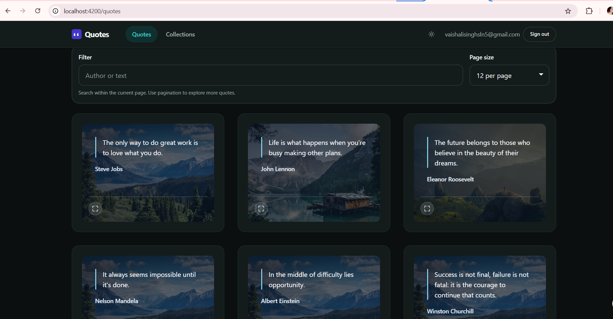
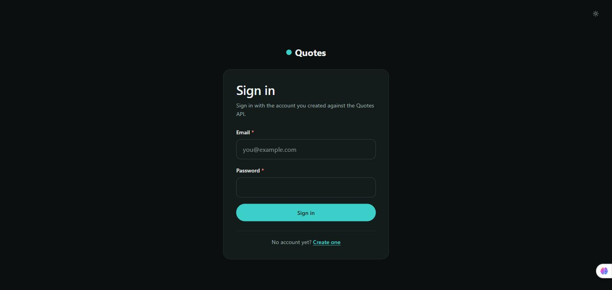
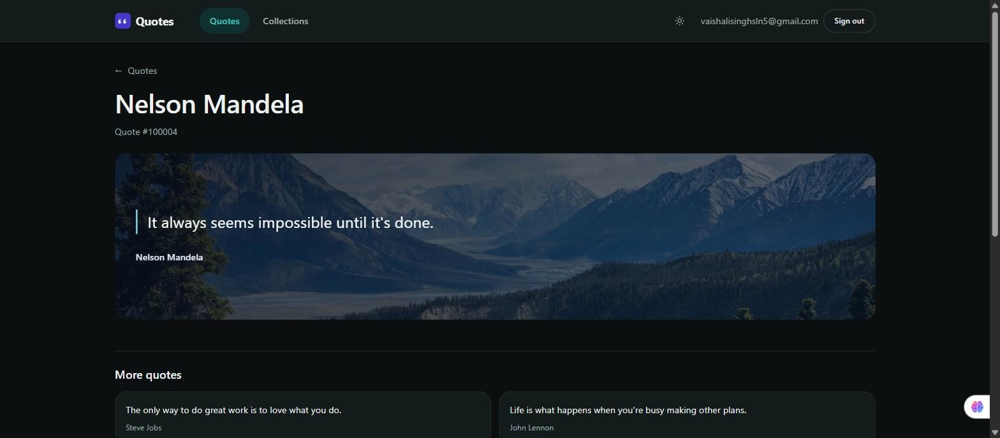

# Day 16 — Routing, lazy loading, guards: answer

## Starting point

Reading the actual source before writing anything showed three of the four required pieces already existed from earlier days:

- Every route in `app.routes.ts` is `loadComponent`-based (lazy).
- `authGuard`/`guestGuard` in `core/guards/auth-guard.ts` already gate every authenticated route and already redirect to `/sign-in?returnUrl=...`.
- `quotes/:id` already exists, backed by the real `GET /api/quotes/{id}`, with a defensive id parser (`parseQuoteId`) that rejects `0x10`, `007`, and out-of-safe-integer-range values rather than trusting a bare `Number(raw)`.

The only missing piece was the View Transition between the quotes list and a quote's detail page — and there was no existing navigation path from the list into `/quotes/:id` at all (the card's only click target opened an in-page modal preview). The brief: `Day16/docs/day16-routing-agent-brief.md`.

## What was built

- `app.config.ts` — `withViewTransitions({ skipInitialTransition: true })` added to `provideRouter`.
- `quote-card.ts`/`.html`/`.scss` — a real `routerLink` to `/quotes/:id` added as a small circular expand-icon button in the card footer (inline SVG, same pattern as the existing theme-toggle icon; the visible label is the glyph, the accessible name is `aria-label="Open the full page for the quote by <author>"`), additive to (not replacing) the existing modal preview button. `[style.view-transition-name]="'quote-image-' + quote().id"` added to the card's visual element.
- `quote-detail-page.html` — the matching `[style.view-transition-name]="'quote-image-' + quote.id"` on the detail page's equivalent element, so the two share an anchor for the browser to morph between.
- `_animations.scss` — the existing global `prefers-reduced-motion` block extended to explicitly cover `::view-transition-old/new/group`, since those pseudo-elements aren't reached by the existing `*`/`*::before`/`*::after` rule.

## Diff review notes

- The new link is genuinely additive: the modal-opening `<button>` inside the card is untouched, so nothing about the existing "click a card to preview" flow changed.
- `view-transition-name` values are per-quote-id, so no collision between simultaneously-rendered cards, and the list page's card and the detail page's article never coexist with the same name at once.
- `skipInitialTransition: true` avoids an animation firing on the very first render, which isn't a navigation from anything.

## Verification log — done independently, not taken on the diff's word

**1. The expand icon on the list, as it actually renders**



**2. Lazy loading (Network tab, real dev server)**

Cleared network tracking, loaded `/quotes` — no `quote-detail-page` chunk requested. Clicked the expand icon on a real card (quote #100001) — only then did the browser request it:

```
GET http://localhost:4200/@ng/component?c=app%2Ffeatures%2Fquotes%2Fpages%2Fquote-detail-page%2Fquote-detail-page.ts%40QuoteDetailPage
-> 200
```

confirming the detail page's code is not downloaded until the moment it's actually navigated to.

**3. Auth guard (real redirect, not read from the guard's source)**

Opened `/quotes` in a fresh, signed-out browser tab (no shared session). Real result: immediate redirect to

```
http://localhost:4200/sign-in?returnUrl=%2Fquotes
```



**4. Route param + real API-backed detail page**

Clicked the expand icon on the Nelson Mandela card. Real URL became `/quotes/100004`, and the page rendered the real quote fetched from the real backend, plus a real "More quotes" list.



**5. View Transition actually fires (not just "the browser supports the API")**

Confirmed `typeof document.startViewTransition === 'function'` in the real browser (true). That alone doesn't prove Angular calls it, so `document.startViewTransition` was wrapped with a counting proxy, then a real SPA navigation was made (detail page → breadcrumb link back to the list). Result: the wrapped function was called exactly once for that one navigation, confirming `withViewTransitions()` is wired correctly and firing on real navigations, not silently no-op'ing.

## What breaks if this changes

- Removing `skipInitialTransition` would make the very first app load also animate a transition from nothing, which is visually meaningless and would need to be caught by eye, not by a test.
- If the expand-icon link were ever removed without another real navigation path added, the View Transition would have nothing to fire on — the API existing in the browser doesn't mean Angular's router is actually invoking it, which is exactly what the `startViewTransition` call-counting check above exists to catch.
- A `view-transition-name` collision (two elements sharing the same name at once) would make the browser skip the transition and log a warning rather than crash — worth knowing if a future page ever renders two cards for the same quote id at once (unlikely today).
- If the API ever changed `id` to a non-numeric identifier (a UUID, say), `parseQuoteId`'s digits-only regex would reject every real id and the detail page would always show "not a quote id" — this would need updating alongside the contract change, the same category of risk called out in Day 15's characterization test.
