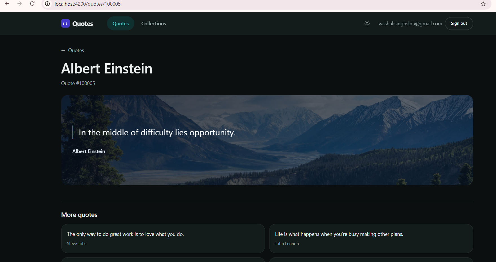
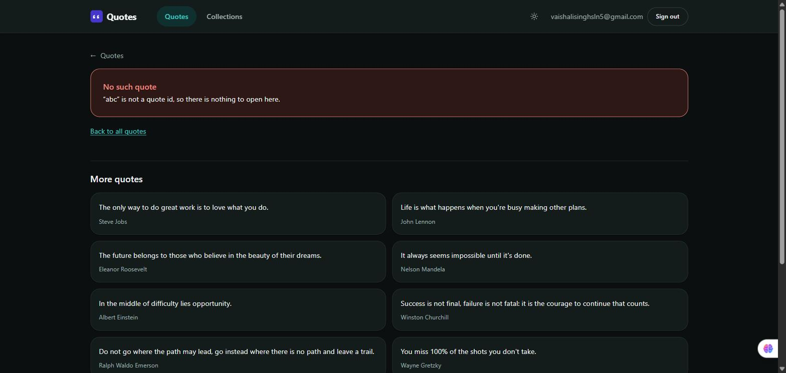

# Day 16 — Routing, lazy loading, guards: submission

## Exercise

MY BRIEF TO THE AGENT

Read Day16/docs/day16-routing-agent-brief.md before assuming anything needs
building: verify what already exists (lazy loading, the functional auth
guard, route params) against the real source rather than rebuilding it, and
scope new work to only what's actually missing -- the View Transition
between the quotes list and a quote's detail page. Real endpoint involved:
GET /api/quotes/{id}, real id field: Quote.id (a number, e.g. 100004).
Enable withViewTransitions() on the router; add a real routerLink from each
quote card into quotes/:id (an icon button, not a text link); share a
view-transition-name between the card and the detail page's matching
element; extend the app's existing prefers-reduced-motion rule to actually
cover the View Transition's own pseudo-elements. Verify every claim live,
don't take the diff's word for it.

ROUTE CONFIG (app.routes.ts)

```
{
  path: 'quotes',
  loadComponent: () => import('.../quotes-page').then(m => m.QuotesPage),
}
{
  path: 'quotes/:id',
  loadComponent: () => import('.../quote-detail-page').then(m => m.QuoteDetailPage),
}
```

Both `loadComponent` -- lazy by construction, nothing eagerly imported.

GUARD (core/guards/auth-guard.ts)

```ts
export const authGuard: CanActivateFn = (_route, state) => {
  const authStore = inject(AuthStore);
  const router = inject(Router);
  if (authStore.isAuthenticated()) return true;
  return router.createUrlTree(['/sign-in'], {
    queryParams: { returnUrl: state.url },
  });
};
```

Applied on the parent route, so every child (including `quotes/:id`) is
protected by default, not by remembering to add it per-route.

DETAIL ROUTE (quote-detail-page.ts)

Reads `:id` via `route.paramMap` (not a one-time snapshot, so `/quotes/1` ->
`/quotes/2` re-loads correctly). Parses it with a digits-only regex
(`parseQuoteId`) before ever calling the API -- rejects `0x10`, `007`,
`abc` -- then calls `QuoteDetailStore.load(id)`, which hits the real
`GET /api/quotes/{id}` and shows one of: loading / the real quote / a 404
("no such quote") / a malformed-id message, mutually exclusive by
construction.

VERIFICATION LOG -- STATES/EDGES ACTUALLY EXERCISED

- **Guard pass (authenticated)**: signed-in session opened `/quotes/100004`
  via a real click -- real quote loaded, real URL, no redirect.
- **Guard redirect (unauthenticated)**: opened `/quotes` in a FRESH,
  signed-out tab -- real redirect to `/sign-in?returnUrl=%2Fquotes`.
- **Lazy chunk loading (Network tab)**: cleared network log, loaded
  `/quotes` -- zero requests for `quote-detail-page`. Clicked into a quote
  -- exactly then, `GET .../quote-detail-page.ts@QuoteDetailPage -> 200`.
  Not downloaded before it's needed.
- **Missing/invalid route param**: navigated directly to `/quotes/abc`
  (real, not simulated) -- real result: "No such quote — 'abc' is not a
  quote id, so there is nothing to open here," no API call made for it at
  all (`parseQuoteId` rejects it client-side before ever hitting
  `GET /api/quotes/{id}`).
- **View Transition actually fires**, not just "the API exists": wrapped
  `document.startViewTransition` with a counting proxy, made one real SPA
  navigation (detail page -> breadcrumb back to list) -- called exactly
  once, confirming Angular's `withViewTransitions()` is really invoking it.

ONE WRONG ASSUMPTION I CAUGHT AND FIXED

Before writing any code I assumed clicking a quote card already navigated
into `quotes/:id`, since that route (backed by the real `GET /api/quotes/{id}`
and its `id` field) already existed. Reading `quote-card.html` and
`quotes-page.ts` showed the card's only click target opens an in-page modal
preview -- there was no real router navigation into `quotes/:id` from the
list at all. Fixed by adding an actual `routerLink` (an icon button) to the
card, additive to the existing modal, so the id-backed detail route the
app already had was finally reachable from the list -- and so the View
Transition would have a real navigation to fire on.

WHAT BREAKS IF THE DETAIL ROUTE OR ID FIELD CHANGES

If `GET /api/quotes/{id}` ever used a non-numeric id (a UUID, say),
`parseQuoteId`'s digits-only regex would reject every real id and the page
would always show "no such quote" -- that check would need updating
alongside the contract change. If the route path itself changed away from
`quotes/:id`, the new icon link's `routerLink` array
(`['/quotes', quote().id]`) and the `view-transition-name` pairing between
card and detail page would both silently stop matching up, and the
transition would just stop happening (no crash, no error -- it would need
to be caught by eye or by the `startViewTransition` call-count check, same
as it was caught here).

## Screenshots





