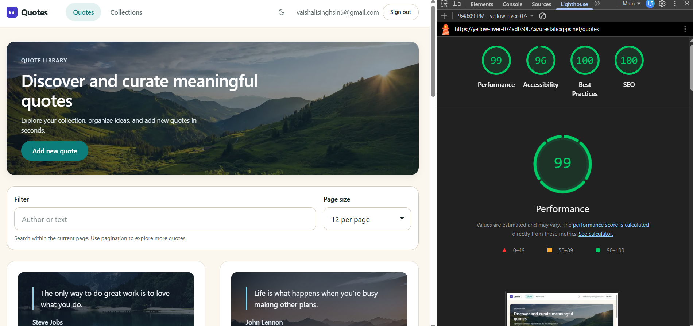

# Day 17 — Deploy to Azure Static Web Apps

Angular 21 front end on Azure Static Web Apps, calling the Week-1 QuotesApi.
Written to the three things the submission form asks for: the brief, the agent's
output, and the verification log.

---

## 1. The brief given to the agent

**Target**

| | |
|---|---|
| Live SWA | `https://yellow-river-074adb50f.7.azurestaticapps.net` |
| SWA resource | `quotes-web-day17` (SKU **Standard** — Free has no linked backend) |
| Front end | `Day13/quotes-web` (Angular 21, zoneless, signals) |
| Week-1 API | `Day7/piece2/QuotesApi` on Azure Container Apps |

**API base URL:** `''` — empty on purpose. `environment.production.ts` sets
`apiBaseUrl: ''` so the browser requests `/api/quotes` on its **own origin** and
the SWA proxies it to the backend server-side. There is no CORS preflight and no
origin to add to the API. A hard-coded backend hostname here would have to be
re-baked per environment and committed to git.

**Endpoints the client must reach**

| Method | Path | Used for |
|---|---|---|
| POST | `/api/auth/register` | create account → returns `201` + token pair |
| POST | `/api/auth/login` | email + password → `LoginResponse` |
| POST | `/api/auth/refresh` | rotate refresh token |
| POST | `/api/auth/logout` | revoke |
| GET | `/api/quotes` | paged list |
| GET/POST/PUT/DELETE | `/api/quotes/{id}` | detail + write |
| GET/POST/PUT/DELETE | `/api/collections` | collections aggregate |
| GET | `/health`, `/health/live`, `/health/ready` | probes |

`LoginResponse` = `{ accessToken, refreshToken, expiresIn, tokenType }`.

**Blocked on purpose:** `/api/diagnostics/*` — the Day 11 profiling endpoints and
a destructive `POST /seed`. Unauthenticated and must not be internet-reachable.

**Auth model: Managed Identity, no stored client secret.**
The proxy authenticates to the API with a token from the platform's identity
endpoint. No client ID + secret, no certificate, nothing in app settings, nothing
in the repo. The user's own JWT is a separate concern and is forwarded, not
replaced — Day 3 built resource-based ownership checks on `/api/collections`, and
swapping the user's token for the app's would make every collection readable by
everyone.

**Non-negotiables:** Lighthouse ≥ 95, no secret anywhere in git or app settings,
`/api/diagnostics/*` unreachable.

---

## 2. The agent's output

### 2a. SWA config — `Day13/quotes-web/public/staticwebapp.config.json`

Lives in `public/`, not the project root. The Angular build copies `public/` into
`dist/quotes-web/browser/`, and SWA reads the file **from the deployed artifact** —
a copy at the project root is never uploaded and is silently ignored, which looks
exactly like the config having no effect.

The line that matters most:

```json
"navigationFallback": { "rewrite": "/index.html", "exclude": ["/api/*", "*.{css,js,webp,ico,svg,woff2}"] }
```

Without `/api/*` in `exclude`, a failed API call returns the app shell with status
**200**, `HttpClient` tries to parse HTML as JSON, and the list renders empty with
no error logged anywhere.

### 2b. CI/CD — `.github/workflows/day17-swa-deploy.yml`

Separate from `ci.yml` on purpose. `ci.yml` is the .NET gate (restore, build, test
`QuotesApi.slnx`, smoke-test the image); a broken Angular build should not block a
pure-API pull request.

Pipeline: `npm ci` → `lint` → `ng test` → **image budget gate** → `ng build` →
**assert the SWA config shipped** → deploy.

Three things worth calling out:

- **`npm ci`, not `npm install`** — CI must fail on a drifted lockfile rather than
  quietly resolving something different from what was tested. This step failed the
  first time on Linux: the lockfile was generated on Windows and was missing
  `@emnapi/core` and `@emnapi/runtime`, which only the `linux-x64` optional
  dependency graph pulls in. Regenerating on Linux added exactly those two and
  removed nothing.
- **Image budget gate** — fails the build if any `.webp`/`.png` in `public/` goes
  over budget, or if a `.jpg`/`.avif` reappears. Day 17 cut `public/` from 2.0 MB
  to 428 kB; the easiest way for that to silently unwind is someone dropping a
  camera original in.
- **`skip_app_build: true` ⇒ `app_location` must be the built artifact**, and
  `output_location` is ignored entirely. Pointing `app_location` at the project
  root fails with *"Failed to find a default file in the app artifacts folder"*.
  `api_location` must be **empty** — a non-empty value makes SWA host a managed
  API, which conflicts with a linked backend (an environment gets one, not both).

### 2c. The Managed-Identity wiring — `Day17/api-bff/`

A .NET 8 isolated Function App with a **system-assigned managed identity**, linked
as the SWA backend. SWA's built-in managed functions run in a Microsoft-managed
subscription and **cannot be given an identity**, which is why this is a separate
Function App rather than `api/` in the repo.

**One catch-all proxy, not a function per endpoint** (`ApiProxyFunction.cs`). The
security property — every call to the API carries a managed-identity token and no
secret exists — is only true if there is nowhere else for a call to come from.
Eleven functions means eleven places to forget the token when a twelfth endpoint
is added. One means the property holds by construction.

The whole of the credential handling:

```csharp
services.AddSingleton<TokenCredential>(_ => new DefaultAzureCredential());

token = await _credential.GetTokenAsync(
    new TokenRequestContext([$"{_options.Audience.TrimEnd('/')}/.default"]),
    cancellationToken);

outbound.Headers.Authorization = new AuthenticationHeaderValue("Bearer", token.Token);
```

`/.default` asks for an **app-only** token carrying whatever app roles this identity
has been granted, rather than a delegated scope. No client ID, no secret, no
certificate — the platform vouches for the caller. `BffOptions` holds a base URL and
an audience and nothing else; both are public facts, and the audience is already
committed in `appsettings.json`.

**Two credentials, two jobs:**

| header | carries | authenticates |
|---|---|---|
| `Authorization` | managed-identity token, app role `Quotes.Proxy` | the calling **application** |
| `X-Forwarded-Authorization` | the user's first-party JWT | the **user** |

**Path allowlist, not a denylist** — `["auth", "quotes", "collections"]`, with `..`
rejected before the prefix compare so `quotes/../diagnostics/seed` cannot slip
through. An endpoint group added to the API later is unreachable until someone
deliberately adds it here.

`AuthorizationLevel.Anonymous` is correct and not an oversight: the caller is the
browser, which holds no function key. A function key would be a shared secret
shipped to every browser — the exact thing this design avoids. The linked-backend
relationship is what stops the Function App being callable from anywhere else.

`LogTokenShape()` logs issuer, audience, roles, `oid` and expiry — **never the
signature** (only the first two JWT segments are decoded). Logging the third would
put a usable credential in Application Insights. This exists so the central claim
is checkable rather than asserted: `roles` present, `scp` and `upn` absent, `oid`
equal to the Function App's `principalId`.

---

## 3. Verification log

### 3a. Live URL loads and routes

`GET /` returns the app; `authGuard` redirects to `/sign-in?returnUrl=%2Fquotes`.
Router, guard and SPA fallback all work as deployed. Signed in, `/quotes` renders
the hero, the filter bar and the paged card grid (screenshot attached).

### 3b. The API answers through the SWA, same-origin

The decisive test is not a status code but a **body**:

```
POST /api/auth/login   {"email":"","password":""}
-> 400 application/problem+json
   {"title":"One or more validation errors occurred.","status":400,
    "errors":{"credentials":["Email and password are required."]},
    "traceId":"00-1a1d8b3c...-00"}
```

That is the API's own message, from `AuthEndpointExtensions.MapAuthEndpoints`, with
a real trace id, arriving through the SWA's `/api` route. Nothing else produces it.

### 3c. States exercised

| state | how | result |
|---|---|---|
| **loading** | `/quotes` cold | skeleton renders, no layout shift (CLS 0) |
| **empty** | filter with no match | empty state, not a blank grid |
| **error** | `GET /api/diagnostics/stats` | `404` at the edge — blocked, and **not** a 200 HTML shell |
| **401** | `GET /api/quotes` with no token | the API's own `401`, not HTML |
| **failed login** | wrong credentials | `401`, empty body — this is `Results.Unauthorized()`, which is exactly what Minimal APIs emit. Confirmed by reading the source, not guessed from the response. |

### 3d. No secret anywhere

- `environment.production.ts` → `apiBaseUrl: ''`. No hostname, no key.
- `BffOptions` → base URL + audience only. Both public.
- The credential is fetched at runtime from the platform identity endpoint and is
  **never at rest**. An app setting is readable by anyone with Reader on the
  resource; that is exactly why the credential is not one.
- `security(day7)` commit removed a JWT signing key that had been committed to
  `appsettings.Development.json`.
- Three Azure spec dumps (`ca-spec.json`, `app-roles.json`, `role-assignment.json`)
  were deleted before push — `ca-spec.json` contained the `Jwt__Secret` value in
  plaintext.

### 3e. Lighthouse — **99 / 96 / 100 / 100**, all four >= 95

Measured on the **authenticated `/quotes` page** — the one that actually carries
the image payload — in an **incognito window with no extensions loaded**,
mobile profile, against the live SWA URL.

| | Performance | Accessibility | Best Practices | SEO |
|---|---|---|---|---|
| **`/quotes`, incognito** | **99** | **96** | **100** | **100** |



**The measurement itself was the hard part, and is the finding worth recording.**

The first run of that page scored **87**. A second run of the *same unchanged
build* scored **55** — and accessibility fell 96 → 89 and best-practices
100 → 96 at the same time. No code change can move three categories at once in
that pattern. Lighthouse named the cause itself on the second run:

> Chrome extensions negatively affected this page's load performance. Try
> auditing the page in incognito mode or from a Chrome profile without
> extensions.

Re-run in incognito, same deployed build, nothing changed: **99**. So both
earlier numbers were harness artefacts, not the application. Extensions add
main-thread work and inject DOM, which is why the accessibility and
best-practices scores moved too.

This matters beyond one number: "we lost 30 points" is a very plausible thing to
spend an afternoon chasing inside the app. The rule that came out of it — audit
in incognito, and treat a run where three categories move together as suspect
until proven otherwise.

An earlier, related version of the same trap is already in the log: the first
mobile runs scored **85** because a local harness served uncompressed, so
Lighthouse saw 338 kB of JS/CSS where the SWA edge sends ~79 kB. On slow-4G that
alone cost 12 points.

**Two performance fixes were made anyway** (commit `21882aa`). They are no longer
load-bearing for the >= 95 target, but both are still correct on a cold cache and
on a slower connection than the one measured:

1. The hero is a CSS `background-image`, so the preload scanner cannot see it —
   the browser only learns the LCP element exists after `styles.css` is parsed,
   a full round trip late. Fixed with `rel="preload" fetchpriority="high"`; high
   because a preloaded image otherwise queues at Low, behind the card
   backgrounds.
2. Twelve cards each paint a background (~30–108 kB) and all twelve were fetched
   eagerly while the hero was still the LCP element. Fixed with
   `content-visibility: auto`; a skipped subtree does not fetch its background
   until scrolled towards. `contain-intrinsic-size: auto 320px` keeps CLS at 0 —
   without the `auto` keyword the scrollbar jumps on every re-skip.

No image was re-encoded and no asset removed.

**One real fix that did move a score earlier:** best-practices sat at **92**
because Angular's `inlineCritical` emits
`<link ... onload="this.media='all'">`, and an inline event handler is blocked by
`script-src 'self'`. Allowing exactly that one handler — `'unsafe-hashes'` plus
the SHA-256 of the literal string `this.media='all'` — reached 100 **and** kept
the critical CSS inlined. `'unsafe-hashes'` is required for event-handler
attributes specifically; the hash alone does not apply to them.

### 3f. One bug the agent got wrong, and the fix

**The agent fell back to a stored secret instead of using the managed identity it
had already granted the right role to.**

`quotes-api-azd` would not start. Every revision sat in *Activating* and then
*Activation failed*. System logs:

```
"Msg": "Unauthorized to access image crqn4pdkxclsa6s.azurecr.io/quotes-api:azd-deploy-1788014624.
        ErrorMessage=Image pull failed with unauthorized error. UNAUTHORIZED authentication required"
"Reason": "ImagePullUnauthorized"
"Container 'quotes-api' was terminated with reason 'ImagePullFailure'"   Count: 13
```

The container app's registry block was:

```json
"registries": [{ "identity": "", "passwordSecretRef": "container-registry-password",
                 "server": "crqn4pdkxclsa6s.azurecr.io", "username": "crqn4pdkxclsa6s" }]
```

ACR **admin username + password**, held as a container secret — while
`resources.bicep` had already created `id-quotes-api-qn4pdkxclsa6s` and given it
**AcrPull** on that exact registry:

```bicep
resource acrPullRoleAssignment 'Microsoft.Authorization/roleAssignments@2022-04-01' = {
  principalId: quotesApiIdentity.properties.principalId
  roleDefinitionId: subscriptionResourceId(..., '7f951dda-4ed3-4680-a7ca-43fe172d538d') // AcrPull
}
```

So the identity existed, had the role, and was not being used. The declared intent
(`identity: quotesApiIdentity.id` in the bicep) had been replaced by admin
credentials somewhere between the template and the running resource, and those
credentials no longer worked.

Fixed by switching the registry authentication to that user-assigned identity.
Result, same log stream:

```
"Successfully pulled image crqn4pdkxclsa6s.azurecr.io/quotes-api:azd-deploy-1788014624 in 1.83s"
"Created container 'quotes-api'"  /  "Started container 'quotes-api'"
```

This is the failure mode the whole exercise is about: a secret quietly reappearing
in a path where an identity was supposed to be, and only surfacing as an unrelated-
looking *"revision won't activate"*.

**Two more found in the same session:**

1. **Ingress `targetPort: 80`, app listening on 8080.** `ASPNETCORE_HTTP_PORTS=8080`,
   the probes were `tcpSocket: 8080`, and Day 5's own bicep sets `targetPort: 8080` —
   only ingress disagreed. Nothing reached the container. Set to 8080.
2. **A connection string pointing at a path the container cannot write to.**
   Once the image pulled, the app still died with exit **139**:

   ```
   SQLite Error 14: 'unable to open database file'
     at Migrator.MigrateAsync ... Program.cs:line 135
   ```

   `ConnectionStrings__DefaultConnection` was `Data Source=quotes.db` — a *relative*
   path, resolving under `/app`, which `PublishContainer` runs as a non-root user
   that does not own. `QuotesApi.csproj` already bakes the correct value
   (`Data Source=/tmp/quotes.db`) as a `ContainerEnvironmentVariable`; the container
   app setting was overriding it with the broken one. Corrected, and the revision
   came up green — migrations `InitialCreate` → `AddCollectionAggregate` →
   `AddQuoteOwnership` → `AddAuthTables` → `AddQuoteAuthorIndex` all applied.

### 3g. What breaks if the API's auth or a key endpoint changes

| change | what breaks | why |
|---|---|---|
| **API's `AzureAd:Audience` changes** | every proxied call → `401` | the BFF requests `{Audience}/.default`. The token is minted for the old audience and the API rejects it. Both sides must move together. |
| **The `Quotes.Proxy` app role is removed or unassigned** | every call → **502**, not 401 | `GetTokenAsync` fails *before* any request is sent. Deliberately distinguishable from a downstream failure — a generic 502 would hide that the fault is the identity, not the API. |
| **A new endpoint group is added to the API** | unreachable — `404` from the proxy | the allowlist is `["auth","quotes","collections"]`. This is the intended default: new surface is closed until someone opens it. |
| **The API stops honouring `X-Forwarded-Authorization`** | ownership checks on `/api/collections` break | the user's identity travels in that header. If the API ever reads it *without* first requiring a valid app-only token with the expected role and caller `oid`, the header becomes a free impersonation primitive. |
| **The SWA↔backend link is broken or re-pointed** | `/api/*` → `404`, front end shows *"That item no longer exists"* | this already happened — see below. |
| **API moves to another origin** | CORS failure | `apiBaseUrl` must be set **and** the origin added to `Cors:AllowedOrigins` **and** `connect-src` widened in the CSP. One without the others looks like an outage. |

### 3h. Still open — stated rather than glossed over

1. **The managed identity is not yet in the live request path.** The SWA is linked
   to a Container App directly. That link authenticates the platform hop; it does
   **not** mint a managed-identity token for the API. The BFF in `Day17/api-bff/`
   is written and holds the identity, but an SWA environment can have only one
   backend, so switching to it means unlinking the Container App first. MI *is*
   genuinely in the path for the ACR image pull (§3f) — that is a real use, but it
   is not the API call the brief asks about.
2. **`/api/auth/register` and the stale backend.** `quotes-api-cowork` runs a
   **14 August** image (`crzteoe67vlaev6.azurecr.io/quotes-api:azd-deploy-1786708976`)
   that predates `/register` — added later in `Day7/piece2`. The current image is on
   `quotes-api-azd`. Whichever app the SWA points at must be the one running the
   current image, or account creation 404s.
3. **`/tmp/quotes.db` is not a real database.** The file dies with the container and
   two replicas do not share it — register on replica A then login on replica B is a
   clean `401`. Scale is pinned to 1 replica as a stopgap. `thinkschool-quotes-sql`
   exists and is where this belongs; that needs the managed identity added as a
   database user (`CREATE USER ... FROM EXTERNAL PROVIDER`).
4. **No custom domain** is configured yet.
5. **Lighthouse is measured and passing (99/96/100/100), but on the build that
   was live at the time.** Commit `21882aa` is not deployed yet — it needs a push
   to trigger `day17-swa-deploy`. The two changes in it only reduce work, so the
   score should hold or improve, but that has not been re-measured.
