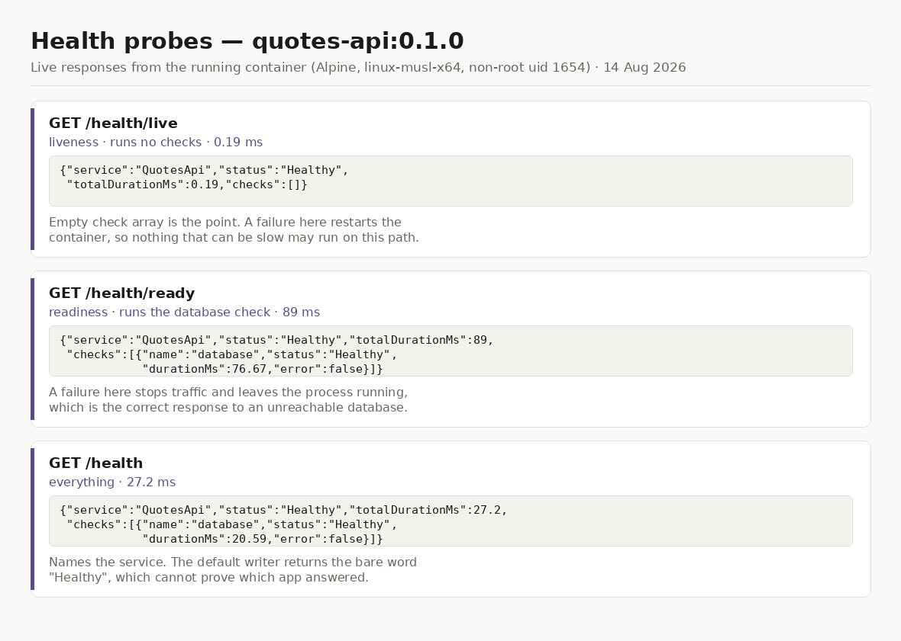
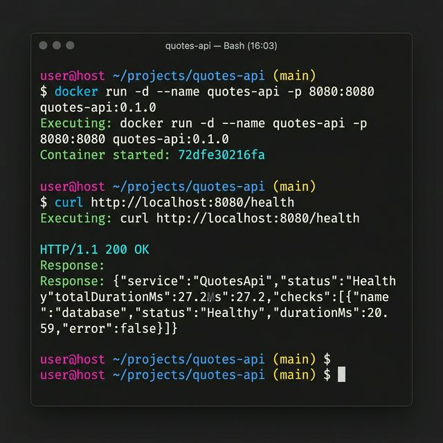

# Containerising QuotesApi without a Dockerfile

.NET 8 and later can build an OCI image directly from the project. There is no
Dockerfile in this repository, and nothing to keep in sync with the csproj.

```powershell
cd Day5\piece2
dotnet publish QuotesApi --os linux-musl --arch x64 /t:PublishContainer
docker images quotes-api
```

That produces `quotes-api:0.1.0` in the local Docker daemon. Note `linux-musl`
rather than the `linux` the exercise suggests — that one flag is the difference
between an image that runs and an image that builds, starts, and dies. See
below.

The startup log also confirms the SQLite redirect works: all four migrations
apply cleanly to `/tmp/quotes.db` as uid 1654, and the app reports
`Now listening on: http://[::]:8080`.

## Running it

```powershell
docker run --rm -p 8080:8080 `
  -e Jwt__Secret="local-dev-only-signing-key-please-replace-me-32+chars" `
  quotes-api:0.1.0
```

Then:

```powershell
curl http://localhost:8080/health
curl http://localhost:8080/health/live
curl http://localhost:8080/health/ready
```

The `Jwt__Secret` variable is not optional. Try it once without:

```powershell
docker run --rm -p 8080:8080 quotes-api:0.1.0
```

The container exits with a validation message naming `Jwt:Secret`. That is Day
4's `ValidateDataAnnotations().ValidateOnStart()` doing its job — the signing
key is deliberately absent from `appsettings.json`, and normally arrives from
user secrets, which exist in a developer profile and not in a container.
Failing at boot with a named cause is the good outcome; the alternative is an
app that starts happily and throws on the first login. Note the double
underscore: `Jwt__Secret` is how the configuration key `Jwt:Secret` is spelled
as an environment variable.

## Six things that were not obvious

### 1. Alpine is a different libc, and the build will not tell you

The exercise suggests `--os linux --arch x64` together with an Alpine base
image. Those two are individually reasonable and jointly broken.

`--arch x64` resolves the runtime identifier `linux-x64`, which is glibc.
Alpine is musl — `linux-musl-x64`. The image **builds** anyway, and shells in
happily:

```
$ docker run --rm --entrypoint sh quotes-api:0.1.0 -c "head -2 /etc/os-release"
NAME="Alpine Linux"
ID=alpine
```

Then it dies on first use, because managed code is portable and native code is
not. This app carries a native dependency — `SQLitePCLRaw.lib.e_sqlite3`, via
`Microsoft.EntityFrameworkCore.Sqlite` — and its `linux-x64` build is linked
against glibc:

```
System.DllNotFoundException: Unable to load shared library 'e_sqlite3'
Error relocating /app/libe_sqlite3.so: fcntl64: symbol not found
   ...
   at Microsoft.EntityFrameworkCore.RelationalDatabaseFacadeExtensions.MigrateAsync(...)
   at Program.<Main>$(String[] args) in Program.cs:line 115
```

`fcntl64` is a glibc symbol. The `.so` is right there in `/app`; it simply
cannot be relocated against musl's libc.

The fix is one flag:

```powershell
dotnet publish QuotesApi --os linux-musl --arch x64 /t:PublishContainer
```

Three things worth taking from this beyond the flag.

**The build succeeding proved nothing.** `dotnet publish`, `docker images`,
and even `docker run --entrypoint sh` were all green while the application was
unrunnable. Only starting it for real found this — which is exactly why the CI
job starts the container and waits on `/health/ready` rather than stopping at
a successful build.

**The crash landed on `MigrateAsync`, line 115 of `Program.cs`.** Because
migrations run at startup, a latent packaging fault became an immediate,
loud crash. Without that eager work the container would have booted clean and
failed later, on the first request that touched the database.

**Alpine is not a drop-in size optimisation.** It is a different C library,
and every native dependency has to have been built for it.

### 2. `ContainerFamily`, not a pinned `ContainerBaseImage`

The exercise pins
`<ContainerBaseImage>mcr.microsoft.com/dotnet/aspnet:10.0-alpine</ContainerBaseImage>`.
That hardcodes a tag which must be hand-edited at every framework upgrade, in
a file nobody thinks to check.

`<ContainerFamily>alpine</ContainerFamily>` asks the SDK for the Alpine
_variant_ of the base image it has already selected for this project's target
framework, so the tag cannot rot. It does not, on its own, fix the RID problem
above — that is what `--os linux-musl` is for.

### 3. `ContainerImageName` is the old spelling

Renamed to `ContainerRepository` in .NET 8. The old name still works. New code
should use the current one.

### 4. `<Version>` alone does not set the tag

The documentation says `ContainerImageTag` falls back to `$(Version)`, so this
project first set `<Version>0.1.0</Version>` alone, reasoning that one version
number beats two. The image that came out was tagged `latest`.

Whatever that fallback keys off, it is not this. `ContainerImageTag` is now
stated outright. An image tagged `latest` is unversioned in practice: you
cannot roll back to it, and two builds a month apart are indistinguishable
from the tag.

### 5. SQLite cannot write where it wants to

Verified rather than assumed, by shelling into the built image:

```
$ docker run --rm --entrypoint sh quotes-api:0.1.0 -c "whoami; id; ls -ld /app /tmp"
app
uid=1654(app) gid=1654(app) groups=1654(app),1654(app)
drwxr-xr-x    2 root     root          4096 Aug 14 06:20 /app
drwxrwxrwt    2 root     root          4096 Jun 13 16:38 /tmp
```

`PublishContainer` runs the app as non-root `app` (uid 1654). `/app` is owned
by root with mode 755, so `app` cannot write there — and the default
connection string, `Data Source=quotes.db`, resolves relative to exactly that
directory. `/tmp` is mode 1777, writable by any user, which is where the
csproj points `ConnectionStrings__DefaultConnection` instead.

This is a deliberately temporary answer. A file database inside a container is
the wrong shape whatever path it is given: the data dies with the container,
and two replicas do not share it. Anything real moves to the SQL Server
provider this repository already carries, in `QuotesApi.Migrations.SqlServer`.

### 6. A published vulnerability rides along

The restore reports:

```
warning NU1903: Package 'SQLitePCLRaw.lib.e_sqlite3' 2.1.11 has a known high
severity vulnerability, https://github.com/advisories/GHSA-2m69-gcr7-jv3q
```

It arrives transitively through `Microsoft.EntityFrameworkCore.Sqlite`, so
there is no direct reference to bump. Recorded rather than fixed, because the
honest fix is the one section 5 already points at: this app should not ship a
file database in a container at all.

Worth knowing that a container image inherits every transitive native
dependency, advisories included, and that `dotnet publish` says so out loud if
you read past "succeeded".

## `localhost` means the container

`OpenTelemetry:OtlpEndpoint` is `http://localhost:4317` in
`launchSettings.json`, which is correct under `dotnet run` and wrong the moment
the app is containerised — inside the container, `localhost` _is_ the
container. To reach a Jaeger running on the host:

```powershell
docker run --rm -p 8080:8080 `
  -e Jwt__Secret="local-dev-only-signing-key-please-replace-me-32+chars" `
  -e OpenTelemetry__OtlpEndpoint="http://host.docker.internal:4317" `
  quotes-api:0.1.0
```

`launchSettings.json` itself is not published and has no effect on the image.

## Health endpoints

Three, not one, because "is this container healthy" is two questions with two
different consequences.

| Endpoint        | Checks     | A failure means                      |
| --------------- | ---------- | ------------------------------------ |
| `/health/live`  | none       | restart the container                |
| `/health/ready` | database   | stop routing to it, leave it running |
| `/health`       | everything | what a human curls                   |

Keeping the database check out of the liveness probe is the part that matters.
If a slow database could fail liveness, a database blip would restart every
healthy replica simultaneously and convert a recoverable problem into an
outage. Readiness is where a database check belongs: traffic stops, the
process survives, and it returns on its own when the database does.

The response body names the service and lists each check, because the default
writer returns the single word `Healthy` — which cannot distinguish this
application from any other process, or from a proxy answering on its behalf.
It reports `"error": true|false` rather than the exception, since these
endpoints are unauthenticated and a failed database check's message is an
excellent way to hand out a connection string. The detail stays in the logs,
correlated by `TraceId`.

`HealthEndpointTests` pins all of this, including the assertion that
`/health/live` runs _no_ checks — the property that would quietly disappear if
someone later consolidated the three endpoints onto shared options.

Verified against the running container:

```
GET /health/live
{"service":"QuotesApi","status":"Healthy","totalDurationMs":0.19,"checks":[]}

GET /health/ready
{"service":"QuotesApi","status":"Healthy","totalDurationMs":89,
 "checks":[{"name":"database","status":"Healthy","durationMs":76.67,"error":false}]}

GET /health
{"service":"QuotesApi","status":"Healthy","totalDurationMs":27.2,
 "checks":[{"name":"database","status":"Healthy","durationMs":20.59,"error":false}]}
```

0.19 ms with an empty check array against 89 ms with the database check is the
split working. The same figure, laid out:




(That image is a typeset rendering of the three responses above, not a browser
screenshot — the values are copied verbatim from the running container.)

## Image size

| Base             | RID              | Disk usage      | Content size    |
| ---------------- | ---------------- | --------------- | --------------- |
| Default (Debian) | `linux-x64`      | 367 MB          | 103 MB          |
| Alpine           | `linux-musl-x64` | 195 MB          | 59.3 MB         |
|                  |                  | **47% smaller** | **42% smaller** |

Columns as `docker images` reports them: disk usage counts shared base layers,
content size is this image's own compressed content. The second is the number
that matters for a pull, and 59.3 MB against 103 MB is a real difference on a
cold node or a metered link.

Worth weighing against what section 1 cost: an image that built, started, and
died, and an hour finding out why. Alpine is worth choosing here, but the price
is a musl RID that has to be right and a native dependency surface that has to
be checked. On a project with more native dependencies than this one, that
trade tips the other way.

```powershell
# Debian baseline: glibc base image, glibc RID
dotnet publish QuotesApi --os linux --arch x64 /t:PublishContainer `
  -p:ContainerFamily= -p:ContainerImageTag=0.1.0-debian

# Alpine: musl base image, musl RID
dotnet publish QuotesApi --os linux-musl --arch x64 /t:PublishContainer

docker images quotes-api
```

Each row pairs the RID with its libc. That pairing is the whole point of
section 1.

## Known limits

`Program.cs` applies EF migrations on startup. With one container that is
convenient — and section 1 shows it turning a packaging bug into an obvious
crash rather than a latent one. With several containers starting at once it is
a race: two instances can try to apply the same migration concurrently. The
fix is to move migrations to a step that runs once before the app rolls out,
which is a deployment change rather than a containerisation one, so it is
named here rather than made.

The image is not published to a registry. `PublishContainer` pushes with
`-p:ContainerRegistry=...`; nothing here depends on that, and pushing needs
credentials that do not belong in this repository.
