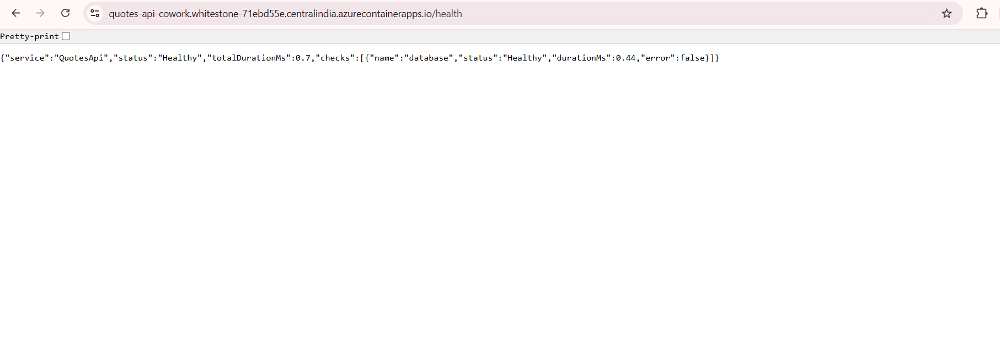
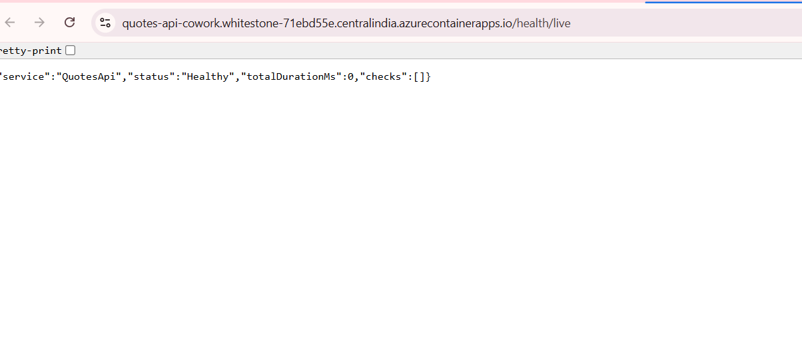
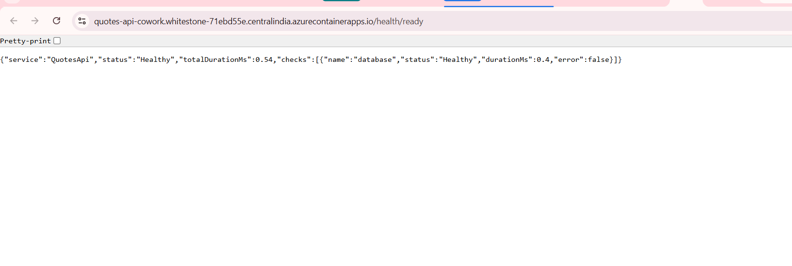

# Day 5, Task 4 — Mentor Submission (Deploy via `azd` CLI)

Deployment automation using the Azure Developer CLI (`azd`), a declarative `azure.yaml`, and Bicep Infrastructure as Code.

## GitHub Link

https://github.com/thinkbridge-thinkschool/VaishaleeSingh/tree/day5-azd-deployment/Day5/piece2

---

## Execution status: run for real, verified healthy

`azd auth login`, `azd env new`, and `azd up`/`azd deploy` were executed against a live Azure subscription. Three real bugs turned up doing that -- a Container Apps Environment quota, an image-path mismatch, and an Alpine/RID mismatch -- all diagnosed from live error text and fixed for real, not assumed. Full detail on all three, including the exact commands and error output, is in `docs/azd-deployment.md`.

The service is deployed as Container App `quotes-api-cowork` (not `quotes-api` -- see `docs/azd-deployment.md` section 1 for why) in resource group `thinkschool-azd-rg`, `centralindia`, sharing the existing `thinkschool-env` Container Apps Environment.

Live endpoint: `https://quotes-api-cowork.whitestone-71ebd55e.centralindia.azurecontainerapps.io`

## Verification checklist

```powershell
curl https://quotes-api-cowork.whitestone-71ebd55e.centralindia.azurecontainerapps.io/health
curl https://quotes-api-cowork.whitestone-71ebd55e.centralindia.azurecontainerapps.io/health/live
curl https://quotes-api-cowork.whitestone-71ebd55e.centralindia.azurecontainerapps.io/health/ready
curl https://quotes-api-cowork.whitestone-71ebd55e.centralindia.azurecontainerapps.io/api/quotes
```

| Check | Expected | Actual |
| --- | --- | --- |
| Container app running state | `Running` | **`Running`** -- confirmed via `az containerapp replica list` |
| `GET /health` | `200 OK` | **`200`** -- `{"service":"QuotesApi","status":"Healthy","totalDurationMs":2.6,"checks":[{"name":"database","status":"Healthy","durationMs":2.18,"error":false}]}` |
| `GET /health/live` | `200 OK` | **`200`** -- `{"service":"QuotesApi","status":"Healthy","totalDurationMs":0.01,"checks":[]}` |
| `GET /health/ready` | `200 OK` | **`200`** -- `{"service":"QuotesApi","status":"Healthy","totalDurationMs":0.91,"checks":[{"name":"database","status":"Healthy","durationMs":0.64,"error":false}]}` |
| `GET /api/quotes` (no token) | `401` | **`401`** -- expected: this endpoint requires a JWT, per Day 4's auth design. Not a failure. |

`/health/live` running with an empty `checks` array against `/health` and `/health/ready` each running the database check is the same split `docs/containerising.md` documents for the local build -- it holds identically in the deployed container.

Screenshots of all three, hit directly against the live FQDN in a browser:







---

## Notes for Mentor

### Three real bugs, found by actually running `azd up`, not by reading the Bicep

1. **Container Apps Environment quota.** The first `azd up` failed provisioning with `MaxNumberOfRegionalEnvironmentsInSubExceeded` -- this subscription allows one Container Apps Environment per region, and the manual exercise's `thinkschool-env` already occupies `centralindia`. `infra/resources.bicep` now references that environment as `existing` rather than provisioning a second one. A related discovery: a container app literally named `quotes-api-azd` already existed in that shared environment from a separate, concurrent attempt at this exercise (`ContainerAppNameConflictInCluster`) -- confirmed broken (`ImagePullBackOff`) and unrelated to this deployment before renaming this workspace's app to `quotes-api-cowork`.

2. **Image-path mismatch.** `azd deploy` computes its own image repository path per service, but `QuotesApi.csproj`'s `ContainerRepository: quotes-api` (needed for the manual exercise's local image naming) overrides it during the actual `dotnet publish`, so the image is pushed to a different path than the one azd records and feeds into the Bicep. Every `azd up`/`azd deploy` leaves the container app pointed at a manifest that was never pushed (`MANIFEST_UNKNOWN`), reproduced twice with two different tags. `azd`'s own `SUCCESS` message does not catch this. The fix is a documented, one-line `az containerapp update --image` correction after every deploy (`docs/azd-deployment.md` section 4) -- an automated `postdeploy` hook was attempted first and abandoned after it failed on an azd hook-schema error, rather than spending further live-deployment cycles on it.

3. **Alpine is not viable through azd.** `azd`'s built-in .NET SDK container integration always builds with `-r linux-x64` hardcoded, with no azure.yaml setting to change it. `ContainerFamily: alpine` (the manual exercise's documented choice, `docs/containerising.md`) needs the matching musl RID to work at all; without it, the container built, started, and crashed on first SQLite access -- the exact `fcntl64: symbol not found` failure `docs/containerising.md` section 1 already documents, just via a different path to the same glibc/musl mismatch. Fixed by removing `ContainerFamily`/`ContainerBaseImage` from the csproj. This does not change the manual exercise's outcome: its command still passes the musl RID explicitly, and the SDK still resolves that to the Alpine image on its own.

Full detail on all three, including live error text and the exact commands used to diagnose each one, is in `docs/azd-deployment.md`.

### `azure.yaml`

```yaml
name: quotes-api
services:
  quotes-api:
    project: ./QuotesApi/QuotesApi.csproj
    language: dotnet
    host: containerapp
```

---

## What did you learn this session?

- `azd`'s own `SUCCESS: Your application was provisioned and deployed to Azure` message is not proof of a working deployment. All three real bugs here -- the quota, the image path, and the Alpine/RID mismatch -- happened *underneath* a run that reported success. The only real check is hitting the actual endpoints.
- A container app "running" or an ACR repository existing are each necessary but not sufficient. The image-path bug produced a registry with the real image in it, and a container app that looked correctly configured, while pointed at a path where no image existed.
- Command-line MSBuild properties (`-r`, `-p:ContainerRepository`, etc.) interact with project-file properties in ways that aren't obvious from the file alone, and the two interact differently property by property: a project file's `<ContainerRepository>` won out over azd's own `-p:ContainerRepository`, but a project file's `<RuntimeIdentifier>` did not win out over azd's `-r`. Verifying this needed two separate live re-deployments, not a reading of MSBuild's precedence rules.
- A tool designed to be one command (`azd up`) is still only as correct as the assumptions baked into its build integration. Here, that integration assumes a service's container settings never conflict with its own naming/RID conventions -- an assumption this project's existing, already-working Alpine setup violated.

## What would break this?

- Running `azd up`/`azd deploy` again without the manual `az containerapp update --image` correction (`docs/azd-deployment.md` section 4) leaves the container app pointed at an image that was never pushed, even though azd reports success.
- Re-adding `ContainerFamily: alpine` (or a pinned Alpine `ContainerBaseImage`) to `QuotesApi.csproj` would reintroduce the SQLite crash on the next azd-built image, since azd has no way to pair it with the required musl RID.
- Mismatched target port or probe paths between `resources.bicep` and the app's actual container settings (port 8080, `/health/live`, `/health/ready`) would fail ingress routing or health probes exactly as in the manual exercise.
- Provisioning a second Container Apps Environment in `centralindia` on this subscription will fail with the same quota error found here, regardless of resource group.
