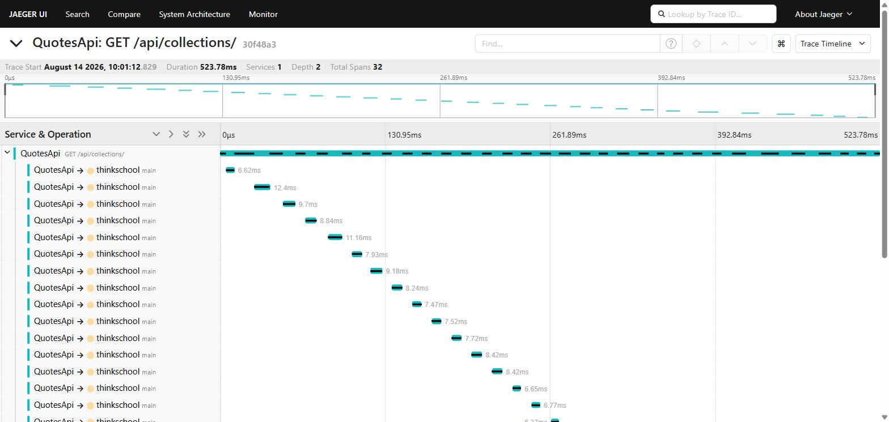
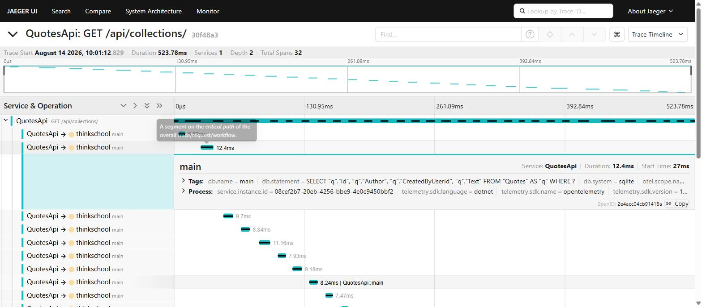
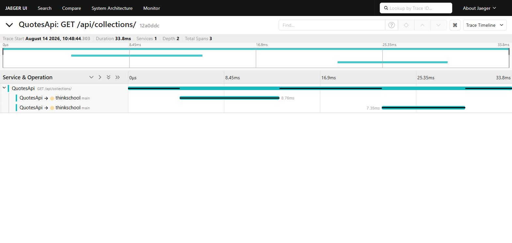
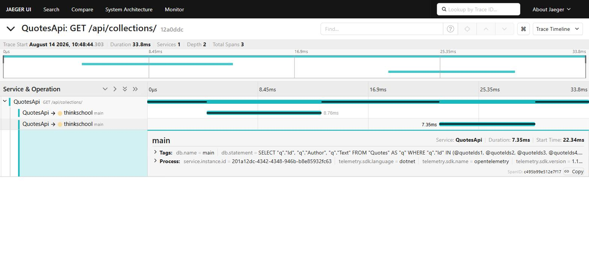
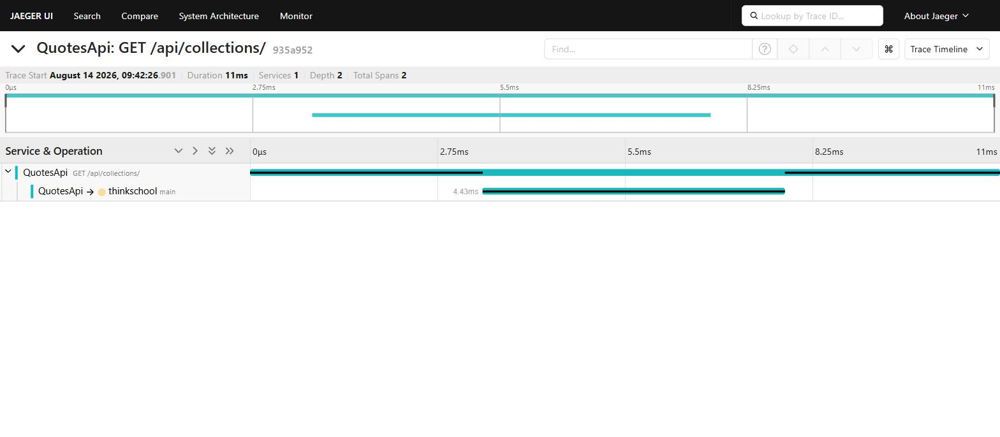

# Diagnosing a slow endpoint from its trace

`GET /api/collections`, diagnosed from its Jaeger trace, fixed, and kept fixed
by a test that fails if the shape comes back.

## Reproducing

With Jaeger running (`docker run -d --name jaeger -p 16686:16686 -p 4317:4317
jaegertracing/all-in-one`) and the API started:

```powershell
cd scripts
.\seed-and-hit.ps1                       # 15 collections, 5 requests
.\seed-and-hit.ps1 -Collections 30       # 30 -- watch the span count follow
```

Then http://localhost:16686 -> service `QuotesApi` -> operation
`GET /api/collections/`.

## The note

> The trace for `GET /api/collections` came back with 32 spans: the request
> span, one `SELECT` over `Collections`, and then thirty near-identical
> `SELECT`s against `Quotes`, one per collection returned. No single query is
> slow -- each runs in roughly 7-12 ms against a local SQLite file -- but
> thirty of them in sequence is 524 ms of the 524 ms request. `ListByOwnerAsync`
> loaded the caller's collections, then looped over them fetching each one's
> quotes in its own round trip, so query count grew linearly with rows: a
> textbook N+1. Against a networked database each round trip also carries
> latency, so this degrades exactly as customers add collections. The fix is to
> gather every quote id first and fetch them in one query.

## What made it obvious

Not the duration on its own. What names the problem is the *shape*: a staircase
of visually identical spans, same SQL, same table, differing only in a
parameter. Once seen, that pattern is unmistakable, and the trace attributes it
to a specific line rather than to "the database being slow".

The confirming evidence is that the count tracks the data. Re-run the seeding
script with a different number of collections and the span count moves with it.
N+1 is precisely that relationship, and demonstrating it move is stronger proof
than any single screenshot.

This is also why the exercise's alternative -- `Thread.Sleep(1500)` -- teaches
less. A sleep shows up as an *absence*: a long parent span with nothing inside
that explains it. That demonstrates a limit of automatic instrumentation rather
than its value. The N+1 is a failure this codebase could plausibly have
shipped, and the trace names it precisely.

## Measured

Same owner (`seed-user`), same machine, SQLite, local Jaeger via OTLP.

| | Collections | Spans in trace | DB spans | Response time |
|---|---|---|---|---|
| Before | 30 | 32 | 31 | 523.78 ms (495 - 811 ms across five runs) |
| After  | 60 | 3  | 2  | 33.8 ms (33.8 - 144.3 ms across five runs) |

`Before` is trace `30f48a3`, `After` is trace `12a0ddc`. Both ranges come from
the five consecutive requests the seeding script issues at the end of a run.

The two rows are **not** on equal data, and the asymmetry runs the safe way.
The seeding script mints a token for a fixed `sub` of `seed-user` and the
SQLite file is never reset, so collections accumulate across runs: the `After`
row is answering for *twice* as many collections as the `Before` row, in 2
queries instead of 31, roughly 15x faster. Had the difference gone the other
way -- less data after the fix -- the comparison would be worthless.

The `After` trace is 3 spans, not 2, because the fix issues two queries by
design (see below). The number that matters is that it stays 2 whether the
caller owns 30 collections or 60.









For reference, trace `935a952` shows the same endpoint answering in 11 ms with
a single database span, from before the per-collection loop existed.



## The fix

`CollectionRepository.ListByOwnerAsync`, before:

```csharp
foreach (var collection in collections)          // <- one query per collection
{
    var quoteIds = collection.Items.Select(item => item.QuoteId).ToList();

    var quotes = await _db.Quotes
        .Where(quote => quoteIds.Contains(quote.Id))
        .AsNoTracking()
        .ToListAsync(cancellationToken);

    result.Add(new CollectionWithQuotes(collection.Id, collection.Name, ...));
}
```

after -- gather every id the caller could need, fetch them once, shape in
memory:

```csharp
var quoteIds = collections
    .SelectMany(collection => collection.Items)
    .Select(item => item.QuoteId)
    .Distinct()
    .ToList();

var quotesById = quoteIds.Count == 0
    ? new Dictionary<int, QuoteSummary>()
    : await _db.Quotes
        .Where(quote => quoteIds.Contains(quote.Id))
        .AsNoTracking()
        .Select(quote => new QuoteSummary(quote.Id, quote.Author, quote.Text))
        .ToDictionaryAsync(quote => quote.Id, cancellationToken);
```

Two round trips, not one, and that is deliberate. `CollectionItem` is an owned
type (`OwnsMany`, see `QuotesDbContext`), so `Collections` already arrives with
its items joined in -- but an item holds only a `QuoteId`, and `Quote` is a
separate aggregate. Folding the quote lookup into the collections query would
join across an aggregate boundary and fan the collection rows out by their item
count. Two constant queries is the honest shape here; what matters is that the
count no longer depends on N.

Two smaller decisions worth naming:

- `Distinct()` -- the same quote can sit in several collections, and there is
  no reason to fetch it twice.
- The empty-list guard -- `Contains` over an empty list still costs a round
  trip that can never match a row.

`AsNoTracking()` is not part of the N+1 fix. It is worth having on a read-only
listing anyway, since the change tracker has no work to do for entities nobody
is going to modify.

## Keeping it fixed

A trace proves the fix today; it does not stop the next person reintroducing
it. `CollectionListingQueryCountTests` (in `Quotes.Tests.Unit`) installs an EF
`DbCommandInterceptor`, lists collections for an owner with 3 collections and
again with 15, and asserts the command count is *the same number* both times.

It deliberately does not assert an exact count -- that would break the moment
someone legitimately adds a lookup -- and it does not assert a duration, which
would be flaky. The property that actually has to hold is that round trips do
not grow with rows, so that is what is pinned.

The test uses SQLite rather than the InMemory provider on purpose: InMemory is
not a relational provider, never issues a `DbCommand`, and a command
interceptor against it would silently count zero and pass forever.

This is the assertion an N+1 breaks and an ordinary correctness test does not.
Every behavioural test in this repository passed against the broken version,
because the endpoint returned exactly the right data. It just asked thirty-one
times.

## Finding this in production (KQL)

Slowest endpoints over the last hour, which is where a latency investigation
starts:

```kusto
requests
| where timestamp > ago(1h)
| summarize
    count(),
    avg(duration),
    p95 = percentile(duration, 95),
    p99 = percentile(duration, 99)
  by name
| order by p99 desc
```

Requests making an unusual number of database calls -- the N+1 signature
itself, rather than its symptom:

```kusto
dependencies
| where timestamp > ago(1h) and type in ("SQL", "sqlite")
| summarize dbCalls = count(), dbTime = sum(duration) by operation_Id
| where dbCalls > 10
| join kind=inner (requests | project operation_Id, name, duration) on operation_Id
| project name, dbCalls, dbTime, requestDuration = duration, operation_Id
| order by dbCalls desc
```

The second query is the more useful of the two. Sorting by duration finds
endpoints that are slow *now*; grouping by database calls per request finds the
ones that will become slow as data grows -- while they are still fast enough
that nobody has complained.
