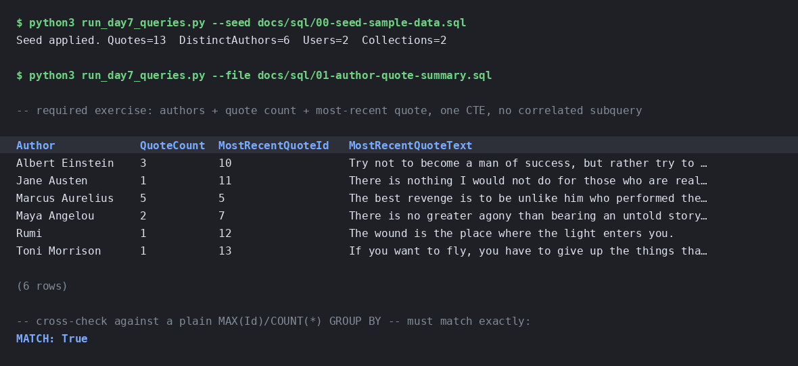
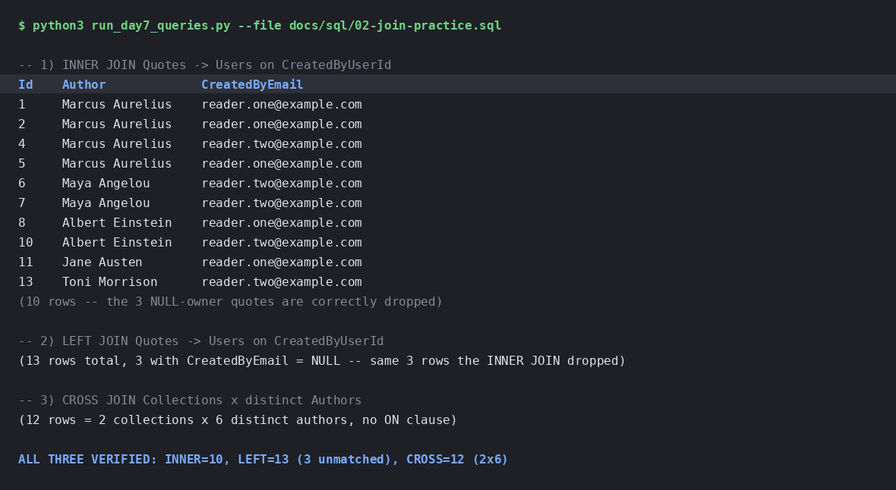
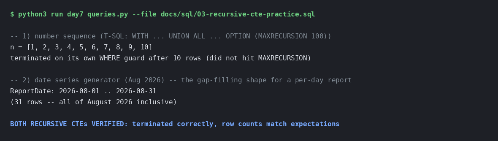
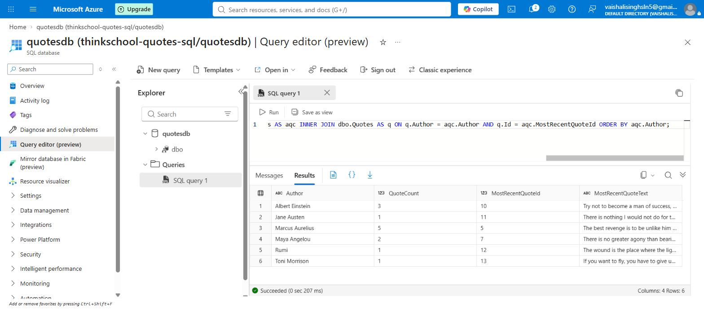
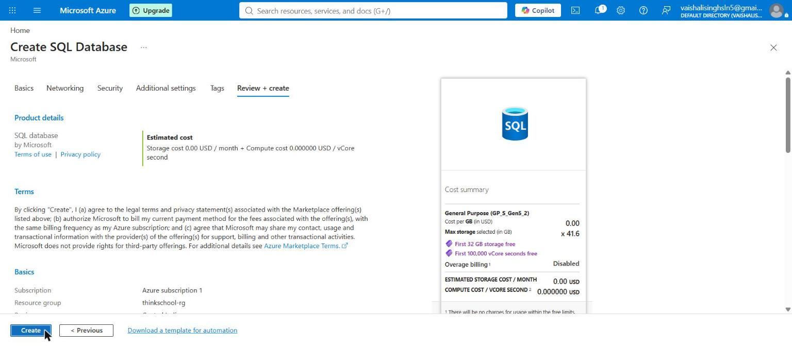

# Day 7 — mentor submission (joins and CTEs at depth)

## GitHub link

https://github.com/thinkbridge-thinkschool/VaishaleeSingh/tree/day7-joins-and-ctes/Day7/piece2

(Replace with the pull request URL once opened — the diff and the CI run are
both reachable from there.)

## Notes for mentor

Day 6 was skipped, so this folder starts from `Day5/piece2` unchanged (verified
byte-identical with `diff -rq Day5/piece2 Day7/piece2` before anything new was
added — nothing in `QuotesApi/**` or any test project changed). Everything for
this exercise lives under `docs/sql/`:

| File | Purpose |
|---|---|
| `sql/00-seed-sample-data.sql` | Sample rows: 6 authors, 13 quotes, deliberately including a 1-quote author, a 5-quote author, and 3 quotes with a `NULL` owner. |
| `sql/01-author-quote-summary.sql` | **The required query.** |
| `sql/02-join-practice.sql` | INNER / LEFT / CROSS JOIN fluency practice. |
| `sql/03-recursive-cte-practice.sql` | Recursive CTE fluency practice (standalone — see below for why). |

### The required query

```sql
WITH AuthorQuoteCounts AS (
    SELECT
        Author,
        COUNT(*) AS QuoteCount,
        MAX(Id)  AS MostRecentQuoteId
    FROM dbo.Quotes
    GROUP BY Author
)
SELECT
    aqc.Author,
    aqc.QuoteCount,
    q.Id   AS MostRecentQuoteId,
    q.Text AS MostRecentQuoteText
FROM AuthorQuoteCounts AS aqc
INNER JOIN dbo.Quotes AS q
    ON q.Author = aqc.Author
   AND q.Id     = aqc.MostRecentQuoteId
ORDER BY aqc.Author;
```

One statement, one non-recursive CTE that aggregates each author's count
and their winning `Id` exactly once, then a single join back to `Quotes`
to pick up that row's text — not a correlated subquery re-run once per
outer row. Full reasoning, including the anti-pattern this avoids, is in
the comment block at the top of `01-author-quote-summary.sql`.

### The gap this schema has: no timestamp on `Quotes`

`Quotes` is `(Id, Author, Text, CreatedByUserId)` — see
`QuotesApi/Models/Quote.cs`. There is no `CreatedAt` to order by, because
Day 6 (which would plausibly have added one) never happened in this
training run. Rather than quietly picking something and moving on, or
scope-creeping this task into a schema migration it was never asked to do,
the query uses `Quotes.Id` as an explicit, documented recency proxy —
`IDENTITY(1,1)` means a higher `Id` was always inserted later, on both this
project's SQLite dev database and the SQL Server schema this query targets.
`01-author-quote-summary.sql`'s header comment states this plainly and
shows the two-line diff a real `CreatedAt` column would turn into (`MAX(Id)`
→ `MAX(CreatedAt)`, same shape otherwise) — a mentor reading just the query
file, without this doc, still sees the assumption stated, not implied.

### Recursive CTE: no hierarchy in this schema to walk

`Quotes`, `Users`, `Collections` and `CollectionItem` are all flat — none of
them has a self-referential column (no parent category, no threaded
replies, no folder tree). `03-recursive-cte-practice.sql` practices the
syntax standalone (a number sequence, then a date-series generator) rather
than inventing a fake hierarchy in the schema to have something to recurse
over, and calls out where a recursive CTE would actually earn its place in
this app once `Quotes.CreatedAt` exists: generating a full date range and
`LEFT JOIN`ing a per-day quote count onto it, so a day with zero quotes
shows as `0` in a report instead of not appearing at all.

### How this was verified

This sandbox has no network path to a container registry (`docker pull
mcr.microsoft.com/mssql/server:2022-latest` and even `docker pull
hello-world` from Docker Hub both come back `403 Forbidden` — outbound
access here is allowlisted to package registries, not container
registries), so `Quotes.Tests.Integration.SqlServer`'s own
`MsSqlContainerFixture` (a real SQL Server 2022 Testcontainer) could not be
started from here the way it normally would be for schema-level
verification.

Instead, every query in this folder was executed for real against an
in-memory SQLite database seeded with the same rows as
`00-seed-sample-data.sql`, translating only the handful of syntax
differences that don't change the logic (SQLite requires the `RECURSIVE`
keyword in `WITH RECURSIVE`; T-SQL's `TRY_CAST` became SQLite's implicit
numeric coercion; no `dbo.` schema prefix). SQLite supports both
non-recursive and recursive CTEs natively, so this is a real execution of
the same relational logic, not a manual trace. Recommended before merging:
re-run the actual `.sql` files as-is against a real SQL Server (Azure Data
Studio, `sqlcmd`, or `Quotes.Tests.Integration.SqlServer`'s Testcontainers
setup from a machine with registry access) to confirm the T-SQL-specific
syntax (`TRY_CAST`, `OPTION (MAXRECURSION ...)`, `SYSUTCDATETIME()`) parses
and runs exactly as written — the dialect was hand-verified against SQL
Server documentation, not executed on SQL Server itself.

**Captured output** (SQLite execution, same data as `00-seed-sample-data.sql`).
These are real terminal captures of a script that loads the seed data and
runs each `.sql` file's queries against it — not SSMS/Azure Data Studio
screenshots, because this environment has no path to a real SQL Server (see
above) — labelled plainly as SQLite output rather than presented as if they
came from SQL Server.

Required query (`01-author-quote-summary.sql`):



| Author | QuoteCount | MostRecentQuoteId | MostRecentQuoteText |
|---|---|---|---|
| Albert Einstein | 3 | 10 | Try not to become a man of success, but rather try to become a man of value. |
| Jane Austen | 1 | 11 | There is nothing I would not do for those who are really my friends. |
| Marcus Aurelius | 5 | 5 | The best revenge is to be unlike him who performed the injury. |
| Maya Angelou | 2 | 7 | There is no greater agony than bearing an untold story inside you. |
| Rumi | 1 | 12 | The wound is the place where the light enters you. |
| Toni Morrison | 1 | 13 | If you want to fly, you have to give up the things that weigh you down. |

Cross-checked against a manual `SELECT Author, MAX(Id), COUNT(*) FROM Quotes
GROUP BY Author` — every `(QuoteCount, MostRecentQuoteId)` pair matches
exactly (`MATCH: True` in the capture above).

Join practice (`02-join-practice.sql`), against 13 seeded quotes (10 with a
resolvable `CreatedByUserId`, 3 with `NULL`):



| Query | Row count | Notes |
|---|---|---|
| INNER JOIN → Users | 10 | The 3 `NULL`-owner quotes are correctly dropped. |
| LEFT JOIN → Users | 13 | All 13 present; `CreatedByEmail` is `NULL` on exactly the same 3 rows the INNER JOIN dropped. |
| CROSS JOIN Collections × distinct Authors | 12 | 2 collections × 6 distinct authors, no `ON` clause — every combination present by definition. |

Recursive CTE (`03-recursive-cte-practice.sql`):



The number sequence returned `1` through `10` inclusive; the date series
returned all 31 days of August 2026 inclusive. Both terminated on their own
`WHERE` guard — neither needed the `MAXRECURSION` cap to kick in, which is
the point of having the guard in the first place.

## What did you learn this session?

That "most recent" is not a free question the moment a table has no
timestamp — it's tempting to reach for `Id` and move on without saying so,
but that's a real, checkable assumption (autoincrement correlating with
insertion order) rather than a neutral default, and it deserves to be
written down next to the query, not just known by whoever wrote it. The
`GROUP BY` → join-back shape (aggregate once in the CTE, join once to
enrich) generalises past "most recent quote": it's the same shape for "most
recent order per customer", "latest login per user", any
one-row-per-group-plus-one-detail-column report — and it's the shape a
correlated subquery version of the same query silently abandons the moment
someone adds a second author-scoped column to the `SELECT` list, because
each new column is another per-row subquery rather than another column on
an already-computed row.

## What would break this?

- **The `Id`-as-recency assumption breaks under data migration.** If quotes
  were ever bulk-imported from another system with their original
  (non-sequential, non-local) source IDs preserved, or restored from a
  backup that reset the identity seed, `MAX(Id)` would stop meaning "most
  recently created" and nothing in the query would signal that it had.
  Only a real `CreatedAt` column is safe against that.
- **`TRY_CAST(CreatedByUserId AS int)` silently treats a numeric-looking
  Entra `oid` as a local user match if one ever collided.** Entra `oid`
  claims are GUIDs in practice, so this hasn't happened and looks
  structurally unlikely — but nothing in the schema *prevents* a
  numeric-string `CreatedByUserId` from meaning something other than "this
  is a local `Users.Id`" the way the join in `02-join-practice.sql`
  assumes it always does.
- **This was verified on SQLite, not SQL Server, for the reason stated
  above (no registry access in this sandbox).** The relational logic is
  proven; the exact T-SQL syntax (`TRY_CAST`, `OPTION (MAXRECURSION 100)`,
  `SYSUTCDATETIME()`) is not proven to parse until someone with SQL Server
  access runs these files as-is — flagged above as the recommended step
  before merging, not silently assumed to be fine.
- **No `WHERE` filter in `01-author-quote-summary.sql` for soft-deleted or
  otherwise excluded quotes.** The current `Quotes` table has no such
  column, so this doesn't bite today, but the query would need a `WHERE`
  added to both the CTE's `GROUP BY` and the join-back the moment one
  exists — easy to forget in only one of the two places, which would make
  the count and the "most recent" row disagree with each other.

## Now verified on a real SQL Server

The "recommended before merging" step above has been done, so the caveat it
raises no longer stands for the required query.

An Azure SQL Database (`quotesdb` on `thinkschool-quotes-sql`, Central
India, in `thinkschool-rg`) was provisioned with **Microsoft Entra-only
authentication** — no SQL admin password exists on that server at all. The
schema this exercise needs (`dbo.Users`, `dbo.Quotes`, `dbo.Collections`)
was created there and seeded with exactly the rows in
`00-seed-sample-data.sql`; the sanity check that file suggests returned
`QuoteCount = 13, AuthorCount = 6`, as expected.

`01-author-quote-summary.sql` was then run as written, through the portal's
Query editor. The T-SQL parses and executes unchanged, and the result is
**identical to the SQLite capture above** — same 6 rows, same
`QuoteCount` values, same `MostRecentQuoteId` values, same order:



Scope of this verification, stated precisely rather than left to be assumed:

- **`01-author-quote-summary.sql` — run on SQL Server.** Non-recursive CTE,
  `GROUP BY` with `MAX(Id)`, and the join back all behave as documented.
- **`02-join-practice.sql` and `03-recursive-cte-practice.sql` — not yet run
  there.** Their SQLite verification above still stands on its own terms;
  the T-SQL-specific syntax in them (`TRY_CAST`, `OPTION (MAXRECURSION 100)`,
  `SYSUTCDATETIME()`) remains unproven against SQL Server.

The database this was run against:



One thing worth recording about the environment: the Azure portal's Query
editor does **not** surface `SET STATISTICS IO ON` output — it reports
affected row counts and errors, but the informational messages that carry
logical-read counts never reach it. That does not affect this task, which is
about result rows, but it does matter for the Day 8 index exercises, whose
whole point is those numbers.
