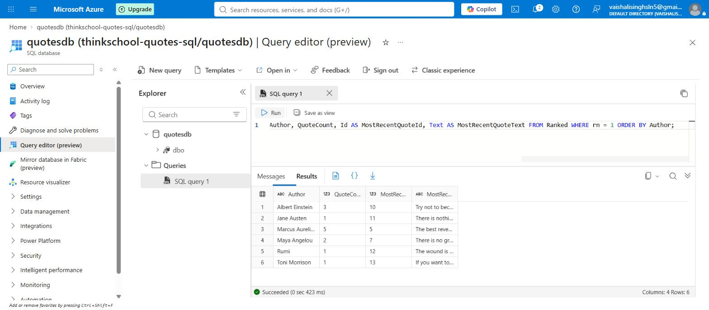
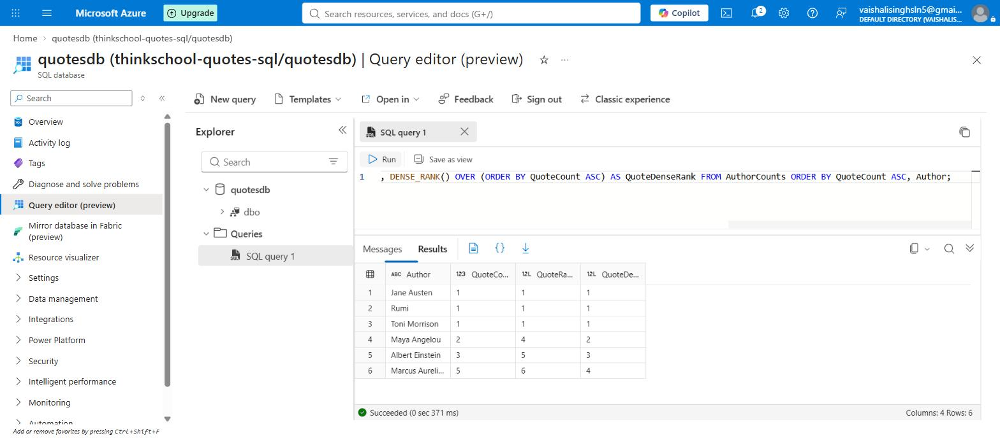
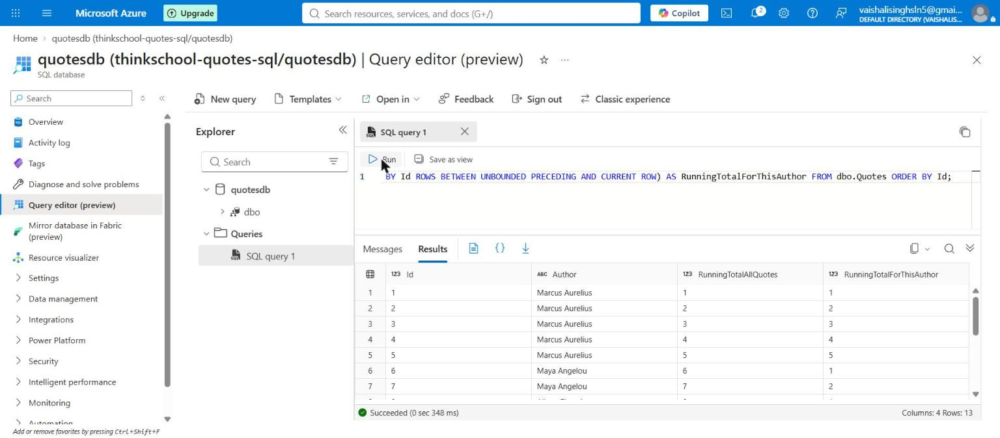

# Day 7 — mentor submission (window functions)

## GitHub link

https://github.com/thinkbridge-thinkschool/VaishaleeSingh/tree/day7-window-functions/Day7/piece2

(Replace with the pull request URL once opened — the diff and the CI run are
both reachable from there.)

## Notes for mentor

A second, separate exercise under the same Day 7 folder as the joins/CTE
task (already merged, PR #19) — same pattern `Day5/piece2` already used for
holding several independent sub-tasks side by side. Nothing in
`QuotesApi/**` or the previously-merged `docs/sql/00`–`03` changed; this
adds one new query file and reuses the existing seed data as-is.

| File | Purpose |
|---|---|
| `sql/04-window-functions.sql` | All four techniques below, one file, four sectioned queries. |

### 1. `ROW_NUMBER` — rewriting the joins/CTE task's own query

```sql
WITH Ranked AS (
    SELECT
        Author, Id, Text,
        ROW_NUMBER() OVER (PARTITION BY Author ORDER BY Id DESC) AS rn,
        COUNT(*)     OVER (PARTITION BY Author)                  AS QuoteCount
    FROM dbo.Quotes
)
SELECT Author, QuoteCount, Id AS MostRecentQuoteId, Text AS MostRecentQuoteText
FROM Ranked
WHERE rn = 1
ORDER BY Author;
```

`01-author-quote-summary.sql` solved the same question — each author's
quote count plus their most-recent quote — with a `GROUP BY` CTE that then
joins back to `Quotes` to pick up the winning row's text. This version does
it in one pass, no join back, because `COUNT(*) OVER (PARTITION BY Author)`
*adds a column* instead of collapsing rows the way a plain aggregate does —
the aggregate and the row-level detail live on the same row together. That
is the real mechanical difference between a `GROUP BY` aggregate and a
window function, not just a syntax preference.

One thing this does *not* remove: T-SQL has no `QUALIFY` clause, so
filtering a window function down to one row per group still needs a
wrapping CTE. "Senior" here isn't "no CTE at all" — it's "the CTE stops
needing a join back to the base table."

**Verified identical to the joins/CTE task's output** — same 6 rows, same
columns, same order:

| Author | QuoteCount | MostRecentQuoteId | MostRecentQuoteText |
|---|---|---|---|
| Albert Einstein | 3 | 10 | Try not to become a man of success, but rather try to become a man of value. |
| Jane Austen | 1 | 11 | There is nothing I would not do for those who are really my friends. |
| Marcus Aurelius | 5 | 5 | The best revenge is to be unlike him who performed the injury. |
| Maya Angelou | 2 | 7 | There is no greater agony than bearing an untold story inside you. |
| Rumi | 1 | 12 | The wound is the place where the light enters you. |
| Toni Morrison | 1 | 13 | If you want to fly, you have to give up the things that weigh you down. |

### 2. `RANK` vs `DENSE_RANK` — an authors-by-quote-count leaderboard

Ordered `ASC` deliberately, not the more "natural" `DESC` leaderboard
order. This seed data's only tie (Jane Austen, Rumi, Toni Morrison — all 1
quote) sits at the low end; ordering `DESC` would put that tie *last*,
where neither function's skip behaviour has a following row to show up
against. Ordering `ASC` puts the tie *first*, followed by Maya Angelou's
distinct count of 2 — exactly where `RANK` and `DENSE_RANK` diverge:

| Author | QuoteCount | QuoteRank | QuoteDenseRank |
|---|---|---|---|
| Jane Austen | 1 | 1 | 1 |
| Rumi | 1 | 1 | 1 |
| Toni Morrison | 1 | 1 | 1 |
| Maya Angelou | 2 | **4** | **2** |
| Albert Einstein | 3 | 5 | 3 |
| Marcus Aurelius | 5 | 6 | 4 |

`RANK` jumps to 4 for Maya Angelou (three rows precede her, tie or not);
`DENSE_RANK` goes to 2 (the next distinct value after 1). Picking the order
that actually produces this divergence, rather than describing it in a
comment next to output that doesn't show it, was deliberate.

### 3. `LAG` / `LEAD` — each quote next to the same author's neighbours

```sql
SELECT
    Author, Id, Text,
    LAG(Text)  OVER (PARTITION BY Author ORDER BY Id) AS PreviousQuoteBySameAuthor,
    LEAD(Text) OVER (PARTITION BY Author ORDER BY Id) AS NextQuoteBySameAuthor
FROM dbo.Quotes
ORDER BY Author, Id;
```

Partitioned by `Author` so `LAG`/`LEAD` never leak across authors, ordered
by `Id` (the same documented recency proxy the joins/CTE task established —
no `CreatedAt` column exists). The three single-quote authors — the same
degenerate case `00-seed-sample-data.sql` was built to exercise for the
joins task — get `NULL` on **both** sides here, correctly: there is no
previous or next row inside their own partition. Marcus Aurelius's 5-quote
chain has a `NULL` only at the very first row's `Previous` and the very
last row's `Next`, nowhere in between:

| Author | Id | PreviousQuoteBySameAuthor | NextQuoteBySameAuthor |
|---|---|---|---|
| Marcus Aurelius | 1 | *(null)* | The happiness of your life depends upon the quality of your thoughts. |
| Marcus Aurelius | 2 | You have power over your mind... | Waste no more time arguing... |
| Marcus Aurelius | 3 | The happiness of your life depends... | It is not death that a man should fear... |
| Marcus Aurelius | 4 | Waste no more time arguing... | The best revenge is to be unlike him... |
| Marcus Aurelius | 5 | It is not death that a man should fear... | *(null)* |
| Maya Angelou | 6 | *(null)* | There is no greater agony... |
| Maya Angelou | 7 | People will forget what you said... | *(null)* |
| Albert Einstein | 8 | *(null)* | Imagination is more important than knowledge. |
| Albert Einstein | 9 | Life is like riding a bicycle... | Try not to become a man of success... |
| Albert Einstein | 10 | Imagination is more important than knowledge. | *(null)* |
| Jane Austen | 11 | *(null)* | *(null)* |
| Rumi | 12 | *(null)* | *(null)* |
| Toni Morrison | 13 | *(null)* | *(null)* |

(Full quote text truncated above for table width — see the query result or
`docs/images/day7-04-window-functions.png` for the untruncated capture.)

### 4. Running total — `SUM() OVER (ORDER BY ...)`, global and per-author

```sql
SELECT
    Id, Author,
    SUM(1) OVER (ORDER BY Id
                 ROWS BETWEEN UNBOUNDED PRECEDING AND CURRENT ROW) AS RunningTotalAllQuotes,
    SUM(1) OVER (PARTITION BY Author ORDER BY Id
                 ROWS BETWEEN UNBOUNDED PRECEDING AND CURRENT ROW) AS RunningTotalForThisAuthor
FROM dbo.Quotes
ORDER BY Id;
```

Both running totals over the same `ORDER BY Id`, in the same query, so
adding `PARTITION BY` to an otherwise-identical running total is directly
visible instead of argued about in prose:

| Id | Author | RunningTotalAllQuotes | RunningTotalForThisAuthor |
|---|---|---|---|
| 1 | Marcus Aurelius | 1 | 1 |
| 2 | Marcus Aurelius | 2 | 2 |
| 3 | Marcus Aurelius | 3 | 3 |
| 4 | Marcus Aurelius | 4 | 4 |
| 5 | Marcus Aurelius | 5 | 5 |
| 6 | Maya Angelou | 6 | 1 |
| 7 | Maya Angelou | 7 | 2 |
| 8 | Albert Einstein | 8 | 1 |
| 9 | Albert Einstein | 9 | 2 |
| 10 | Albert Einstein | 10 | 3 |
| 11 | Jane Austen | 11 | 1 |
| 12 | Rumi | 12 | 1 |
| 13 | Toni Morrison | 13 | 1 |

`RunningTotalAllQuotes` only ever goes up and reaches 13 (the total seeded
row count) on the last row; `RunningTotalForThisAuthor` resets to 1 every
time `Author` changes and reaches that author's own `QuoteCount` on their
last row (5 for Marcus Aurelius, 2 for Maya Angelou, 3 for Albert
Einstein). `ROWS BETWEEN UNBOUNDED PRECEDING AND CURRENT ROW` is stated
explicitly rather than left as the implicit default — `Id` is unique here
so the default `RANGE` frame happens to behave identically, but that's a
coincidence of this column having no ties, not something to rely on.

### How this was verified

Same constraint and workaround as the joins/CTE task, stated again rather
than assumed still true: this sandbox has no route to a SQL Server
container registry (confirmed again against `mcr.microsoft.com`, Docker
Hub, `ghcr.io`, and `packages.microsoft.com` — all `403`). Every query
above was executed for real against an in-memory SQLite database (3.45.1)
seeded identically to `00-seed-sample-data.sql` — SQLite supports
`ROW_NUMBER`, `RANK`, `DENSE_RANK`, `LAG`, `LEAD` and `SUM()`/`COUNT() OVER`
natively, so this is real window-function execution, not a manual trace.
The capture is in `docs/images/day7-04-window-functions.png`. Recommended
before merging: re-run `04-window-functions.sql` as-is against a real SQL
Server to confirm the T-SQL-specific framing syntax
(`ROWS BETWEEN UNBOUNDED PRECEDING AND CURRENT ROW`) parses exactly as
written.

The query 1 vs `01-author-quote-summary.sql` comparison was a real
equality check on the Python-side result sets (`rn_rows == cte_rows`),
not eyeballed.

## What did you learn this session?

That the useful way to think about a window function isn't "an aggregate
that doesn't group" — it's "a column that can see its neighbours." A
`GROUP BY` aggregate destroys row-level detail to produce one summary row
per group; a window function keeps every row and lets each one look
sideways (`LAG`/`LEAD`), up through its own history (`SUM() OVER (ORDER BY
...)`), or across its whole group (`COUNT(*) OVER (PARTITION BY ...)`)
without losing anything. Rewriting the joins/CTE task's own query with
`ROW_NUMBER` made that concrete rather than theoretical: the join back to
`Quotes` for the text column disappears specifically because the window
function never collapsed the row that text lived on in the first place.

## What would break this?

- **`RunningTotalForThisAuthor` still relies on `Id` as the ordering
  signal**, the same documented stand-in for a missing `CreatedAt` column
  the joins/CTE task flagged. If quotes were ever bulk-imported out of
  chronological order, "1st, 2nd, 3rd quote by this author" would reflect
  insertion order, not the order the author actually said them.
- **The frame clause matters more than it looks like it does here.**
  `ROWS BETWEEN UNBOUNDED PRECEDING AND CURRENT ROW` and the default
  `RANGE` frame agree in this query only because `Id` has no duplicate
  values. The moment a running total is ordered by a column that *can* tie
  (a `CreatedAt` with second-level precision and simultaneous inserts,
  for instance), `RANGE`'s default behaviour of including all peer rows in
  the current frame — not just up to the current row — silently changes
  the running total's shape. Stating `ROWS` explicitly here is what
  prevents that from being a future surprise.
- **`RANK`/`DENSE_RANK`'s divergence was verified on a 3-way tie of size
  1 quote.** The reasoning generalises, but a mentor spot-checking this
  against a *different* order (`DESC`, the more natural leaderboard
  direction) will correctly see `RANK` and `DENSE_RANK` produce IDENTICAL
  numbers for the tied rows in that ordering too, because this particular
  seed data's tie happens to sit at one extreme. That's exactly why this
  submission explains the `ASC` choice rather than leaving it to look
  arbitrary.

## Now verified on a real SQL Server

The "recommended before merging" step above has been done for three of the
four queries in `04-window-functions.sql`.

An Azure SQL Database (`quotesdb` on `thinkschool-quotes-sql`, Central
India, in `thinkschool-rg`, Microsoft Entra-only authentication) was
provisioned and seeded with exactly the rows in `00-seed-sample-data.sql`
(`QuoteCount = 13, AuthorCount = 6`). Each query below was then run as
written through the portal's Query editor. All of them parse and execute
unchanged — including the explicit `ROWS BETWEEN UNBOUNDED PRECEDING AND
CURRENT ROW` frame clause, which was the specific piece of T-SQL syntax
flagged above as unproven.

### 1. `ROW_NUMBER` — identical output to the joins/CTE query, on SQL Server too

Same 6 rows, same `QuoteCount`, same `MostRecentQuoteId`, same order as
`01-author-quote-summary.sql` produced on the same database. The equality
this submission claimed from SQLite now holds on the engine the queries were
actually written for:



### 2. `RANK` vs `DENSE_RANK` — the divergence reproduces exactly

Every value in the table above is reproduced, including the one the `ASC`
ordering was chosen to expose: **Maya Angelou is `RANK` 4 and `DENSE_RANK`
2**, after the three-way tie at 1 quote.



### 4. Running total — the `PARTITION BY` reset reproduces

13 rows, `RunningTotalAllQuotes` climbing monotonically, and
`RunningTotalForThisAuthor` resetting to 1 exactly where `Author` changes —
visible at `Id = 6`, Marcus Aurelius's 5 giving way to Maya Angelou's 1:



### What was not run there

**Query 3 (`LAG`/`LEAD`) was not run on SQL Server.** Its SQLite
verification above stands on its own terms and nothing about it is in
doubt — `LAG`/`LEAD` are not syntactically unusual here — but it is listed
separately rather than folded into a blanket "verified on SQL Server" claim
that would cover a query nobody actually executed there.
