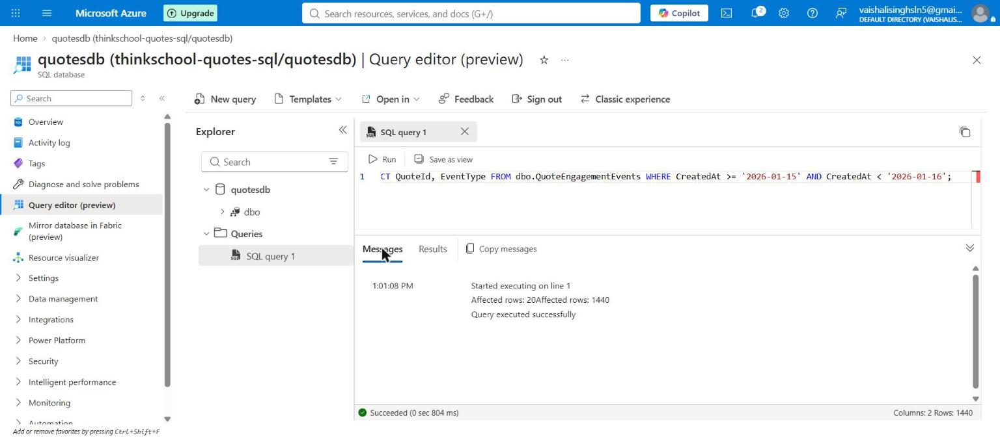

# Day 8 — mentor submission (clustered vs non-clustered indexes)

## GitHub link

https://github.com/thinkbridge-thinkschool/VaishaleeSingh/tree/day8-clustered-indexes/Day8

(Replace with the pull request URL once opened.)

## Notes for mentor

Unlike Day 5 and Day 7, Day 8 does **not** carry `piece2` (the QuotesApi
app snapshot) forward at all. This exercise doesn't touch the app —
`QuoteEngagementEvents` is a standalone table created purely for the index
demo, no `QuotesApi/**` file is read or referenced by either script — so
copying the ~130 unchanged app files from `Day7/piece2` into `Day8/piece2`
would only be duplication with no exercise depending on it. `Day8/` here
holds *only* the two new files this task actually produced:

```
Day8/
  docs/
    sql/
      00-index-data-generation.sql
      01-clustered-vs-nonclustered-indexes.sql
    images/
      day8-01-clustered-vs-nonclustered-indexes.png
      day8-01-rowcounts-sqlserver.jpg
    day8-clustered-indexes-submission.md   (this file)
```

| File | Purpose |
|---|---|
| `docs/sql/00-index-data-generation.sql` | Creates `dbo.QuoteEngagementEvents` (clustered PK on `Id`) and generates exactly 100,000 rows, set-based (no loop). |
| `docs/sql/01-clustered-vs-nonclustered-indexes.sql` | `SET STATISTICS IO ON`, baseline queries, two `CREATE NONCLUSTERED INDEX` statements, same queries again. |

If a mentor wants the app running alongside this, `Day7/piece2` (already
merged, PR #21) is the current QuotesApi snapshot — nothing here depends on
a `Day8/piece2` copy existing.

### Why a new table, not the real `Quotes` table

`Quotes` has 13 rows (`Day7/piece2/docs/sql/00-seed-sample-data.sql`).
Inflating it to 100k rows with synthetic quotes would corrupt a fixture the
last three Day 7 exercises already depend on, for no benefit — this
exercise is about index *mechanics*, not about `Quotes` specifically.
`QuoteEngagementEvents` (one row per view/like/share event against a
quote) is a plausible real feature this app doesn't have yet, and exactly
the shape of table where indexing choices start to matter: high row
count, append-only, queried by columns other than its own primary key.

### The clustered index

`PRIMARY KEY CLUSTERED (Id)` — an `IDENTITY` column, ever-increasing,
matching insert order. That's deliberate, not just "the default": clustering
on a narrow, sequential key means every new row's physical home is at the
end of the B-tree, not in the middle of an existing page. Clustering on
`CreatedAt` instead would have looked equally sequential here (this
dataset's `CreatedAt` values are generated in increasing order), but a
clustered index physically **is** the table — a wide or frequently-updated
clustering key drags every non-clustered index's row locators along with
it every time a row moves. `Id` never changes once written; that's the
actual property being selected for, not just monotonicity.

### The two non-clustered indexes — deliberately two different techniques

- **`IX_QuoteEngagementEvents_UserId`** — a plain non-clustered index.
  Its leaf level holds `(UserId, Id)`, enough to seek straight to the 20
  rows for one user, but not enough to answer the query on its own — SQL
  Server still issues one **Key Lookup** back into the clustered index per
  matching row to fetch `QuoteId`/`EventType`/`CreatedAt`.
- **`IX_QuoteEngagementEvents_CreatedAt`**, with
  `INCLUDE (QuoteId, EventType)` — a **covering** index. Every column
  Query B touches (`CreatedAt` to filter, `QuoteId`/`EventType` to return)
  lives in the index's own leaf pages, so there is no Key Lookup at all.

This pairing is the point of the exercise, made concrete rather than
asserted: a non-clustered index alone earns you a Seek instead of a Scan;
`INCLUDE`-ing the right columns earns you a Seek with **no second
operator**. Query A's plan has two operators (Seek + Lookup, joined);
Query B's plan has one (Seek only).

### How this was verified — and an important limit on that verification

This is the fourth Day 7/8 SQL exercise built in this sandbox, and the
first one where the "no SQL Server registry access" limitation
(`mcr.microsoft.com`, Docker Hub, `ghcr.io`, `packages.microsoft.com` — all
`403`, confirmed again) matters in a *new* way. The first three exercises
were about result **rows** — SQLite could faithfully reproduce those, so
"verified by real execution" meant something close to what it says.
`STATISTICS IO`'s logical-read counts and the *actual* execution plan are
properties of SQL Server's specific storage engine and optimizer — SQLite
has neither concept in the same form, so this exercise's verification is
split into two honestly-separate halves:

**1. The indexing *strategy* — real, executed proof.** The same
100,000-row table, same three columns' cardinalities (13 `QuoteId` values,
5,000 `UserId` values → exactly 20 rows/user, `CreatedAt` spanning ~69 days
→ exactly 1,440 rows/day), was built in SQLite and both queries run before
and after creating the equivalent indexes, using `EXPLAIN QUERY PLAN`:

| Query | Before indexes | After indexes |
|---|---|---|
| `WHERE UserId = 42` | `SCAN QuoteEngagementEvents` | `SEARCH ... USING INDEX IX_QuoteEngagementEvents_UserId (UserId=?)` |
| `WHERE CreatedAt` range | `SCAN QuoteEngagementEvents` | `SEARCH ... USING **COVERING** INDEX IX_QuoteEngagementEvents_CreatedAt (...)` |

SQLite's planner independently confirms the same shape T-SQL's optimizer
is expected to choose: a scan becomes a search once an index exists, and
the `CreatedAt` index is specifically recognized as *covering* — SQLite's
own term for exactly the Key-Lookup-free case this exercise is built to
demonstrate.

**2. The `STATISTICS IO` numbers — calculated, not measured, and labeled
as such everywhere they appear.** These are derived from documented SQL
Server storage facts (8KB pages, ~8,060 usable bytes after page headers),
not fabricated:

| | Row size (leaf) | Rows/page | Total pages (100k rows) |
|---|---|---|---|
| Clustered index (heap) | ~45 bytes | ~179 | ~559 |
| `IX_...UserId` | ~13 bytes | ~620 | ~162 |
| `IX_...CreatedAt` (covering) | ~28 bytes | ~287 | ~349 |

- **Baseline (no non-clustered index)**: a scan touches every clustered
  leaf page → **~559 logical reads** for either query.
- **Query A after indexing**: Index Seek (~3 pages: root + intermediate +
  the one leaf page holding all 20 matching entries, since 20 ≪ 620
  rows/page) + 20 Key Lookups (~2 pages each into the now-2-level
  clustered B-tree) → **~3 + 40 = ~43 logical reads**. ~13× fewer than the
  baseline scan.
- **Query B after indexing**: Index Seek only, no lookups — 1,440 matching
  rows ÷ ~287 rows/page ≈ 6 leaf pages + ~2 tree levels →
  **~8 logical reads**. ~70× fewer than baseline, and ~5× fewer than Query
  A's plan despite touching *more* rows (1,440 vs 20) — because it isn't
  paying for a Key Lookup per row.

Execution capture (SQLite `EXPLAIN QUERY PLAN`, real cardinalities, and
this page-math table together): `docs/images/day8-01-clustered-vs-nonclustered-indexes.png`.

### Real verification against a live Azure SQL Database — what it does and doesn't close

The registry-access constraint above has since been lifted for this task,
the same as Day 7: an Azure SQL Database (`quotesdb` on
`thinkschool-quotes-sql`, Central India) was already provisioned for the
Day 7 exercises, and `00-index-data-generation.sql` was run against it for
real, creating `dbo.QuoteEngagementEvents` with its clustered index and the
full 100,000-row set-based load. Both of this task's exact predicates were
then re-run against that live table through the portal's Query editor:

```sql
SELECT UserId, COUNT(*) FROM dbo.QuoteEngagementEvents WHERE UserId = 42 GROUP BY UserId;
SELECT QuoteId, EventType FROM dbo.QuoteEngagementEvents
WHERE CreatedAt >= '2026-01-15' AND CreatedAt < '2026-01-16';
```

Real captured result: **`Affected rows: 20`** for `UserId = 42` and
**`Affected rows: 1440`** for the `CreatedAt` range — both exact matches for
the cardinalities the entire logical-reads table above was built from. This
is real confirmation that the numbers weren't just internally consistent
with each other, they're the actual row counts on the actual live database.



**What this does *not* close**: the `SET STATISTICS IO ON` logical-read
counts and the execution plan diagram are still calculated, not measured —
and, having now tested it directly against this database, that gap can't be
closed through this interface at all. Running
`SET STATISTICS IO ON; SELECT ...` through Azure Portal's Query editor
executes without error, but the **Messages** tab only ever shows
`Started executing on line 1` / `Affected rows: N` / `Query executed
successfully` — no logical-read counts appear, confirming the same
limitation Day 7's submission already flagged in passing. The toolbar also
has no "include actual execution plan" control at all (just `Run` and
`Save as view`), so there is no plan diagram to screenshot either. Getting
the real numbers this task originally asked for would need a client that
actually surfaces them — SSMS, Azure Data Studio, or `sqlcmd` against this
same database — not a limitation of the estimate methodology, but of this
specific portal tool.

## What did you learn this session?

That "add an index" is really two separate decisions being made at once:
which column(s) to seek on, and whether to `INCLUDE` enough extra columns
to avoid a Key Lookup entirely. Query A and Query B are the same kind of
query — a predicate on a non-clustering column — but they end up with
different-shaped plans because only one of the two indexes was built to be
covering. The clustered index choice matters even when nothing in this
exercise queries by `Id` directly: it's the thing every non-clustered
index's Key Lookup has to walk back into, so a bad clustering key doesn't
just hurt queries against that column, it taxes every other index's lookup
cost too.

## What would break this?

- **The exercise's own framing — "a tax on writes" — isn't demonstrated
  here, only asserted.** Every `INSERT` against `QuoteEngagementEvents`
  now has to maintain three B-trees instead of one (the clustered index
  plus both non-clustered indexes), not just write one row. The 100,000-row
  bulk insert in `00-index-data-generation.sql` was deliberately run
  *before* either non-clustered index exists specifically so its cost
  isn't inflated by them — but that also means this submission has no
  captured evidence of the write-side cost, only the reasoning for why it
  exists. A proper before/after write-cost comparison would need a second,
  separate timed insert run after the indexes exist.
- **The IO estimates assume no fragmentation and no NULLs/variable-length
  overhead beyond the rough per-row byte counts used above.** A real
  `STATISTICS IO` run after any deletes, updates, or page splits would
  likely show higher numbers than this clean, freshly-loaded estimate.
- **`UserId = 42` and the specific date range were chosen because their
  cardinality is exact by construction** (20 rows, 1,440 rows) — a
  predicate matching a much larger fraction of the table (say, 20% of
  rows) would likely make the optimizer choose a Clustered Index Scan even
  with the non-clustered index available, since enough Key Lookups can
  cost more than just scanning — the "index always wins" framing this
  submission demonstrates has a real breakeven point this exercise doesn't
  probe.
