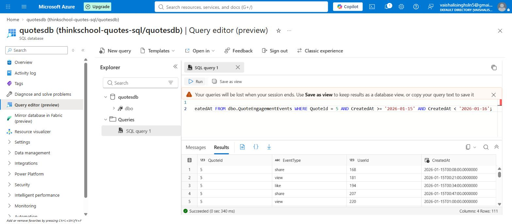
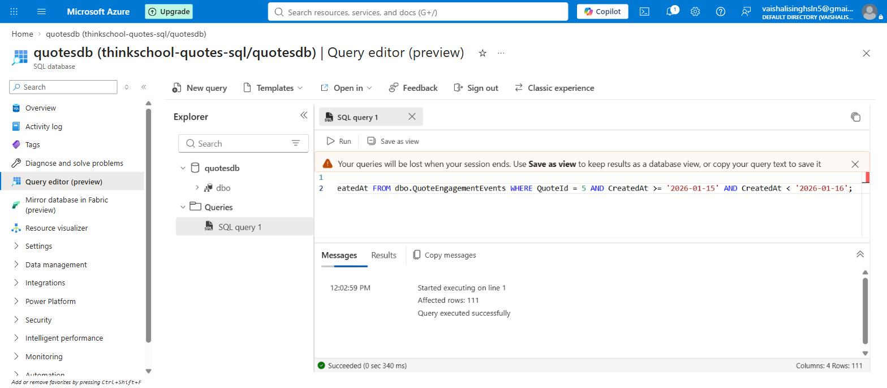

# Day 8 — mentor submission (covering indexes + INCLUDEd columns)

## GitHub link

https://github.com/thinkbridge-thinkschool/VaishaleeSingh/tree/day8-covering-indexes/Day8

(Replace with the pull request URL once opened.)

## Notes for mentor

This is Day 8's second, independent task — separate branch
(`day8-covering-indexes`, cut from `main` directly, not from
`day8-clustered-indexes`) and a separate PR, so it merges on its own
regardless of which of the two Day 8 tasks lands first. Like Task 1, it
does not carry `Day7/piece2` forward — neither task touches `QuotesApi/**`,
so there's nothing there to duplicate. New content:

```
Day8/
  docs/
    sql/
      02-covering-index-included-columns.sql
    images/
      day8-02-covering-index-included-columns.png
      day8-02-rowcount-confirmed-sqlserver.jpg
      day8-02-statistics-io-not-surfaced-sqlserver.jpg
    day8-covering-indexes-submission.md   (this file)
```

`docs/sql/02-covering-index-included-columns.sql` assumes
`dbo.QuoteEngagementEvents` already exists (created by Task 1's
`00-index-data-generation.sql`) — that generator is not duplicated here,
per the same "don't recreate what already exists" rule Day 8 as a whole is
following. If this PR is reviewed before Task 1's, the table doesn't
physically exist yet in that reviewer's database; the script is still
correct and self-explanatory as written, and running `00-` first (from
Task 1) makes it runnable end to end.

### The exercise's actual ask, and how this differs from Task 1

Task 1 showed a plain index and a covering index side by side, on two
*different* queries (`UserId = 42` vs. a `CreatedAt` range). This task asks
for something narrower and more specific: take **one** query that starts
out doing a Key Lookup, and fix *that same query* — not a different one —
by widening its own index with `INCLUDE`, then prove the Lookup is gone.
So this file runs the *same* query three times, changing only the index
available to it each time:

1. **No relevant index** → Clustered Index Scan.
2. **Plain composite index** `(QuoteId, CreatedAt)` → Index Seek (using
   both key columns) **+ Key Lookup** (for `EventType`/`UserId`, which
   aren't in the index) **+ Nested Loops** joining the two. This is the
   "query doing a key lookup" the exercise means.
3. **Same index, widened** with `INCLUDE (EventType, UserId)` → Index Seek
   **only** — the Key Lookup and the Nested Loops that joined it are both
   gone from the plan.

Step 3 replaces the Step-1 index (`DROP` then `CREATE`) rather than adding
a second index alongside it. Two overlapping indexes on the same leading
columns would answer the query just as well, but every future `INSERT`
would then maintain three B-trees for this table instead of two — widening
the one index that already exists is the correct fix, not adding a
competing one.

The query and predicate are deliberately different from anything in
Task 1: `WHERE QuoteId = 5 AND CreatedAt >= '2026-01-15' AND CreatedAt <
'2026-01-16'` — a composite filter ("one quote's engagement on one day"),
selecting `EventType`/`UserId`. Task 1's two queries each filtered on a
single column; this one exercises a composite seek key, which is also why
the index is `(QuoteId, CreatedAt)` — a leading `QuoteId` narrows first,
`CreatedAt` narrows further within that, matching the order the predicate
actually filters in.

### How this was verified — same two-part split as Task 1

Same sandbox constraint as every SQL exercise this week: no route to a
real SQL Server (`mcr.microsoft.com`, Docker Hub, `ghcr.io`,
`packages.microsoft.com` all `403`, reconfirmed). Verification is split
the same honest way as Task 1's submission:

**1. The plan shape — real, executed proof**, via SQLite's
`EXPLAIN QUERY PLAN` against the same 100,000-row table and the same exact
cardinality (`QuoteId` cycles 1–13 evenly, `CreatedAt` is exactly 1,440
rows/day → exactly **111** matching rows for one quote on one day, by
construction):

| Step | Plan |
|---|---|
| 0 — no index | `SCAN QuoteEngagementEvents` |
| 1 — plain `(QuoteId, CreatedAt)` index | `SEARCH ... USING INDEX IX_QuoteEngagementEvents_QuoteId_CreatedAt (...)` |
| 2 — same index `+ INCLUDE (EventType, UserId)` | `SEARCH ... USING **COVERING** INDEX IX_QuoteEngagementEvents_QuoteId_CreatedAt (...)` |

SQLite's own planner marks step 2's plan `COVERING` and step 1's plan
*not* `COVERING` — same index name, same seek predicate, only the leaf
columns changed. That word appearing/disappearing is SQLite's version of
"the Key Lookup operator disappeared from the plan," which is exactly what
step 3 in the `.sql` file is built to demonstrate for real SQL Server.

**2. The `STATISTICS IO` numbers — calculated, not measured**, from the
same documented SQL Server page-size arithmetic (8KB pages, ~8,060 usable
bytes) as every other Day 8 exercise this week:

| Step | Logical reads (calculated) |
|---|---|
| 0 — Clustered Index Scan | ~559 |
| 1 — Seek + 111 Key Lookups | ~225 |
| 2 — Seek only (covering) | ~3 |

Step 1 already beats the baseline scan (~2.5x fewer reads) — the seek
itself is cheap even before removing the lookup. But nearly all of step
1's ~225 reads *are* the 111 Key Lookups (~222 of the ~225); removing them
in step 2 is where almost the entire further win comes from — ~75x fewer
reads than step 1, ~186x fewer than the original baseline.

Execution capture (SQLite `EXPLAIN QUERY PLAN` proof and the page-math
table together): `docs/images/day8-02-covering-index-included-columns.png`.

### Real verification against a live Azure SQL Database — what it does and doesn't close

Same lifted constraint as Task 1: this task's exact predicate was run
against the live `quotesdb` (Azure SQL Database, `thinkschool-quotes-sql`)
through the portal's Query editor, against the same `dbo.QuoteEngagementEvents`
table Task 1's `00-index-data-generation.sql` created there:

```sql
SET STATISTICS IO ON;
SELECT QuoteId, EventType, UserId, CreatedAt FROM dbo.QuoteEngagementEvents
WHERE QuoteId = 5 AND CreatedAt >= '2026-01-15' AND CreatedAt < '2026-01-16';
```

Real captured result: **`Columns: 4  Rows: 111`** — an exact match for the
cardinality (`111` matching rows) the entire logical-reads table above was
built from, confirmed against the actual live data rather than assumed from
the generator's construction:



**What this does *not* close, and why**: `SET STATISTICS IO ON` was set
before running this query specifically to test whether the portal would
finally surface it for a query this task cares about — it didn't. The
**Messages** tab shows only `Started executing on line 1` / `Affected rows:
111` / `Query executed successfully`, with no logical-read counts anywhere,
confirming the same limitation found while re-verifying Task 1:



There is also no "include actual execution plan" control in this editor's
toolbar (just `Run` and `Save as view`), so there is no real plan diagram
to capture either — for step 1 (plain index, Key Lookup present) or step 2
(covering index, no lookup). The `STATISTICS IO` numbers and the plan
diagrams above remain calculated, not measured, and that gap is now known
to be a limitation of Azure Portal's Query editor specifically, not of the
verification approach — a client that surfaces these (SSMS, Azure Data
Studio, `sqlcmd`) against this same database would close it.

## What did you learn this session?

That "add an index" and "fix this specific query's plan" aren't always the
same move. Step 1's index wasn't wrong — it turned a full scan into a seek,
a real improvement — but it left a Key Lookup in place, and that Key
Lookup was responsible for nearly all of the remaining cost (~222 of ~225
reads). The fix wasn't a new index; it was widening the one that already
existed with the two columns the query selects but never filters or sorts
on. `INCLUDE` exists specifically so those columns don't have to become
part of the sort key to be covered.

## What would break this?

- **`INCLUDE`-ing too much, or the wrong thing, isn't free.** This query
  only ever needs `EventType` and `UserId` back — I included exactly those
  two. Reflexively `INCLUDE`-ing every column the table has "just in case"
  would make the index leaf rows wider (more pages, more write cost on
  every insert/update to those columns) without the query needing any of
  the extra width. Covering only helps the queries it was actually built
  for.
- **The DROP + CREATE in step 2 is not how this would be done safely
  against a live table.** On a table this size, dropping the only index
  serving this query and recreating it leaves a real window (however
  brief) where step-1's index doesn't exist yet and step-0's Scan is the
  only plan available. A production-safe version would either use
  `CREATE INDEX ... WITH (DROP_EXISTING = ON)` (atomic, same net effect,
  no window) or create the covering index under a temporary name first and
  drop the old one only after. This file uses the simpler two-statement
  form because the point being demonstrated is the *plan*, not the
  deployment mechanics — but the deployment gap is real and worth flagging
  rather than leaving implicit.
- **111 rows was chosen because it lands in the same "small and exact by
  construction" zone as Task 1's predicates** — real enough to make the
  Key Lookup expensive relative to the seek (222 of 225 reads), but still
  far below where a real optimizer would give up on Seek+Lookup and choose
  a Scan instead. A predicate matching a much larger share of the table
  would eventually cross that breakeven point, same caveat Task 1's
  submission already raised — this exercise doesn't probe where.
