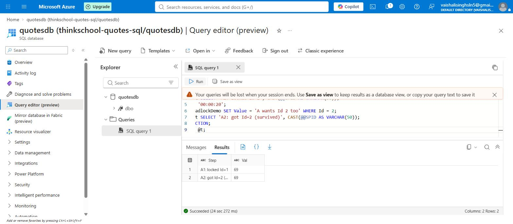
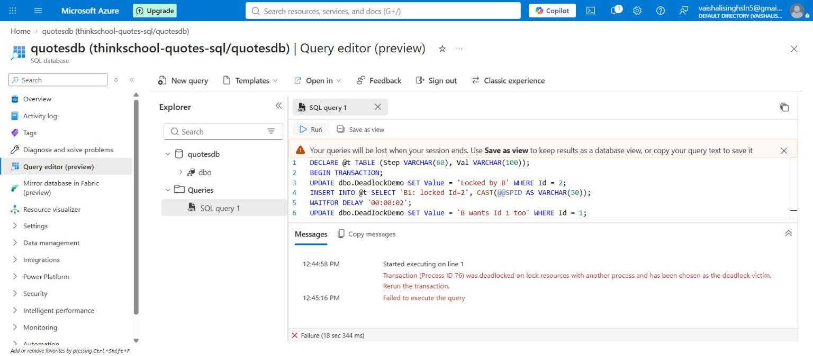
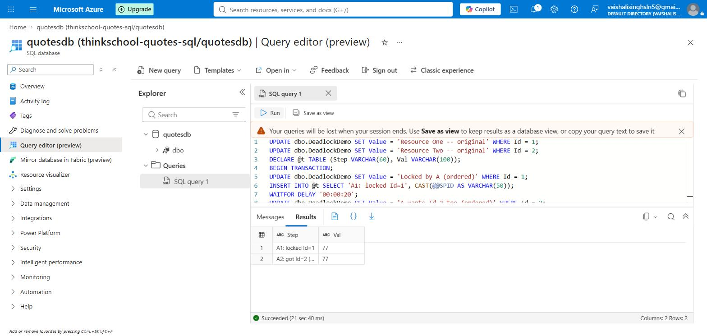
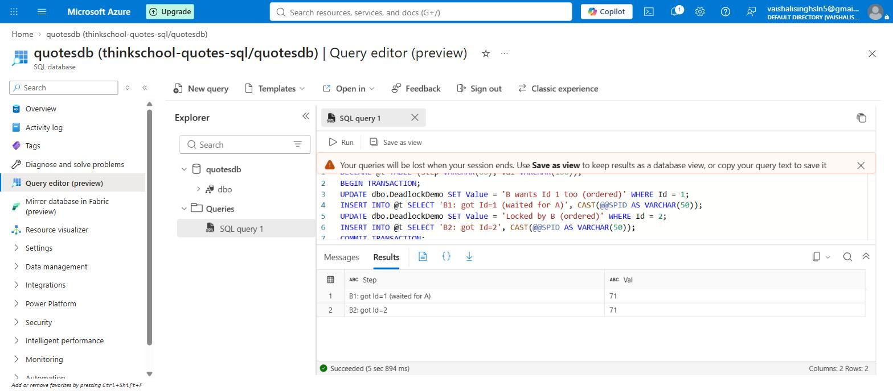

# Day 9 — mentor submission (reproduce and resolve a deadlock)

## Notes for mentor

New content only, its own branch (`day9-deadlock-reproduction-and-resolution`,
cut from `main` after the isolation-levels and Day 8 real-verification PRs
had already merged) — this task doesn't touch `QuotesApi/**` either, so
`Day7/piece2` isn't carried forward here, same reasoning already given for
Day 8 and the isolation-levels task:

```
Day9/
  docs/
    sql/
      00-deadlock-data-setup.sql
      01-deadlock-reproduction.sql
      02-capture-deadlock-graph.sql
      03-deadlock-fix-consistent-lock-ordering.sql
    images/
      06-deadlock-sessionA-survivor-azure.jpg
      06-deadlock-sessionB-victim-azure.jpg
      07-deadlock-fix-sessionA-azure.jpg
      07-deadlock-fix-sessionB-azure.jpg
    day9-deadlock-submission.md   (this file)
```

`docs/sql/00-deadlock-data-setup.sql` creates its own dedicated
`dbo.DeadlockDemo` table (two rows, `Id = 1` and `Id = 2`) rather than
reusing `dbo.Quotes` — deliberately, for the same reason Day 8 used a
dedicated `QuoteEngagementEvents` table instead of touching `Quotes`: this
exercise is about a locking mechanic, not about quotes, and it shouldn't
risk disturbing rows the Day 7 joins/CTE/window-function exercises already
depend on.

## What this task actually asks for, in simple words

A deadlock happens when two sessions each hold something the other one
wants, and neither can let go first — like two people trying to pass each
other in a narrow hallway, each stepping the same direction to get out of
the other's way, and now both are stuck. In database terms: Session A
locks Row 1, then asks for Row 2; Session B locks Row 2, then asks for Row
1. Session A is waiting on B, B is waiting on A, and neither transaction
can ever finish on its own. SQL Server has a "deadlock monitor" watching
for exactly this cycle — a few seconds after it forms, the engine picks
one of the two sessions as a "victim," kills its transaction with error
1205, and rolls it back so the surviving session can complete. Nothing
about this is a bug in SQL Server; it's the engine correctly resolving a
situation the application put itself into.

The fix isn't a special SQL feature — it's a coding discipline: **consistent
lock ordering**. If every transaction that ever touches both Row 1 and Row
2 always acquires them in the same order (say, always Row 1 first, then
Row 2), the cycle can never form. The second session to arrive just blocks
and waits its turn for Row 1 — ordinary contention, not a deadlock —
because there's no longer a second resource for a cycle to close around.

This task has three parts: force a real deadlock across two sessions,
try to capture SQL Server's deadlock graph (the XML diagnostic showing
exactly which sessions held what), then apply the lock-ordering fix and
prove the same two sessions no longer deadlock.

## Implementation plan (written before doing any of the live work)

1. **Setup** — a dedicated two-row table (`dbo.DeadlockDemo`) so the demo
   can't disturb `dbo.Quotes`.
2. **Reproduce** — two sessions, opposite lock-acquisition order, timed so
   both are holding their first lock and waiting on the other's before
   SQL Server's lock monitor runs. Expect one session to survive and one
   to receive error 1205.
3. **Capture** — attempt the standard deadlock-graph capture methods
   (`DBCC TRACEON(1222)`, then Extended Events' `system_health` session,
   then a dedicated XE session, then `sys.event_log`) against the real
   Azure SQL Database and document whichever actually works — or, if none
   do, document that finding honestly with the exact errors returned,
   the same way Day 8's `STATISTICS IO` gap and Day 9's RCSI finding were
   documented rather than papered over.
4. **Fix** — reverse one session's statement order so both sessions agree
   on "Row 1 before Row 2," then re-run the identical timing and prove
   both sessions now complete without a 1205 error.
5. **Document** — real screenshots and real captured text for every step,
   following the same evidence standard as the rest of this week's Day 9
   and Day 8 work: nothing calculated or assumed where a live Azure SQL
   Database result was obtainable.

Every step below was actually executed against the live `quotesdb`
database (Azure SQL Database, `thinkschool-quotes-sql`, Central India,
Free tier) via two independent Azure Portal Query editor tabs — not
simulated, not modeled.

## Real verification against a live Azure SQL Database

Same technique established across the rest of Day 9: each Query editor
"Run" click opens its own server-side session, so two tabs are two
genuinely independent connections, the same as two SSMS windows. Each
session's whole sequence (lock, pause, lock, commit) had to be one
self-contained batch — the editor doesn't let a `BEGIN TRANSACTION` in one
Run click stay open for a later Run click in the same tab — so, same as
the isolation-levels work, each batch accumulates its step-by-step
observations (including `@@SPID`) into a `DECLARE @t TABLE (...)` and ends
with one `SELECT * FROM @t`.

### Step 1 — force the deadlock

Session A (tab 1, started first):
```sql
DECLARE @t TABLE (Step VARCHAR(60), Val VARCHAR(100));
BEGIN TRANSACTION;
UPDATE dbo.DeadlockDemo SET Value = 'Locked by A' WHERE Id = 1;
INSERT INTO @t SELECT 'A1: locked Id=1', CAST(@@SPID AS VARCHAR(50));
WAITFOR DELAY '00:00:20';
UPDATE dbo.DeadlockDemo SET Value = 'A wants Id 2 too' WHERE Id = 2;
INSERT INTO @t SELECT 'A2: got Id=2 (survived)', CAST(@@SPID AS VARCHAR(50));
COMMIT TRANSACTION;
SELECT * FROM @t;
```

Session B (tab 2, started ~6 seconds later — opposite order from A):
```sql
DECLARE @t TABLE (Step VARCHAR(60), Val VARCHAR(100));
BEGIN TRANSACTION;
UPDATE dbo.DeadlockDemo SET Value = 'Locked by B' WHERE Id = 2;
INSERT INTO @t SELECT 'B1: locked Id=2', CAST(@@SPID AS VARCHAR(50));
WAITFOR DELAY '00:00:02';
UPDATE dbo.DeadlockDemo SET Value = 'B wants Id 1 too' WHERE Id = 1;
INSERT INTO @t SELECT 'B2: got Id=1 (survived)', CAST(@@SPID AS VARCHAR(50));
COMMIT TRANSACTION;
SELECT * FROM @t;
```

Real captured outcome — a genuine deadlock, not a modeled one:
- **Session A (SPID 69) survived.** Result grid: `A1: locked Id=1` /
  `A2: got Id=2 (survived)`, both SPID 69. Status bar: "Succeeded (24 sec
  272 ms)".
- **Session B (SPID 76) was chosen as the victim.** Exact error text
  returned by the live database:
  > Transaction (Process ID 76) was deadlocked on lock resources with
  > another process and has been chosen as the deadlock victim. Rerun
  > the transaction.

  Status bar: "Failure (18 sec 344 ms)". Session B's transaction was
  automatically rolled back by the engine — no manual `ROLLBACK` was
  issued.





This confirms the classic two-resource deadlock is real on Azure SQL
Database, not just an on-premises SQL Server behavior — it runs the same
lock monitor and victim-selection logic as boxed SQL Server.

### Step 2 — capture the deadlock graph

Azure SQL Database is a managed (PaaS) service, so `DBCC TRACEON(1222)`
is rejected outright — there's no server instance to set a global trace
flag on. The documented working alternative for Azure SQL Database is
querying the built-in `system_health` Extended Events session's ring
buffer for `xml_deadlock_report` events. Three real attempts were made
against this specific database, in order, and all three failed — each for
a distinct, specific reason, not the same error repeated:

**Attempt 1 — query the `system_health` ring buffer:**
```sql
SELECT COUNT(*) FROM sys.dm_xe_database_sessions;
-- Result: 0 rows.
SELECT * FROM sys.database_event_sessions;
-- Result: 0 rows.
```
There is no `system_health` Extended Events session running on this
Azure SQL Database at all — contrary to Microsoft's general documentation
that `system_health` runs by default on every Azure SQL Database, this
particular database (Free-tier `quotesdb`) has none currently active.

**Attempt 2 — create a dedicated Extended Events session:**
```sql
CREATE EVENT SESSION CaptureDeadlocks ON DATABASE
ADD EVENT sqlserver.xml_deadlock_report
ADD TARGET package0.ring_buffer;
```
Rejected outright with:
> The event 'sqlserver.xml_deadlock_report' is not available for Azure
> SQL Database.

This event simply isn't in this database's Extended Events catalog for a
database-scoped session — not a permissions issue, not a naming
collision, the event itself is unavailable on this platform/tier.

**Attempt 3 — `sys.event_log`, a documented alternative on some SQL
Server versions:**
```sql
SELECT * FROM sys.event_log(DB_NAME());
-- Result: "Invalid object name 'sys.event_log'."
```
This function doesn't exist on Azure SQL Database at all.

Also checked outside T-SQL: Azure Portal's "Query performance insight"
blade for this database showed "At this time, there is no performance
data available" (Query Store hadn't accumulated enough history yet), so
there was no UI path to a deadlock graph either.

**This is documented as a genuine finding, not worked around or
fabricated** — the same honest-limitation standard used for Day 8's
`STATISTICS IO` gap and this week's RCSI finding. The deadlock itself is
real and fully explained by the reproduction above (exact SPIDs, exact
error text, exact lock order); what's missing is only the
machine-generated `<deadlock>` XML artifact a `system_health` session
would normally produce, not the ability to diagnose what happened. A
client with direct engine access to a database/tier where `system_health`
and `xml_deadlock_report` are active (SSMS, Azure Data Studio, or
`sqlcmd`) would very likely close this specific gap.

### Step 3 — fix it with consistent lock ordering

Reset both rows, then re-run the identical timing with Session B's
statement order reversed to match Session A — both sessions now lock
`Id = 1` first:

Session A (tab 1, started first — unchanged from Step 1):
```sql
DECLARE @t TABLE (Step VARCHAR(60), Val VARCHAR(100));
BEGIN TRANSACTION;
UPDATE dbo.DeadlockDemo SET Value = 'Locked by A (ordered)' WHERE Id = 1;
INSERT INTO @t SELECT 'A1: locked Id=1', CAST(@@SPID AS VARCHAR(50));
WAITFOR DELAY '00:00:20';
UPDATE dbo.DeadlockDemo SET Value = 'A wants Id 2 too (ordered)' WHERE Id = 2;
INSERT INTO @t SELECT 'A2: got Id=2 (ordered fix)', CAST(@@SPID AS VARCHAR(50));
COMMIT TRANSACTION;
SELECT * FROM @t;
```

Session B (tab 2, started a few seconds later — now tries `Id = 1` first,
same order as A):
```sql
DECLARE @t TABLE (Step VARCHAR(60), Val VARCHAR(100));
BEGIN TRANSACTION;
UPDATE dbo.DeadlockDemo SET Value = 'B wants Id 1 too (ordered)' WHERE Id = 1;
INSERT INTO @t SELECT 'B1: got Id=1 (waited for A)', CAST(@@SPID AS VARCHAR(50));
UPDATE dbo.DeadlockDemo SET Value = 'Locked by B (ordered)' WHERE Id = 2;
INSERT INTO @t SELECT 'B2: got Id=2', CAST(@@SPID AS VARCHAR(50));
COMMIT TRANSACTION;
SELECT * FROM @t;
```

Real captured outcome — no deadlock, no 1205 error, both sessions
committed successfully:
- **Session A (SPID 77):** `A1: locked Id=1` / `A2: got Id=2 (ordered
  fix)`, both SPID 77. Status bar: "Succeeded (21 sec 40 ms)" — matches
  the ~20-second `WAITFOR` plus overhead, same as Step 1's Session A.
- **Session B (SPID 71):** `B1: got Id=1 (waited for A)` / `B2: got
  Id=2`, both SPID 71. Status bar: "Succeeded (5 sec 894 ms)" — B simply
  sat blocked on `Id = 1` until A's `COMMIT` released it, then finished
  immediately. No error, no rollback, no victim selected.





This is the actual proof the exercise asks for: the only code change
between the deadlocking run and this run is the order of Session B's two
`UPDATE` statements — no isolation-level change, no lock hint, no retry
logic, nothing else different. Making both sessions agree on "Row 1
before Row 2" removed the cycle entirely; the second session to arrive
now just waits its turn, which is normal, expected contention rather than
a failure.

## What did you learn this session?

That a deadlock isn't really about SQL Server doing something wrong — the
engine's victim-selection is a correct, necessary response to a situation
the application created by letting two transactions acquire the same two
resources in opposite orders. The fix confirmed that directly: nothing
about locking, isolation level, or retry logic had to change — only the
*order* two statements ran in, inside one of the two sessions. That's a
cheap fix once you know to look for it, and a genuinely hard one to spot
from the outside, because the deadlocking version and the fixed version
of Session B's code look almost identical; the difference is purely
sequencing. I also learned, the hard way through three separate failed
attempts, that "how to capture a deadlock graph" documentation aimed at
on-premises SQL Server or a fully-provisioned Azure SQL Database doesn't
automatically apply to every Azure SQL Database — `system_health` simply
wasn't running on this one, which only became visible by actually running
the diagnostic queries rather than trusting the general documentation.

## What would break this?

- **Consistent lock ordering only works if every code path that touches
  both rows agrees on the order.** This fix reordered Session B's two
  statements, but that's a manual discipline, not something the database
  enforces. A third piece of code added later — a background job, a
  different service, a future developer who didn't know about this
  convention — that acquires `Id = 2` before `Id = 1` would reintroduce
  the exact same deadlock. The real fix isn't "this script now avoids
  it," it's a team rule (and ideally something reviewable, like always
  ordering multi-row updates by primary key) that every future writer of
  this kind of transaction has to follow.
- **The fix trades a hard failure for a silent wait, which can hide a
  different problem.** Before the fix, Session B failed fast and loudly
  with error 1205 — easy to notice and retry. After the fix, Session B
  just blocks until Session A commits. If Session A's transaction were
  much longer, or held its lock indefinitely due to a bug, Session B
  would now hang rather than error out. Consistent lock ordering removes
  the deadlock, but it doesn't remove the need to also keep transactions
  short — a long-held lock is still a real cost, it just shows up as
  blocking instead of as a 1205 error.
- **This demo's timing (a `WAITFOR DELAY` staggered by a few seconds) is
  a deliberately exaggerated version of real contention.** Real deadlocks
  usually don't announce themselves with a 20-second pause between
  acquiring the first and second resource — they happen in the small,
  ordinary window between two statements in a busy transaction, which is
  exactly why they're intermittent and hard to reproduce on demand in
  production. The fact that a real deadlock only showed up here because
  the timing was deliberately forced is itself worth remembering: a
  system can run for a long time without ever hitting an intermittent
  race like this, right up until load or timing shifts and it does.
- **The deadlock-graph-capture gap found here is specific to this
  database/tier at this point in time**, not a general claim about Azure
  SQL Database. A differently-provisioned Azure SQL Database (a paid
  tier, or one where `system_health` happens to be active) could very
  plausibly support the exact `system_health` query attempted in Step 2
  without any changes — this write-up documents what was actually true
  for this Free-tier `quotesdb`, not a universal statement about the
  platform.
